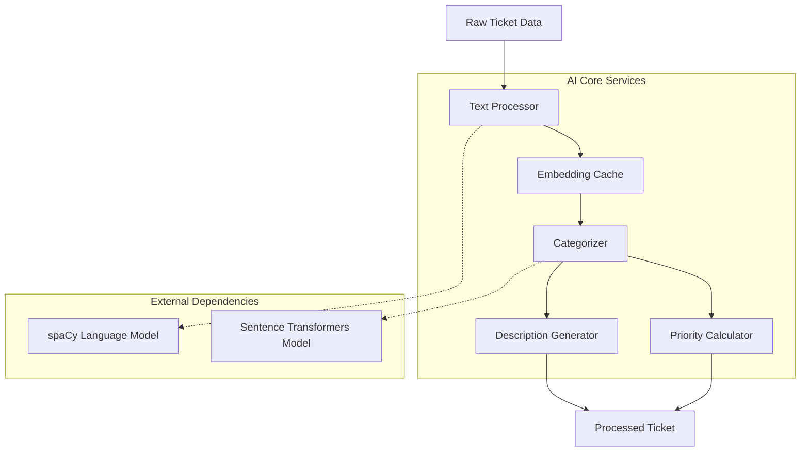

# AI System Architecture

This document provides a technical overview of the AI system for intelligent ticket management. The system uses natural language processing and machine learning to categorize tickets, calculate priority, and generate summaries.

## High-Level Architecture

The AI pipeline processes raw ticket data through a series of components to produce structured, actionable insights.

## Core Components

### 1. Text Processor (`backend/app/services/ai/text_processor.py`)

**Purpose:** Cleans and preprocesses raw ticket text for AI analysis.

**Key Functions:**

-   `preprocess_text(text: str) -> list`:
    -   Uses the `spaCy` library for tokenization and lemmatization.
    -   Removes stopwords, punctuation, and company names.
    -   Filters out short tokens.
-   `extract_ticket_text(ticket_item) -> str`:
    -   Extracts and combines text from ticket fields like `title` and `description`.

### 2. Embedding Cache (`backend/app/services/ai/embedding_cache.py`)

**Purpose:** Caches sentence embeddings to improve performance by avoiding redundant computations.

**Architecture:**

-   Implements a Least Recently Used (LRU) cache with a Time-to-Live (TTL) for each entry.
-   Uses an in-memory dictionary for storage, with an access order list to track usage.
-   The cache key is an MD5 hash of the ticket text.

**Key Functions:**

-   `get(text: str)`: Retrieves an embedding from the cache.
-   `put(text: str, embedding: torch.Tensor)`: Stores an embedding in the cache.
-   `get_batch(texts: list[str])`: Retrieves a batch of embeddings.
-   `put_batch(texts: list[str], embeddings: torch.Tensor)`: Stores a batch of embeddings.

### 3. Categorizer (`backend/app/services/ai/categorizer.py`)

**Purpose:** Predicts the category of a ticket using a hybrid approach.

**Classification Strategy:**

1.  **Keyword Matching:** Uses predefined keywords for each category to quickly find a match.
2.  **Semantic Similarity:** If keyword matching is not decisive, it uses the `all-MiniLM-L6-v2` sentence transformer model to compute embeddings and find the most similar category.
3.  **Batch Processing:** Supports batching for significantly faster processing of multiple tickets.

**Key Functions:**

-   `predict_category_by_keywords(text: str)`: Scores categories based on keyword matches.
-   `predict_category_by_semantic(text: str)`: Finds the best category based on embedding similarity.
-   `predict_categories_batch(texts: list[str])`: Processes a batch of tickets efficiently.
-   `predict_category_hybrid(text: str)`: Combines keyword and semantic methods.

### 4. Priority Calculator (`backend/app/services/ai/priority_calculator.py`)

**Purpose:** Calculates a priority score for a ticket based on multiple factors.

**Scoring Algorithm:**

The priority score is calculated based on:

-   **Category Weight:** Each category has a predefined weight.
-   **Urgency Keywords:** The presence of words like "urgent" or "critical" increases the score.
-   **Semantic Confidence:** The confidence of the category prediction.
-   **Text Length:** Longer, more detailed tickets are given a slight boost.

**Key Functions:**

-   `calculate_priority_score(text: str, category: str, semantic_scores: dict)`: Calculates the priority for a single ticket.
-   `calculate_priority_scores_batch(texts: list[str], categories: list[str], semantic_scores_list: list[dict])`: Calculates priorities for a batch of tickets.
-   `get_priority_label(priority_score: int)`: Converts the numeric score to a label (e.g., "High", "Medium").

### 5. Description Generator (`backend/app/services/ai/description_generator.py`)

**Purpose:** Generates a summary and suggested remediation steps for a ticket.

**Functionality:**

-   The system uses a predefined map of issue types to remediation steps.
-   It does not involve advanced AI generation but rather provides templated responses based on the ticket's issue type.

**Key Functions:**

-   `generate_ai_description(ticket_item: dict)`: Creates the description and remediation suggestions.
-   `_get_issue_remediation(issue_type: str)`: Retrieves the appropriate remediation steps from the map.

### 6. Category Generator (`backend/app/services/ai/category_generator.py`)

**Purpose:** Automatically discovers and generates categories from a collection of tickets.

**Process:**

1.  **Load Tickets:** Loads ticket data from a JSON file.
2.  **Generate Embeddings:** Creates embeddings for all tickets.
3.  **Find Optimal Clusters:** Uses K-means clustering and silhouette scores to determine the best number of categories.
4.  **Cluster Tickets:** Assigns each ticket to a cluster.
5.  **Name Categories:** Analyzes the keywords in each cluster to generate a descriptive name.

## Performance

-   **Caching:** The embedding cache is the most critical performance feature, significantly reducing the need for expensive model inference.
-   **Batch Processing:** The categorizer and priority calculator are optimized for batch operations, making them highly efficient for large numbers of tickets.
-   **Asynchronous Operations:** The backend is built on FastAPI, which allows for asynchronous request handling.
