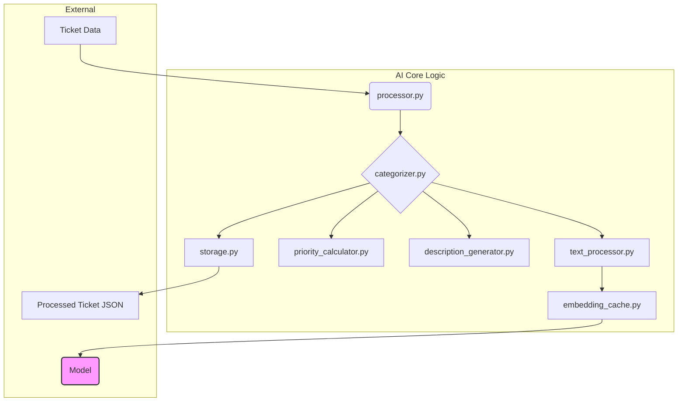

# AI System Architecture

This document provides a high-level overview of the AI services responsible for ticket categorization, priority calculation, and content generation.

## Core Objective

The primary goal of the AI system is to automate the initial processing of support tickets. It reads unstructured ticket data, predicts a relevant category and priority, and generates a concise summary for human agents. This reduces manual effort and improves response times.

## System Components

The AI logic is encapsulated within the `backend/app/services/ai/` directory. The system is composed of several specialized modules that work together.

### Component Breakdown

1.  **`processor.py` (Ticket Processor)**
    -   **Entry Point**: The main orchestrator for processing a single ticket.
    -   **Workflow**: It takes a raw ticket, calls the `categorizer` to enrich it with AI predictions, and then uses the `storage` module to save the result.

2.  **`categorizer.py` (AI Categorizer)**
    -   **Core Brains**: This is the central component that coordinates the AI prediction tasks.
    -   **Responsibilities**:
        -   Uses `text_processor` to clean and prepare ticket text.
        -   Leverages a sentence-transformer model (via `embedding_cache`) to generate vector embeddings for the ticket content.
        -   Compares the ticket embedding against pre-generated category embeddings to find the best match (hybrid approach using semantic search and keyword matching).
        -   Calls `priority_calculator` to determine an initial priority.
        -   Calls `description_generator` to create a summary.

3.  **`text_processor.py` (Text Processor)**
    -   **Function**: Cleans and normalizes raw text from tickets to improve model accuracy.
    -   **Operations**: Removes HTML tags, decodes entities, and standardizes formatting.

4.  **`embedding_cache.py` (Embedding Cache)**
    -   **Purpose**: Manages the creation and caching of vector embeddings.
    -   **Mechanism**: It stores generated embeddings on disk to avoid re-computing them for the same text, significantly speeding up processing for repeated or similar tickets.

5.  **`priority_calculator.py` (Priority Calculator)**
    -   **Logic**: Assigns a priority level (e.g., Low, Medium, High) to a ticket based on keywords and predicted category.

6.  **`description_generator.py` (Description Generator)**
    -   **Function**: Uses a generative model or rule-based system to create a short, one-sentence summary of the ticket's content.

7.  **`storage.py` (Storage Manager)**
    -   **Responsibility**: Handles the serialization and storage of processed tickets.
    -   **Output**: Saves the final, enriched ticket data as a JSON file in the `data/Unprocessed Tickets/categorized/` directory.

8.  **`category_generator.py` (Category Generator)**
    -   **Utility**: A script used to pre-process the list of possible categories. It generates the vector embeddings for each category description, which are then used by the `categorizer` for semantic comparison.

## Data Flow: Single Ticket Journey

1.  A script like `predict_categories.py` reads a raw ticket from a JSON file.
2.  It passes the ticket data to `processor.process_ticket()`.
3.  The `processor` calls the `categorizer`, which performs the core AI tasks:
    a.  The ticket's text is cleaned by `text_processor`.
    b.  An embedding is generated for the cleaned text using a pre-trained model, managed by `embedding_cache`.
    c.  This embedding is compared against the pre-calculated category embeddings to find the most likely category.
    d.  A priority is calculated.
    e.  A summary description is generated.
4.  The `processor` receives the enriched ticket data.
5.  `storage.save_ticket_to_json()` writes the final result to a new JSON file, ready for the next stage in the pipeline.
