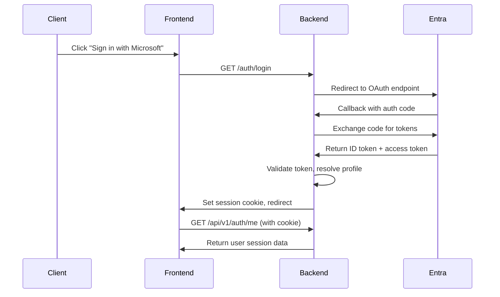

# CompSecOps API Reference - Complete Guide

## Overview

The CompSecOps API provides comprehensive endpoints for AI-powered ticket management, multi-tenant profile administration, and Microsoft Entra ID authentication. Built with FastAPI, it offers automatic OpenAPI documentation, robust error handling, and high-performance async processing.

**Base URL**: `http://localhost:8000` (development) / `https://api.yourdomain.com` (production)

**Interactive Documentation**: Available at `/docs` (Swagger UI) and `/redoc` (ReDoc)

## Authentication

All API endpoints (except health checks) require authentication via session cookies obtained through the Microsoft Entra ID OAuth flow.

### Authentication Flow



### Session Cookie

**Cookie Name**: `secops_session`
**Properties**:
- HttpOnly (not accessible to JavaScript)
- SameSite=Lax (CSRF protection)
- Secure=False (development), True (production)
- Max-Age: 28800 seconds (8 hours)

## Core API Endpoints

### 1. Health & Monitoring

#### System Health Check
```http
GET /health
```

**Response**:
```json
{
    "ok": true
}
```

#### AI Cache Statistics
```http
GET /api/cache/stats
```

**Response**:
```json
{
    "hits": 0,
    "misses": 0,
    "keys": 0,
    "size": 0,
    "average_load_time": 0
}
```

#### Clear AI Cache
```http
POST /api/cache/clear
```

**Response**:
```json
{
    "status": "cache cleared"
}
```

### 2. Authentication Endpoints

#### Initiate Login
```http
GET /auth/login
```

**Description**: Redirects to Microsoft Entra ID OAuth login page

**Response**: 302 Redirect to `https://login.microsoftonline.com/...`

#### OAuth Callback
```http
GET /auth/callback?code={code}&state={state}
```

**Description**: Handles OAuth callback from Microsoft Entra ID

**Query Parameters**:
- `code` - OAuth authorization code
- `state` - CSRF protection token

**Response**: 302 Redirect to frontend with session cookie set

#### Get Current Session
```http
GET /api/v1/auth/me
```

**Description**: Returns current authenticated user information

**Response**:
```json
{
    "session": {
        "profile_id": "550e8400-e29b-41d4-a716-446655440000",
        "tenant_id": "550e8400-e29b-41d4-a716-446655440001",
        "entra_tenant_id": "24e92e30-83bf-4d0e-8a69-3a7b71901db6",
        "object_id": "12345678-1234-1234-1234-123456789012",
        "display_name": "John Doe",
        "issuer": "https://sts.windows.net/...",
        "exp": 1673819400
    },
    "profile": {
        "profile_id": "550e8400-e29b-41d4-a716-446655440000",
        "tenant_id": "550e8400-e29b-41d4-a716-446655440001",
        "status": "active",
        "created_at": "2024-01-10T09:15:00Z",
        "deactivated_at": null,
        "deactivated_reason": null,
        "display": {
            "display_name": "John Doe",
            "created_at": "2024-01-10T09:15:00Z",
            "updated_at": "2024-01-10T09:15:00Z"
        }
    }
}
```

**Error Response** (401 Unauthorized):
```json
{
    "detail": "Not authenticated"
}
```

#### Logout
```http
POST /api/v1/auth/logout
```

**Description**: Clears session cookie and invalidates session

**Response**: 204 No Content

### 3. Ticket Management with AI

#### List Tickets with AI Analysis
```http
GET /api/tickets?status={status}&priority={priority}&category={category}&limit={limit}&verbose={verbose}&batch={batch}
```

**Query Parameters**:
- `status` (optional, string): Filter by ticket status
- `priority` (optional, string): Filter by ticket priority
- `category` (optional, string): Filter by AI category
- `limit` (optional, integer): Number of tickets to return (default 100)
- `verbose` (optional, boolean): Enable verbose logging
- `batch` (optional, boolean): Use batch processing (default true)


**Description**: Returns list of tickets with AI-powered categorization and priority analysis

**Response**:
```json
{
    "items": [
        {
            "autotask_ticket_id": 12345,
            "ticket_number": "T20240115.0001",
            "company": "Acme Corporation",
            "contact": "Jane Smith",
            "status": "New",
            "priority": "Medium",
            "created": "2024-01-15T10:30:00Z",
            "title": "Network connectivity issues",
            "description": "Users unable to access internal servers",
            "strike_level": "0",
            "due_date": "2024-01-20T17:00:00Z",
            "source": "Monitoring Alert",
            "issue_type": "Network",
            "sub_issue_type": "Connectivity",
            "location": "Main Office",
            "additional_contacts": [],
            "work_type": "Remote",
            "primary_resource": "John Tech",
            "secondary_resource": "",
            "queue": "Network Support",
            "ai": {
                "category": "network_infrastructure",
                "confidence": 0.89,
                "priority": "High",
                "priority_score": 3.2,
                "method": "semantic"
            }
        }
    ],
    "count": 1
}
```

#### Get Individual Ticket with AI Analysis
```http
GET /api/tickets/{autotask_ticket_id}
```

**Path Parameters**:
- `autotask_ticket_id` - The unique Autotask ticket identifier

**Response**: (Same as a single item in the `/api/tickets` response)

#### Real-Time Ticket Processing Stream
```http
GET /api/tickets/stream/categorize?status={status}&priority={priority}&limit={limit}
```

**Description**: Server-Sent Events endpoint for real-time AI processing updates

**Query Parameters**:
- `status` (optional, string): Filter by ticket status
- `priority` (optional, string): Filter by ticket priority
- `limit` (optional, integer): Number of tickets to return (default 100)

**Headers**:
- `Accept: text/event-stream`
- `Cache-Control: no-cache`

**Event Stream Format**:
```
data: {"type": "start", "total": 100}

data: {"type": "ticket", "index": 1, "total": 100, "data": {...ticket_data...}}

data: {"type": "complete", "total": 100}
```

#### Get Available Categories
```http
GET /api/categories
```

**Description**: Returns all available ticket categories with their metadata

**Response**:
```json
{
    "items": [
        {
            "key": "Email blocked/held",
            "label": "Email blocked/held"
        },
        {
            "key": "Backup failed",
            "label": "Backup failed"
        }
    ]
}
```

### 4. Profile Management API

The profile management API is documented in the OpenAPI specification, available at `/docs`.

## Error Handling

The API uses standard HTTP status codes and provides detailed error messages in JSON format.

### Common Status Codes

- `200 OK` - Request successful
- `201 Created` - Resource created successfully
- `204 No Content` - Request successful, no content to return
- `400 Bad Request` - Invalid request parameters
- `401 Unauthorized` - Authentication required
- `403 Forbidden` - Insufficient permissions
- `404 Not Found` - Resource not found
- `422 Unprocessable Entity` - Validation errors
- `500 Internal Server Error` - Server error

### Error Response Format

```json
{
    "detail": "Error message description"
}
```

This API provides comprehensive functionality for AI-powered security operations ticket management with enterprise-grade authentication, multi-tenancy, and real-time processing capabilities.
