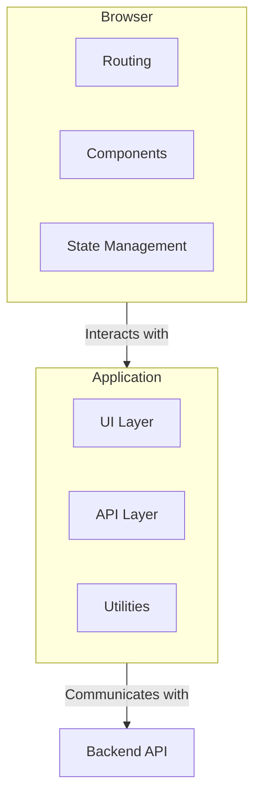

# Frontend Architecture - Complete Technical Guide

## Overview

The CompSecOps frontend is a modern Single Page Application (SPA) built with **Vanilla TypeScript** and **Tailwind CSS**. It provides a comprehensive security operations interface with AI-powered ticket management, real-time processing capabilities, and Microsoft Entra ID authentication integration.

## Architecture Philosophy

### Why Vanilla TypeScript?

The decision to use Vanilla TypeScript instead of a framework like React, Vue, or Angular provides several advantages for this project:

- **Performance**: Direct DOM manipulation without framework overhead results in a fast and responsive user experience.
- **Simplicity**: The architecture avoids complex state management libraries and component lifecycle concepts, making it easier to understand and maintain.
- **Learning**: It provides a clear and direct way to work with web fundamentals.
- **Flexibility**: The architecture is custom-built and tailored to the specific needs of the application.
- **Bundle Size**: The minimal dependency footprint leads to faster load times.
- **Control**: Developers have full control over rendering, state management, and performance optimization.

## System Architecture

### High-Level Structure



### Directory Structure

```
frontend/
├── src/
│   ├── main.ts                 # Application bootstrap
│   ├── app/
│   │   └── App.ts             # Main application controller
│   ├── pages/                 # Screen/page components
│   │   ├── Dashboard.ts       # Overview dashboard
│   │   ├── ActiveTickets.ts   # Active ticket management
│   │   ├── TicketDetail.ts    # Individual ticket view
│   │   ├── AccountPage.ts     # User profile/settings
│   │   ├── Settings.ts        # Application settings
│   │   └── ClosedTickets.ts   # Historical tickets
│   ├── components/            # Reusable UI components
│   │   ├── TicketCard.ts      # Individual ticket display
│   │   ├── TicketListContainer.ts # Advanced ticket list
│   │   └── EllipsisMenu.ts    # Dropdown menu component
│   └── shared/               # Shared utilities and types
│       ├── auth.ts           # Authentication helpers
│       ├── lib/
│       │   ├── dom.ts        # DOM manipulation utilities
│       │   └── ticketStatus.ts # Ticket status management
│       └── types.ts          # TypeScript interfaces
├── assets/                   # Static assets
├── dist/                     # Build output
├── index.html               # Entry HTML file
├── tailwind.config.js       # Tailwind configuration
├── tsconfig.json           # TypeScript configuration
├── postcss.config.js       # PostCSS configuration
├── package.json            # Dependencies and scripts
└── run_local.sh            # Development server script
```

## Core Systems

### 1. Application Bootstrap (`src/main.ts`)

**Purpose**: Application initialization and authentication flow.

The `bootstrap` function is the entry point of the application. It attempts to fetch the current user's session information. If successful, it initializes the main application with the user's data. Otherwise, it renders the signed-out view.

### 2. Application Controller (`src/app/App.ts`)

**Purpose**: Main application logic, routing, and UI orchestration.

This file contains the core of the frontend application, including the router, the main application shell, and the rendering logic for different pages.

#### Routing System

The application uses a simple hash-based routing system. The `parseHash` function reads the URL hash and determines the current route, while the `setHash` function updates the URL hash to navigate to a new route.

#### UI Shell Architecture

The main UI is composed of a `Sidebar` for navigation and a `TopHeader` that displays the current page and user information. The main content of the page is rendered into a `content` element.

### 3. Page Components

The `pages` directory contains the components for each of the main application screens.

- **`Dashboard.ts`**: Displays an overview of ticket statistics and a list of critical tickets.
- **`ActiveTickets.ts`**: A wrapper around the `TicketListContainer` component for displaying active tickets.
- **`TicketDetail.ts`**: Shows a detailed view of a single ticket.
- **`AccountPage.ts`**: Displays the current user's profile information.
- **`Settings.ts`**: Provides a UI for managing user specializations.
- **`ClosedTickets.ts`**: A placeholder page for displaying closed tickets.

### 4. Reusable Components

The `components` directory contains reusable UI components that are used across multiple pages.

- **`TicketListContainer.ts`**: A complex component that displays a list of tickets, grouped by AI-generated categories. It includes functionality for searching, filtering, and sorting tickets.
- **`TicketCard.ts`**: A simple component that displays a summary of a single ticket.
- **`EllipsisMenu.ts`**: A dropdown menu component that provides actions for a ticket, such as viewing, editing, and deleting.

### 5. Shared Utilities

The `shared` directory contains utility functions and type definitions that are used throughout the application.

- **`lib/dom.ts`**: Contains helper functions for creating and manipulating DOM elements.
- **`lib/ticketStatus.ts`**: Defines the possible statuses for a ticket and provides utility functions for working with them.
- **`types.ts`**: Contains TypeScript type definitions for the main data structures used in the application, such as `BackendTicket`.
- **`auth.ts`**: Provides functions for interacting with the backend authentication API, including fetching the current user, logging in, and logging out.

## Build System and Development

### TypeScript Configuration (`tsconfig.json`)

The `tsconfig.json` file is configured to compile TypeScript to modern ES2020 JavaScript, with strict type checking enabled.

### Tailwind Configuration (`tailwind.config.js`)

The `tailwind.config.js` file is used to configure the Tailwind CSS framework, including the content to be scanned for CSS classes and any custom theme extensions.

### Build Scripts (`package.json`)

The `package.json` file contains a set of `npm` scripts for building and running the application. The `dev` script starts a development server with hot-reloading, while the `build` script creates a production-ready build of the application.

### Development Workflow

To start the development server, run the following command:

```bash
cd frontend
./run_local.sh
```

This will start a live-server on port `5173` with file watching and hot-reloading enabled for TypeScript and Tailwind CSS changes.

## Performance Optimization

### Bundle Optimization

The application is built into a single JavaScript bundle and a single CSS bundle. The build process includes minification of the CSS to reduce the file size.

### Runtime Performance

The application uses a number of techniques to optimize runtime performance, including:

- **Efficient DOM manipulation**: The `el` function in `src/shared/lib/dom.ts` provides a lightweight way to create and update DOM elements.
- **Debounced search**: The search functionality in the `TicketListContainer` is debounced to avoid excessive re-rendering while the user is typing.
- **Performance logging**: The application includes detailed performance logging to help identify and diagnose performance bottlenecks.

This frontend architecture provides a robust, performant, and maintainable foundation for the CompSecOps security operations platform with modern development practices and enterprise-ready features.
