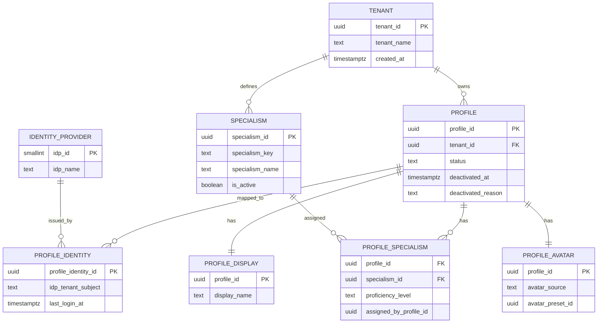
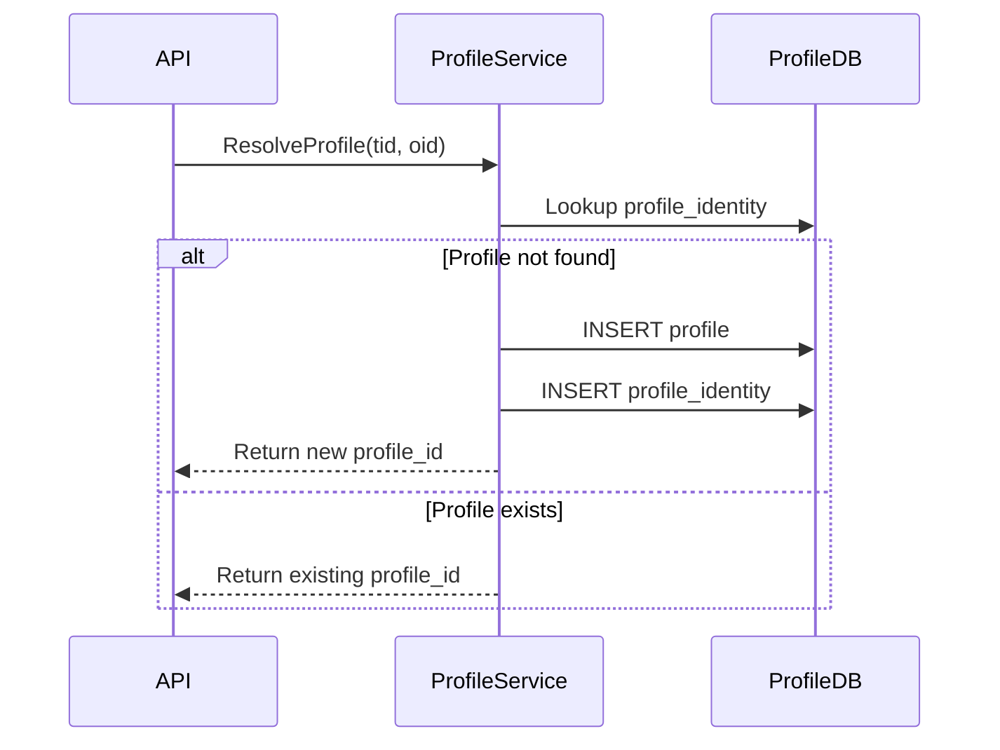
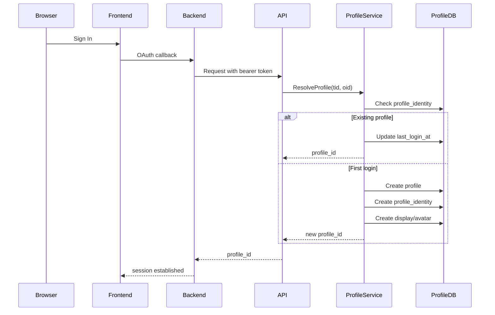

# Profile Service Technical Documentation

**System:** Security Operations Profile Service  
**Architecture:** Multi-tenant, JIT Provisioning  

---

## 1. TENANT

**Purpose:**  
The root entity for multi-tenancy. It ensures logical data isolation between different organizations or IT departments using the SOC extension.

| Attribute | Type | Function / Purpose |
|---|---|---|
| tenant_id | UUID (PK) | Unique identifier for the organization. |
| tenant_name | Text | Human-readable name of the company/department. |
| created_at | Timestamptz | Audit trail for when the tenant was onboarded. |

**Links to**
- PROFILE: One Tenant has many Profiles.
- SPECIALISM: One Tenant defines many Specialisms.

---

## 2. PROFILE

**Purpose:**  
The central identity record within the SOC extension. It represents a "User" but is decoupled from the external Auth provider to allow for internal state management (like deactivation reasons).

| Attribute | Type | Function / Purpose |
|---|---|---|
| profile_id | UUID (PK) | Primary internal reference for the user. |
| tenant_id | UUID (FK) | Links the user to their specific organization. |
| status | Text | Current state (e.g., active, deactivated, pending). |
| deactivated_at | Timestamptz | Recorded time for security offboarding. |
| deactivated_reason | Text | Context for why access was revoked (important for SOC audits). |

**Links to**
- PROFILE_IDENTITY: To map back to Entra ID.
- PROFILE_SPECIALISM: To track the analyst's skills.

---

## 3. IDENTITY_PROVIDER

**Purpose:**  
A lookup table defining valid external authentication sources (e.g., Microsoft Entra ID, Okta).

| Attribute | Type | Function / Purpose |
|---|---|---|
| idp_id | Smallint (PK) | Unique ID for the provider. |
| idp_name | Text | Name of the provider (e.g., "EntraID"). |

**Links to**
- PROFILE_IDENTITY: Provides the context for the external mapping.

---

## 4. PROFILE_IDENTITY

**Purpose:**  
The bridge table that maps a local profile_id to an external IDP user identifier.

| Attribute | Type | Function / Purpose |
|---|---|---|
| profile_identity_id | UUID (PK) | Unique record for this identity mapping. |
| idp_tenant_subject | Text | Composite key from Entra ID (e.g., tid:oid). |
| last_login_at | Timestamptz | Tracks user activity for security monitoring. |

**Links to**
- IDENTITY_PROVIDER: Identifies which service issued the credential.
- PROFILE: Connects the external login to the internal profile.

---

## 5. SPECIALISM

**Purpose:**  
Defines expertise categories available within the SOC (e.g., Malware Analysis).

| Attribute | Type | Function / Purpose |
|---|---|---|
| specialism_id | UUID (PK) | Unique identifier for the skill. |
| specialism_key | Text | Constant slug used in code logic (e.g., tier_3_ir). |
| specialism_name | Text | Display name for the UI (e.g., Incident Response L3). |
| is_active | Boolean | Allows retiring specialisms without deleting historical data. |

**Links to**
- TENANT: Each tenant can define their own skill tree.
- PROFILE_SPECIALISM: Maps skills to analysts.

---

## 6. PROFILE_SPECIALISM

**Purpose:**  
Associative table assigning skills to analysts and tracking proficiency.

| Attribute | Type | Function / Purpose |
|---|---|---|
| profile_id | UUID (FK) | Analyst receiving the skill. |
| specialism_id | UUID (FK) | Skill assigned. |
| proficiency_level | Text | Skill depth (Junior, Senior, Expert). |
| assigned_by_profile_id | UUID (FK) | Lead analyst who verified the skill. |

**Links to**
- PROFILE
- SPECIALISM

---

## 7. PROFILE_DISPLAY & PROFILE_AVATAR

**Purpose:**  
Handles user-facing personalization. These are 1:1 extensions of the Profile to keep the core table slim.

| Table | Attribute | Purpose |
|---|---|---|
| DISPLAY | display_name | Preferred display name in SOC dashboard |
| AVATAR | avatar_source | Indicates preset or uploaded avatar |
| AVATAR | avatar_preset_id | FK to avatar preset gallery |

---

# Profile Database ERD

---

# Sequence Diagram — Profile Resolution

---

# Sequence Diagram — Login and Profile Registration

