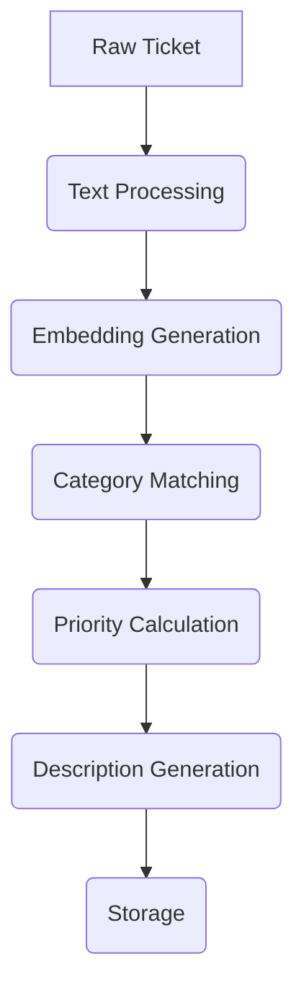
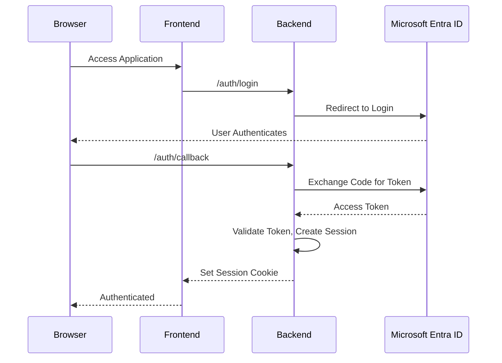

# CompSecOps - Complete System Architecture

## Overview

CompSecOps is a comprehensive security operations platform that combines AI-powered ticket analysis, multi-tenant profile management, and Microsoft Entra ID authentication. The system provides intelligent ticket categorization, user management, and real-time processing capabilities for security operations centers (SOCs).

## System Architecture

### High-Level Architecture

```mermaid
graph TD
    subgraph Frontend SPA
        direction LR
        A[Dashboard]
        B[Ticket Management]
        C[Profile Management]
    end

    subgraph Backend API (FastAPI)
        direction LR
        D[Auth Router]
        E[Profile Router]
        F[Main Router]
    end

    subgraph Service Layer
        direction LR
        G[ProfileSvc]
        H[AI Services]
        I[Auth Service]
    end

    subgraph Repository Layer
        direction LR
        J[ProfileRepository]
        K[AI Cache]
        L[IdentityRepository]
    end

    subgraph External Systems
        direction LR
        M[PostgreSQL]
        N[Microsoft Entra ID]
        O[AI/ML Models]
    end

    Frontend_SPA -- HTTP/JSON API --> Backend_API
    Backend_API -- Uses --> Service_Layer
    Service_Layer -- Uses --> Repository_Layer
    Repository_Layer -- Accesses --> External_Systems
```

## Core Systems

### 1. Frontend Architecture (Vanilla TypeScript SPA)

**Technology Stack:**
- **Language**: TypeScript ES2020 with strict mode
- **Styling**: Tailwind CSS 3.4.10 with custom configuration
- **Build**: Custom npm scripts (no webpack/vite)
- **Development**: Live-server with hot reload

**Component Architecture:**
```
frontend/src/
├── main.ts                 # Application bootstrap
├── app/
│   └── App.ts             # Main app logic and routing
├── pages/                 # Screen components
│   ├── Dashboard.ts       # Overview with statistics
│   ├── ActiveTickets.ts   # Ticket management
│   ├── TicketDetail.ts    # Individual ticket view
│   ├── AccountPage.ts     # User profile
│   ├── Settings.ts        # User preferences
│   └── ClosedTickets.ts   # Historical tickets
├── components/            # Reusable UI components
│   ├── TicketCard.ts      # Ticket display card
│   ├── TicketListContainer.ts # Advanced ticket list with AI
│   └── EllipsisMenu.ts    # Dropdown menu component
└── shared/               # Utilities and types
    ├── auth.ts           # Authentication helpers
    ├── lib/dom.ts        # DOM manipulation utilities
    ├── lib/ticketStatus.ts # Ticket status management
    └── types.ts          # TypeScript interfaces
```

**Key Features:**
- Hash-based client-side routing
- Real-time AI-powered ticket categorization
- Advanced search and filtering
- Responsive design with mobile support
- Performance monitoring throughout

### 2. Backend Architecture (FastAPI)

**Technology Stack:**
- **Framework**: FastAPI with async support
- **Database**: PostgreSQL with async SQLAlchemy
- **Authentication**: Microsoft Entra ID OAuth 2.0
- **AI/ML**: Sentence Transformers, spaCy, scikit-learn
- **Containerization**: Docker for PostgreSQL

**Service Layer Architecture:**
```
backend/app/
├── main.py               # FastAPI application
├── config.py             # Configuration management
├── database.py           # Database connection
├── auth.py               # Authentication logic
├── models/               # SQLAlchemy ORM models
│   └── profile.py        # Multi-tenant profile system
├── schemas/              # Pydantic validation
│   └── profile.py        # Request/response models
├── routers/              # API endpoints
│   ├── auth.py          # Authentication routes
│   └── profiles.py      # Profile management routes
├── services/             # Business logic
│   ├── profile_service.py    # Profile operations
│   └── ai/              # AI processing services
│       ├── processor.py      # Main orchestrator
│       ├── categorizer.py    # AI categorization
│       ├── priority_calculator.py # Priority scoring
│       ├── text_processor.py     # Text preprocessing
│       ├── description_generator.py # AI descriptions
│       ├── embedding_cache.py    # Performance cache
│       ├── category_generator.py # Dynamic categories
│       ├── storage.py           # File I/O
│       └── logging_config.py    # Production logging
├── repositories/         # Data access layer
│   └── profile_repository.py   # Database operations
└── providers/           # External data sources
    └── fake_autotask_provider.py # Mock data source
```

### 3. Database Schema (Multi-Tenant Profile System)

**Core Entities:**
```sql
-- Tenant (Organization)
CREATE TABLE tenant (
    id UUID PRIMARY KEY,
    tenant_name VARCHAR NOT NULL,
    created_at TIMESTAMPTZ DEFAULT NOW()
);

-- User Profile
CREATE TABLE profile (
    profile_id UUID PRIMARY KEY,
    tenant_id UUID REFERENCES tenant(id),
    status VARCHAR NOT NULL, -- active/deactivated/suspended
    created_at TIMESTAMPTZ DEFAULT NOW(),
    updated_at TIMESTAMPTZ DEFAULT NOW()
);

-- External Identity Providers
CREATE TABLE identity_provider (
    id UUID PRIMARY KEY,
    provider_name VARCHAR NOT NULL, -- 'microsoft', 'google', etc.
    is_active BOOLEAN DEFAULT TRUE
);

-- Identity Mappings (Entra ID, etc.)
CREATE TABLE profile_identity (
    profile_id UUID REFERENCES profile(profile_id),
    identity_provider_id UUID REFERENCES identity_provider(id),
    idp_subject VARCHAR NOT NULL,        -- Entra oid
    idp_tenant_subject VARCHAR NOT NULL, -- Entra tid
    last_login TIMESTAMPTZ,
    PRIMARY KEY (profile_id, identity_provider_id)
);

-- Skills/Expertise System
CREATE TABLE specialism (
    id UUID PRIMARY KEY,
    tenant_id UUID REFERENCES tenant(id),
    specialism_key VARCHAR NOT NULL,
    specialism_name VARCHAR NOT NULL,
    description TEXT,
    is_active BOOLEAN DEFAULT TRUE
);

CREATE TABLE profile_specialism (
    profile_id UUID REFERENCES profile(profile_id),
    specialism_id UUID REFERENCES specialism(id),
    proficiency_level VARCHAR NOT NULL, -- beginner/intermediate/expert/master
    assigned_by UUID REFERENCES profile(profile_id),
    assigned_at TIMESTAMPTZ DEFAULT NOW(),
    PRIMARY KEY (profile_id, specialism_id)
);

-- Display Customization
CREATE TABLE profile_display (
    profile_id UUID PRIMARY KEY REFERENCES profile(profile_id),
    display_name VARCHAR
);

CREATE TABLE profile_avatar (
    profile_id UUID PRIMARY KEY REFERENCES profile(profile_id),
    avatar_preset_id UUID,
    custom_avatar_url VARCHAR
);
```

### 4. AI/ML System Architecture

**AI Pipeline:**


**Components:**

1. **Text Processor** (`text_processor.py`):
   - HTML tag removal and normalization
   - Company name detection and extraction
   - Text preprocessing for ML models

2. **Categorizer** (`categorizer.py`):
   - Hybrid keyword + semantic similarity matching
   - Dynamic category generation from ticket data
   - Confidence scoring for predictions

3. **Embedding Cache** (`embedding_cache.py`):
   - LRU cache with TTL for semantic embeddings
   - Sentence Transformer model optimization
   - Performance metrics and statistics

4. **Priority Calculator** (`priority_calculator.py`):
   - Multi-factor priority scoring
   - Keyword-based urgency detection
   - Batch processing optimization

5. **Performance Monitoring**:
   - Operation timing with configurable thresholds
   - Cache hit/miss statistics
   - Request/response performance tracking

**AI Models Used:**
- **Sentence Transformers**: `all-MiniLM-L6-v2` for semantic embeddings
- **spaCy**: English language model for NLP preprocessing
- **scikit-learn**: Machine learning utilities and metrics

### 5. Authentication System (Microsoft Entra ID)

**OAuth 2.0 Flow:**


**Security Features:**
- JWKS-based token signature validation
- CSRF protection with state tokens
- HTTPOnly secure session cookies
- Multi-tenant identity resolution
- Auto-provisioning on first login

**Session Management:**
- JWT-signed session cookies
- Configurable expiration (default: 8 hours)
- Secure cookie attributes (HttpOnly, SameSite=Lax)
- Profile and tenant isolation

### 6. API Architecture

**Endpoint Categories:**

1. **Health & Monitoring**:
   - `GET /health` - System health check
   - `GET /api/cache/stats` - AI cache statistics
   - `POST /api/cache/clear` - Cache management

2. **Authentication**:
   - `GET /auth/login` - Entra OAuth initiation
   - `GET /auth/callback` - OAuth callback handler
   - `GET /api/v1/auth/me` - Current user session
   - `POST /api/v1/auth/logout` - Session termination

3. **Ticket Management**:
   - `GET /api/tickets` - List with AI categorization
   - `GET /api/tickets/{id}` - Individual ticket with AI analysis
   - `GET /api/tickets/stream/categorize` - Real-time processing

4. **Profile Management**:
   - Tenant CRUD operations
   - User profile management with search
   - External identity linking
   - Skills/specialisms management

**API Features:**
- Async request handling throughout
- Automatic session validation
- Multi-tenant data isolation
- Performance monitoring
- Structured error responses

## Development Workflow

### Local Development Setup

1. **Database**: PostgreSQL via Docker Compose
2. **Backend**: FastAPI with auto-reload
3. **Frontend**: Live-server with watch mode
4. **AI Models**: Auto-download on first run

### Build Process

**Frontend**:
```bash
npm run dev    # Development with watch mode
npm run build  # Production compilation
```

**Backend**:
```bash
./run_local.sh        # Development server
alembic upgrade head  # Database migrations
```

### Testing Strategy

- **Backend**: Async testing with pytest
- **Frontend**: Manual testing via browser
- **AI System**: Performance benchmarking
- **Authentication**: OAuth flow validation

## Deployment Considerations

### Production Ready Features

1. **Security**:
   - HTTPS enforcement for cookies
   - Environment-based configuration
   - Secret management for OAuth credentials
   - Database connection pooling

2. **Performance**:
   - AI model caching and optimization
   - Database query optimization
   - Static asset serving
   - CDN integration potential

3. **Monitoring**:
   - Structured logging throughout
   - Performance metrics collection
   - Error tracking and aggregation
   - Health check endpoints

4. **Scalability**:
   - Async/await throughout system
   - Multi-tenant architecture
   - Horizontal scaling ready
   - Caching at multiple layers

## Key Integrations

### Microsoft Entra ID
- Full OAuth 2.0 implementation
- Token validation with JWKS
- User provisioning and profile mapping
- Multi-tenant support

### AI/ML Stack
- Sentence Transformers for embeddings
- spaCy for NLP preprocessing
- Custom hybrid classification
- Performance-optimized caching

### Database
- PostgreSQL with async SQLAlchemy
- Alembic migrations
- Connection pooling
- Multi-tenant data isolation

## Technology Decisions

### Why Vanilla TypeScript (Frontend)
- **Simplicity**: No framework overhead
- **Performance**: Direct DOM manipulation
- **Learning**: Clear understanding of web fundamentals
- **Flexibility**: Custom architecture for specific needs

### Why FastAPI (Backend)
- **Async Support**: High-performance async throughout
- **Type Safety**: Pydantic integration with TypeScript
- **Documentation**: Auto-generated OpenAPI docs
- **Modern Python**: Latest async/await patterns

### Why PostgreSQL
- **ACID Compliance**: Data integrity for multi-tenant system
- **JSON Support**: Flexible schema for ticket data
- **Performance**: Excellent query optimization
- **Ecosystem**: Rich tooling and extensions

This architecture provides a robust, scalable foundation for security operations with advanced AI capabilities, enterprise authentication, and comprehensive user management suitable for production SOC environments.
