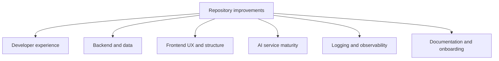

# Things To Improve

## Purpose

This file collects the biggest improvement opportunities currently visible in the repository.

It is not a criticism list. It is a practical backlog for making the system easier to run, safer to extend, and easier for new developers to understand.

Unless noted otherwise, these points are based on the current source code and the documentation work already completed across `backend/app`, `frontend/src`, and `docs/`.

## Improvement Map

## Highest-Value Improvements First

If the team wants the best return for the next wave of work, these are the strongest candidates:

1. add a checked-in backend `.env.example` and tighten environment documentation
2. improve route protection and authorization boundaries around profile-related APIs
3. replace or clearly abstract the fake ticket provider behind a production-ready provider contract
4. separate the AI service's request-time pipeline from its offline/file-processing responsibilities
5. move logging toward a more structured and queryable observability model

## Developer Experience

### Add a real backend `.env.example`

Why it matters:

- new developers still have to infer required variables from code and docs
- auth and local startup become harder than they need to be

Suggested improvement:

- add `backend/.env.example`
- include safe placeholders for Entra, database, session, and frontend URL settings
- keep `docs/getting-started/environment.md` as the explanation layer

### Make startup more self-checking

Why it matters:

- the app has several moving parts: PostgreSQL, backend dependencies, frontend dependencies, migrations, and Entra config

Suggested improvement:

- add lightweight startup validation scripts or health checks
- surface missing config more clearly at boot time
- consider a single developer bootstrap script for first-time setup

### Add clearer local test and verification paths

Why it matters:

- a new developer benefits from knowing what to run after making changes

Suggested improvement:

- document and standardize backend tests, frontend checks, and quick smoke tests
- if tests are missing in an area, treat that as a gap and fill it gradually

## Backend And Data Layer

### Strengthen authorization around profile routes

Verified concern:

- the profile domain is well structured, but route protection and authorization boundaries still deserve tightening

Why it matters:

- profile, tenant, and specialism data are sensitive enough to need explicit access rules

Suggested improvement:

- require authenticated access where appropriate
- define who can read or mutate which tenant-scoped records
- document the authorization model once implemented

### Improve transaction consistency

Verified concern:

- some repository operations commit directly, which can make transaction boundaries more granular than the request lifecycle suggests

Why it matters:

- multi-step operations become harder to reason about and rollback cleanly

Suggested improvement:

- standardize commit strategy
- decide whether transactions should be repository-owned or request/service-owned

### Add more explicit domain constraints and lifecycle handling

Why it matters:

- profile lifecycle and assignment logic are important business rules

Suggested improvement:

- tighten tenant-consistency checks
- formalize profile deactivation/reactivation behavior
- consider audit-style event recording for identity and profile changes

## Ticket Provider Layer

### Replace the fake provider or formalize the abstraction

Verified current reality:

- ticket data still comes from a fake local JSON-backed provider

Why it matters:

- the app architecture suggests an external integration, but the current source is still simulation data

Suggested improvement:

- either implement a real provider
- or make the abstraction more explicit so fake/local/demo modes are first-class and documented clearly

### Improve provider error handling and resilience

Why it matters:

- external provider work eventually needs retries, paging, timeouts, and clearer failure reporting

Suggested improvement:

- design provider interfaces around error states as well as success paths
- log fetch failures in a structured way

## AI Service

### Separate online inference from offline processing

Verified concern:

- the AI service currently mixes API-time enrichment with file-processing and offline-style responsibilities

Why it matters:

- this makes the service harder to understand, test, and deploy cleanly

Suggested improvement:

- split request-time inference modules from offline jobs or scripts
- keep the runtime API path lean and easy to reason about

### Improve portability and configuration

Verified concern:

- parts of AI configuration still reflect prototype-style path handling

Why it matters:

- environment portability suffers, especially across developer machines and operating systems

Suggested improvement:

- replace hard-coded path assumptions with environment-driven or repository-relative config

### Add evaluation and quality measurement

Why it matters:

- the AI system currently produces useful outputs, but quality is hard to measure formally

Suggested improvement:

- create labeled evaluation samples
- add repeatable checks for category quality, priority usefulness, and generated descriptions
- track regressions when models or rules change

### Make the architecture more honest about heuristics vs model use

Why it matters:

- new developers often assume "AI service" means everything is model-driven

Suggested improvement:

- keep naming and docs explicit about which parts are heuristic, which are semantic similarity, and which are template-based

## Logging And Observability

### Move beyond fragmented local logging

Verified current reality:

- logging is currently split across backend console logs, AI rotating-file logs, browser console output, and in-memory AI metrics

Why it matters:

- debugging across services and requests is harder than it should be

Suggested improvement:

- standardize log event shape
- add request or correlation IDs
- define which events should be durable and queryable

### Consider durable structured event storage

Why it matters:

- local log files are useful during development, but they are weak as a long-term operational record

Suggested improvement:

- introduce a database-backed event or application-log model for high-value events
- keep console output for local feedback, but not as the only durable history

## Frontend

### Finish or clearly mark placeholder screens

Verified current reality:

- some frontend screens such as Settings and Closed Tickets are still placeholder or demo-level

Why it matters:

- unfinished screens can confuse developers and users about what the product actually supports

Suggested improvement:

- either complete those flows
- or label them clearly in code and docs as planned/not-yet-implemented areas

### Improve frontend configuration clarity

Why it matters:

- frontend/backend coupling is important for auth and API requests

Suggested improvement:

- make API base URL handling more explicit and consistent
- document local vs deployed assumptions cleanly

### Add stronger UX around auth and failure states

Why it matters:

- auth-driven apps feel brittle when errors collapse into generic states

Suggested improvement:

- improve signed-out, expired-session, and backend-unavailable messaging
- make recovery paths more obvious in the UI

## Documentation And Onboarding

### Keep docs source-first and avoid drift

Why it matters:

- this repo already had older docs that diverged from reality

Suggested improvement:

- continue treating code as the main source of truth
- update docs whenever a service changes materially
- mark future-state ideas clearly instead of mixing them into current-state docs

### Add a lightweight docs index later

Why it matters:

- the docs structure is much better now, but an entry page would make navigation easier

Suggested improvement:

- consider a `docs/index.md` or README-style docs landing page linking getting-started, architecture, services, and runbooks

## Suggested Delivery Order

## Final Note

The important thing is not to "perfect" everything at once.

The repository already has a solid shape in several places, especially around service separation and documentation direction. The next wins come from tightening the rough edges that still reflect prototype-stage decisions, then documenting those improvements clearly as they land.
