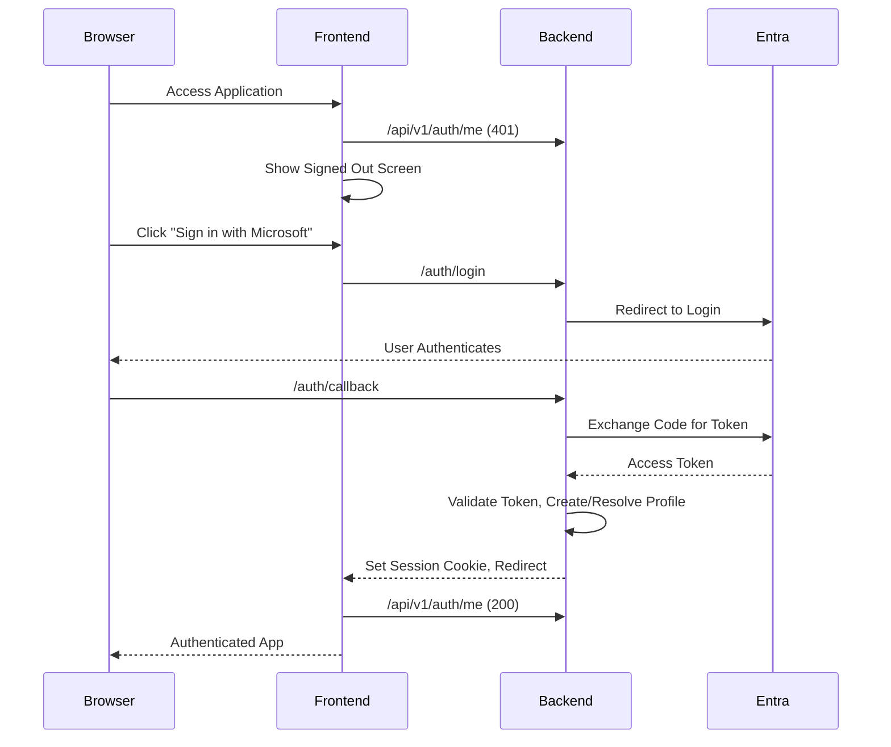

# Entra Profile Service Integration

This document explains the local Microsoft Entra ID integration that was added to the profile service and UI, how it works, what is stored, and how to maintain or extend it later.

## Goal

The objective was to add first-time authentication to the existing profile service without turning the system into a store of company user data.

The implemented design therefore does this:

- Microsoft Entra ID handles sign-in.
- The backend validates the Entra identity.
- The backend resolves a local profile using `tid + oid`.
- A local profile is auto-provisioned on first login.
- The UI trusts only the backend session cookie.

The design intentionally avoids copying broad directory data into the app.

## What data is stored

The current implementation stores only the minimum needed to resolve the user locally:

- Entra tenant ID `tid`
- Entra object ID `oid`
- A local `profile_id`
- A local internal `tenant_id`
- Display name
- Last login timestamp

It does not intentionally pull or persist:

- Company phone numbers
- Company addresses
- Employee directory records
- Additional profile claims beyond what is needed for login and display

## Current local tenant mapping

There are two different tenant concepts:

1. Microsoft Entra tenant
2. Internal app tenant row in the database

The implementation currently uses one internal app tenant row:

- Internal tenant name: `profile-service-test`

On first login, if this internal tenant row does not exist, the backend creates it automatically.

## Implemented auth flow

The current flow is backend-led OAuth/OIDC.

### Sequence

## Files changed

### Backend

- `backend/app/auth.py`: Authentication helpers for Entra OIDC, token validation, and signed session cookies.
- `backend/app/routers/auth.py`: Routes for `/auth/login`, `/auth/callback`, `/api/v1/auth/me`, and `/api/v1/auth/logout`.
- `backend/app/services/profile_service.py`: Added `resolve_entra_profile(...)` to find or auto-provision a local profile from Entra claims.
- `backend/app/repositories/profile_repository.py`: Added tenant lookup by name and get-or-create identity provider support.
- `backend/app/main.py`: Registered auth routes and protected ticket endpoints using the backend session.
- `backend/app/config.py`: Added Entra and session-related settings.
- `backend/.env.example`: Template for required local backend environment variables.
- `backend/.env`: Local runtime values for this test tenant.
- `backend/run_local.sh`: Helper script to start the local backend server without reload mode, which avoids local watcher issues with `.venv` and large model files.

### Frontend

- `frontend/src/shared/auth.ts`: Frontend session helpers and backend auth endpoint wrappers.
- `frontend/src/main.ts`: Bootstraps the app by checking the backend session first and surfaces a visible startup message if the backend is unavailable.
- `frontend/src/App.ts`: Adds the signed-out screen, sign-in button, sign-out control, and backend-unavailable startup warning.
- `frontend/src/pages/AccountPage.ts`: Shows local identity-linking information rather than mock personal/company data.
- `frontend/src/pages/Dashboard.ts`: Sends requests with session cookies.
- `frontend/src/components/TicketListContainer.ts`: Sends requests with session cookies.
- `frontend/run_local.sh`: Helper script to start the local frontend dev server.

## Auth endpoints

### `GET /auth/login`

Starts the Entra authorization code flow.

### `GET /auth/callback`

Handles the Entra redirect, exchanges the authorization code, validates the ID token, resolves or provisions the local profile, and sets the session cookie.

### `GET /api/v1/auth/me`

Returns:

- current backend session
- resolved local profile

If no session exists, it returns `401`.

### `POST /api/v1/auth/logout`

Clears the session cookie.

## Protected routes

The following app endpoints now require a valid backend session cookie:

- `GET /api/tickets`
- `GET /api/tickets/{autotask_ticket_id}`
- `GET /api/tickets/stream/categorize`

## Session model

The browser does not store Entra tokens directly in frontend code.

Instead, the backend creates a signed cookie containing:

- `profile_id`
- `tenant_id`
- `entra_tenant_id`
- `object_id`
- `display_name`
- `issuer`
- `iat`
- `exp`

Cookie properties:

- `HttpOnly`
- `SameSite=Lax`
- `Secure=False` for local HTTP development

For production, `Secure` should be enabled and HTTPS should be mandatory.

## Entra configuration used

Current local assumptions:

- App type: `Web`
- Tenant ID: `24e92e30-83bf-4d0e-8a69-3a7b71901db6`
- Client ID: `52b091e9-0fd8-47d7-9e82-9f140281fe55`
- Redirect URI: `http://localhost:8000/auth/callback`
- Frontend URL after login: `http://localhost:5173`

Why `Web` was used:

- The backend performs the authorization-code exchange.
- The backend uses the client secret.
- The frontend stays simple and only consumes the backend session.

## Why this design was chosen

This is the correct fit for the current repo because:

- there was no existing frontend auth library or SPA OIDC setup
- there was no existing backend auth middleware
- the backend already had profile identity tables
- the user wanted the profile service to avoid storing broader company data

## Local verification completed

The following were verified locally during implementation:

- frontend dependencies installed
- backend dependencies installed with CPU-only torch
- spaCy English model installed
- PostgreSQL container started
- Alembic migrations applied
- backend started on `localhost:8000`
- frontend started on `localhost:5173`
- `GET /health` returned `200 OK`
- `GET /api/v1/auth/me` returned `401` before login
- `GET /api/tickets` returned `401` before login
- `GET /auth/login` returned a valid `302` redirect to Microsoft Entra

What was not fully automated:

- A real end-to-end browser sign-in through Entra, because that requires an interactive browser session with your tenant account.

## Troubleshooting

### Problem: Entra login redirects but callback fails

Check:

- `backend/.env` values are correct.
- Entra redirect URI in the Azure portal is set to `http://localhost:8000/auth/callback`.
- The backend logs (`./run_local.sh`) for any error messages from the `authlib` library.
- The system time on your machine is correct, as token validation is time-sensitive.

### Problem: frontend stays on sign-in screen after login

Check:

- The browser was redirected back to `http://localhost:5173`.
- The `secops_session` cookie is present in your browser's developer tools for the `localhost:5173` site.
- The `GET /api/v1/auth/me` call in the browser's network tab returns a `200 OK` status with the user's profile data. A `401` indicates a session issue.
- The frontend and backend are running on the correct ports (`5173` and `8000` respectively).

### Problem: backend starts slowly

Reason:

- The sentence-transformer model loading happens on startup. This is expected on the first run as `all-MiniLM-L6-v2` may need to be downloaded from Hugging Face. Subsequent startups will be faster.

### Problem: the browser shows a white screen

Most likely causes:

- the backend is not running
- the backend is still starting its model downloads
- PostgreSQL is not running

Current local behavior:

- the frontend waits up to 5 seconds for `GET /api/v1/auth/me`
- if the backend still does not respond, the UI now renders a visible startup warning instead of hanging indefinitely

Recommended run order:

1. `cd backend && docker compose up -d`
2. `cd backend && ./run_local.sh`
3. wait for backend startup to finish
4. `cd frontend && ./run_local.sh`
5. open `http://localhost:5173`

### Problem: ticket endpoints fail after login with a 500 error

Check:

- Backend logs for AI model loading failures. The AI service might have failed to initialize.
- Internet access is available for the initial Hugging Face model download.
- The local Python environment is active and all dependencies from `requirements.txt` are installed.
- The `SPACY_MODEL` environment variable is set correctly in `backend/.env`.

## Security follow-up

The Entra client secret used during setup should be rotated after testing, because it was shared interactively during implementation.

After rotation:

1. Update `ENTRA_CLIENT_SECRET` in `backend/.env`
2. Restart the backend

## Recommended future improvements

- Add production-only HTTPS cookie settings.
- Add a real persistent internal mapping table between Entra tenant IDs and internal tenant rows.
- Add audit logs for authentication and provisioning events.
- Add backend tests for `/auth/callback`, `/api/v1/auth/me`, and profile auto-provisioning.
- Add a lightweight health endpoint for the Entra config and model readiness.
- Move secrets into a proper secret manager instead of a local `.env`.
