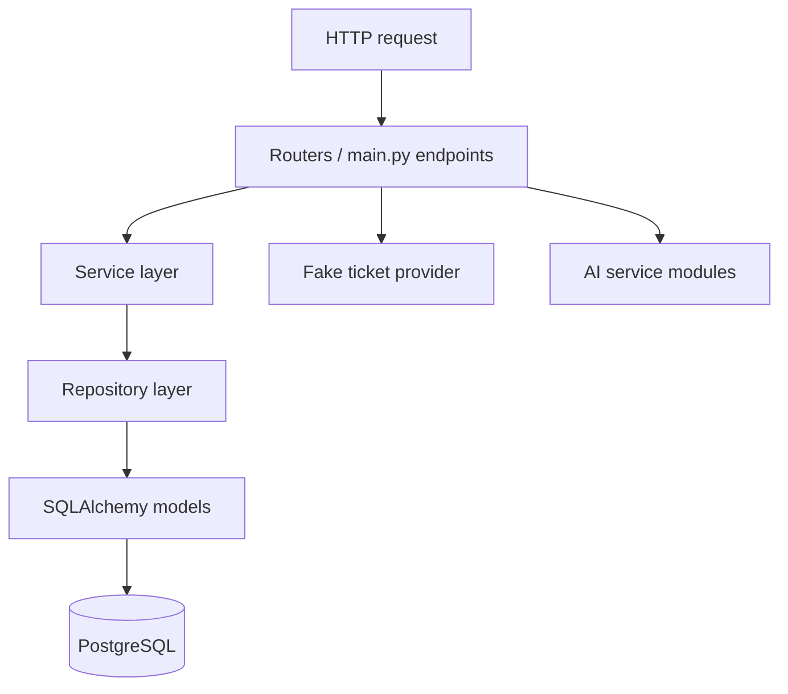
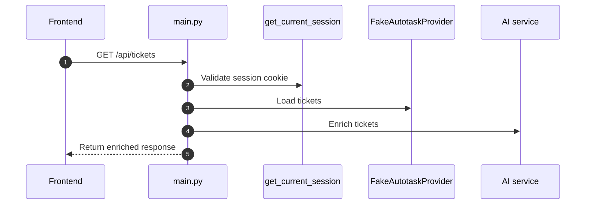
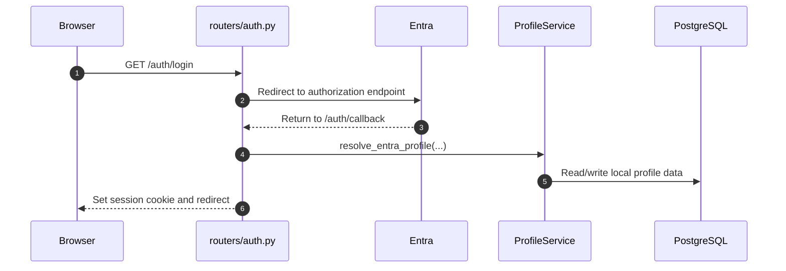

# Backend Overview

## Purpose

This document explains how the backend is structured and how requests move through it.

It is based on the current backend code in:

- `backend/app/main.py`
- `backend/app/config.py`
- `backend/app/database.py`
- `backend/app/auth.py`
- `backend/app/routers/**`
- `backend/app/services/**`
- `backend/app/repositories/**`
- `backend/app/models/**`

## Backend In One Sentence

The backend is a FastAPI application that handles auth, profile persistence, ticket delivery, and AI enrichment before returning data to the frontend.

## Layered Structure

## Main Backend Modules

### `main.py`

Responsibilities:

- creates the FastAPI app
- configures CORS and lifespan behavior
- registers routers
- exposes top-level health, cache, category, and ticket endpoints
- coordinates ticket provider access and AI enrichment

Key endpoints defined directly here:

- `GET /health`
- `GET /api/cache/stats`
- `POST /api/cache/clear`
- `GET /api/categories`
- `GET /api/tickets`
- `GET /api/tickets/{autotask_ticket_id}`
- `GET /api/tickets/stream/categorize`

### `config.py`

Responsibilities:

- loads environment-driven backend settings
- defines database, auth, session, Entra, and CORS configuration

### `database.py`

Responsibilities:

- creates the async SQLAlchemy engine
- provides request-scoped DB sessions
- defines the shared declarative `Base`
- closes DB connections on shutdown

### `auth.py`

Responsibilities:

- Entra OpenID configuration loading
- JWKS loading and token validation
- authorization URL generation
- session-token creation and decoding
- cookie settings
- current-session dependency

### `routers/auth.py`

Responsibilities:

- start login flow
- handle Entra callback
- return current authenticated user
- clear session on logout

### `routers/profiles.py`

Responsibilities:

- expose tenant, profile, identity-linking, and specialism endpoints

### `services/profile_service.py`

Responsibilities:

- implement profile-domain business logic
- resolve/provision local profiles during auth flow

### `services/ai/**`

Responsibilities:

- enrich ticket text with category, priority, and explanation data

### `providers/fake_autotask.py`

Responsibilities:

- load tickets from local JSON
- cache them in memory

## Request Paths

### Ticket request path

### Auth request path

## Backend Boundaries

### What the backend owns

- auth/session handling
- tenant/profile persistence
- ticket retrieval
- AI enrichment
- API response shaping

### What the backend does not delegate to the frontend

- session validation
- profile provisioning
- ticket categorization
- priority scoring

## Data Sources

### PostgreSQL

Used for:

- profile, tenant, identity, avatar, and specialism data

### Local JSON ticket source

Used for:

- fake ticket-provider data

### Entra ID

Used for:

- external identity validation and sign-in

## Strengths

Visible in the current structure:

- backend responsibilities are clearly broader than frontend responsibilities
- profile logic is layered into router, service, repository, and model levels
- AI functionality is modular
- request-time ticket enrichment is implemented server-side

## Weaknesses And Gaps

Also visible in the current code:

- some top-level ticket endpoints are defined directly in `main.py` rather than a dedicated router
- the fake provider may blur the architectural picture if mistaken for a real external integration
- logging is not fully unified across all backend subsystems
- some profile routes are not currently protected at the router layer
