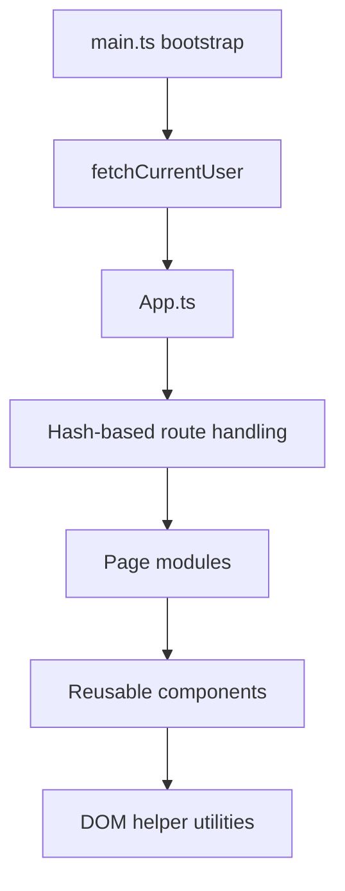
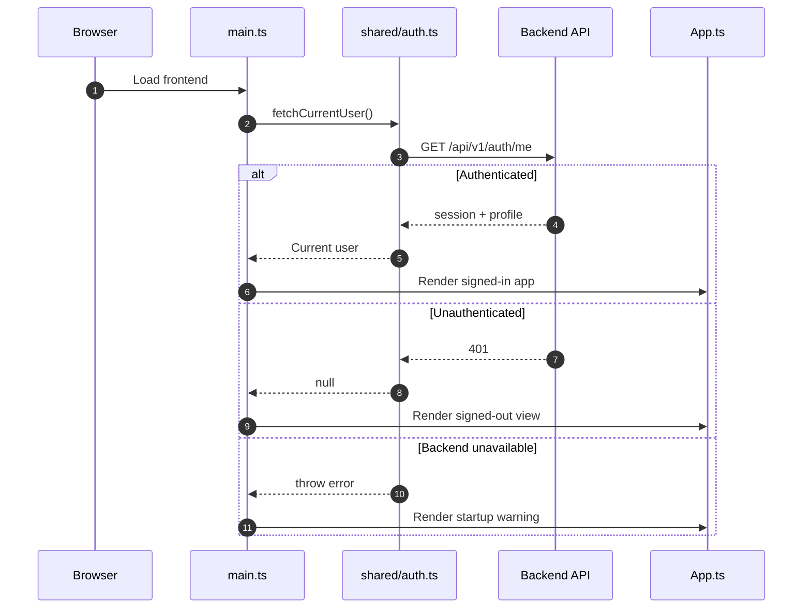
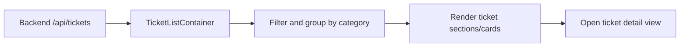

# Frontend Overview

## Purpose

This document explains how the frontend is structured, how navigation works, and how it depends on the backend.

It is based on the current frontend code in:

- `frontend/src/main.ts`
- `frontend/src/App.ts`
- `frontend/src/pages/**`
- `frontend/src/components/**`
- `frontend/src/shared/**`

## Frontend In One Sentence

The frontend is a vanilla TypeScript single-page application that checks backend auth state on startup, uses hash-based routing, and renders AI-enriched ticket data returned by the backend.

## Frontend Architecture Diagram

## Startup Flow

The frontend boot process is simple and important.

### What happens

1. `main.ts` finds the `#app` root
2. `main.ts` calls `fetchCurrentUser()`
3. if the backend returns a current user, the app renders the signed-in shell
4. if the backend returns `401`, the app renders the signed-out view
5. if the backend is unreachable, the app renders a startup warning

### Startup sequence

## Routing Model

The frontend uses hash-based routing defined in `App.ts`.

Supported route states:

- `dashboard`
- `active-tickets`
- `closed-tickets`
- `settings`
- `account`
- `ticket`

Important routing detail:

- a ticket detail route cannot be fully restored from URL alone
- `parseHash()` redirects `#/ticket/...` back to active tickets unless in-memory route state still exists

That means the current routing model is lightweight and practical, but not fully URL-restorable for ticket detail screens.

## Main Frontend Modules

### `main.ts`

Responsibilities:

- bootstrap the app
- perform initial auth-state fetch
- show a useful failure message if backend bootstrap fails

### `App.ts`

Responsibilities:

- define route types
- parse and set URL hashes
- render signed-out and signed-in shells
- coordinate top-level page rendering
- manage route transitions

### `shared/auth.ts`

Responsibilities:

- define auth-related frontend types
- call `/api/v1/auth/me`
- start backend-led sign-in via `/auth/login`
- call logout endpoint

Important architectural note:

- the frontend does not validate identity tokens itself
- it relies on the backend session cookie model

### `pages/`

Current page modules:

- `Dashboard.ts`
- `ActiveTickets.ts`
- `TicketDetail.ts`
- `AccountPage.ts`
- `Settings.ts`
- `ClosedTickets.ts`

### `components/`

Current reusable components:

- `TicketListContainer.ts`
- `EllipsisMenu.ts`
- `TicketCard.ts`

### `shared/lib/dom.ts`

Responsibility:

- helper for creating DOM elements consistently without a frontend framework

## Current Page Responsibilities

### Dashboard

- fetches tickets
- computes summary statistics
- renders critical-ticket summary cards

### Active Tickets

- delegates to `TicketListContainer`

### Ticket Detail

- renders detailed information for one selected ticket

### Account

- shows current user profile/session information

### Settings

- currently behaves more like a placeholder/demo UI for specialisations

### Closed Tickets

- currently placeholder content

## Backend Integration Pattern

The frontend depends on the backend for:

- current-user state
- sign-in entry point
- logout
- ticket data

It does not:

- store its own auth tokens in JavaScript
- perform AI inference locally
- own business persistence

## Data Flow To The Ticket UI

## Frontend Strengths

Visible from the current implementation:

- simple startup flow
- clear separation between top-level app shell, pages, and shared helpers
- no heavy frontend framework complexity
- backend remains the single source of truth for auth and AI-enriched data

## Frontend Weaknesses And Gaps

Also visible from the current code:

- some route state is not fully recoverable from URL alone
- `Settings` and `ClosedTickets` are not fully implemented product features
- a lot of performance/debug logging exists directly inside page/component modules
- the app relies on a fixed backend base URL in `shared/auth.ts`
