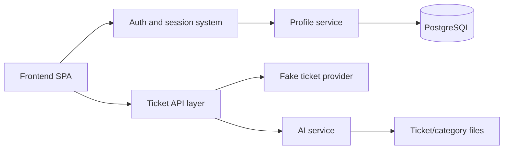

# Service Boundaries

## Purpose

This document explains where responsibilities begin and end across the major systems in the repository.

It is meant to answer questions like:

- which layer should own this behavior?
- should this logic live in the frontend or backend?
- which backend service is responsible for this workflow?

## Boundary Map

## Core Principle

The architecture generally follows this rule:

- the frontend presents and navigates
- the backend decides, validates, persists, and enriches

That principle is not perfect everywhere, but it is the main design line in the current code.

## Frontend Boundary

Owned by the frontend:

- app bootstrap
- signed-in vs signed-out rendering
- hash-based navigation
- page rendering
- client-side filtering and grouping of ticket results for display

Not owned by the frontend:

- authentication validation
- session creation
- profile provisioning
- ticket categorization
- priority scoring
- persistence

## Auth Boundary

Owned by auth/session system:

- start Entra login flow
- validate OpenID/JWKS-backed identity
- create and decode backend session cookies
- expose current session to backend routes

Depends on:

- profile service to resolve the external identity into a local application profile

Does not own:

- tenant/profile CRUD rules
- ticket enrichment

## Profile Service Boundary

Owned by profile service:

- tenants
- profiles
- external identity mappings
- avatar metadata
- specialism definitions and assignments
- local-profile resolution during auth flow

Does not own:

- session token mechanics
- ticket retrieval
- AI categorization

## Ticket Provider Boundary

Owned by provider:

- loading ticket records from the current source
- caching those raw ticket records in memory

Current provider reality:

- it is a fake local JSON-backed provider

Does not own:

- auth
- persistence of profile data
- AI enrichment decisions
- frontend formatting

## AI Service Boundary

Owned by AI service:

- text preprocessing
- category prediction
- priority scoring
- explanation generation
- embedding cache
- optional offline-style category generation and file storage helpers

Does not own:

- session auth
- user profile management
- browser rendering
- raw ticket-source ownership

## Backend API Layer Boundary

Owned by the API layer in `main.py` and routers:

- route definitions
- dependency wiring
- response shaping
- orchestration between auth, provider, profile, and AI services

Important current design choice:

- some ticket endpoints live directly in `main.py` rather than a dedicated ticket router

## Boundary Examples

### Example: user signs in

Owned by:

- auth validates identity
- profile service resolves/provisions local profile
- frontend only initiates the sign-in flow and reacts to the result

### Example: tickets need categories

Owned by:

- backend ticket API route
- fake provider for raw ticket loading
- AI service for categorization and priority

Not owned by:

- frontend

### Example: account page shows user information

Owned by:

- backend auth/profile path for returning current user data
- frontend for presentation only

## Current Boundary Risks

Visible from the current code:

- the fake provider may blur the distinction between "provider interface" and "real integration"
- some prototype-style AI file workflows sit near the same AI modules used for request-time inference
- some profile routes are not router-protected by auth yet, which weakens the practical boundary between "available service" and "allowed operation"
- frontend placeholder pages can make product boundaries look more complete than they are

## Recommended Rule Of Thumb For Contributors

When deciding where new logic should go:

1. if it changes how data is interpreted, persisted, or authorized, it probably belongs in the backend
2. if it changes only how data is presented or navigated, it probably belongs in the frontend
3. if it explains ticket meaning or urgency, it probably belongs in the AI service
4. if it maps external identity to internal people/tenants, it probably belongs in the profile/auth boundary
