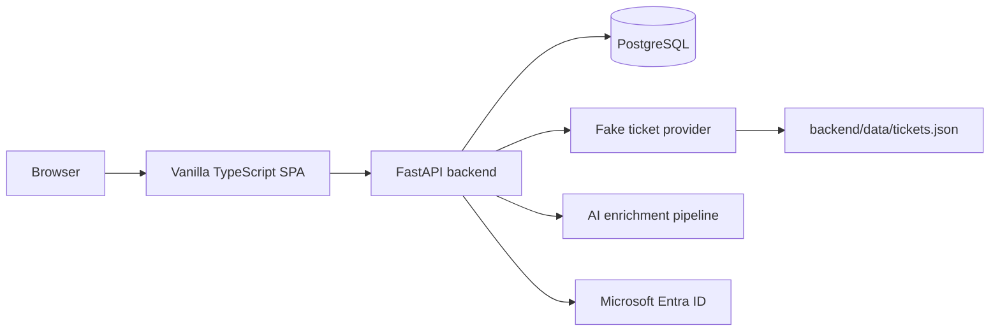
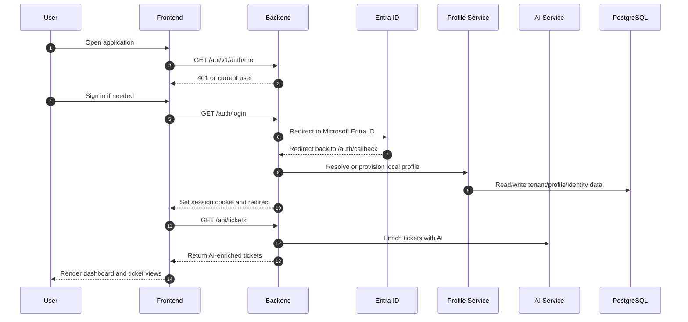

# System Overview

## Purpose

This document explains the system at the highest level so a new developer can understand what this repository is, what its main moving parts are, and how those parts interact.

It is based on the current source code, especially:

- `backend/app/**`
- `frontend/src/**`

Historical docs were used only as background reference.

## What This Repository Is

This repository contains a full-stack application with:

- a FastAPI backend
- a vanilla TypeScript frontend
- a PostgreSQL-backed profile/auth domain
- an AI-assisted ticket-enrichment pipeline
- a fake local ticket provider used in place of a real Autotask integration

## System In One Sentence

The frontend shows ticket and account views, the backend handles auth and data access, and the backend AI pipeline enriches tickets with categories and priority information before the frontend renders them.

## Top-Level Architecture

## Main Systems

### 1. Frontend SPA

Location:

- `frontend/src`

Responsibility:

- bootstraps the browser app
- checks current authenticated user
- presents signed-out or signed-in states
- renders dashboard, ticket list/detail, account, settings, and closed-tickets pages
- fetches AI-enriched ticket data from the backend

Important architectural boundary:

- the frontend does not do AI categorization itself

### 2. Backend API

Location:

- `backend/app/main.py`
- `backend/app/routers/**`

Responsibility:

- hosts the FastAPI app
- exposes health, auth, profile, cache, category, and ticket endpoints
- manages CORS and application lifespan
- coordinates provider access and AI enrichment for ticket endpoints

### 3. Authentication And Session System

Location:

- `backend/app/auth.py`
- `backend/app/routers/auth.py`
- `frontend/src/shared/auth.ts`

Responsibility:

- performs Microsoft Entra ID sign-in
- validates identity
- resolves that identity into a local profile
- creates and validates backend session cookies

Important architectural note:

- the current implementation uses a backend-led Entra flow, not a frontend bearer-token architecture

### 4. Profile And Tenant System

Location:

- `backend/app/models/profile.py`
- `backend/app/services/profile_service.py`
- `backend/app/repositories/profile_repository.py`
- `backend/app/routers/profiles.py`

Responsibility:

- stores tenants, profiles, identity mappings, avatar settings, and specialisms
- provides CRUD-style tenant/profile/specialism operations
- supports auth-time profile resolution and first-login provisioning

### 5. Ticket Source Provider

Location:

- `backend/app/providers/fake_autotask.py`

Responsibility:

- loads ticket data from local JSON
- caches ticket objects in memory
- gives ticket data to the backend ticket API

Important architectural note:

- this is currently a fake/simulated provider, not a real external Autotask integration

### 6. AI Ticket Enrichment System

Location:

- `backend/app/services/ai/**`

Responsibility:

- preprocesses ticket text
- predicts categories
- calculates priority
- generates explanation/remediation text
- caches embeddings
- supports batch and single-ticket enrichment

## Main User-Facing Flow

This is the core path a developer should understand first.

## External Dependencies

### PostgreSQL

Used for:

- tenant/profile/auth domain data

### Microsoft Entra ID

Used for:

- sign-in and external identity validation

### Sentence-transformers and spaCy

Used for:

- AI ticket enrichment

### Local ticket JSON data

Used for:

- fake provider ticket source

## What Is Real Vs Prototype-Like

### More production-like

- backend API structure
- profile/auth domain modeling
- session-cookie auth flow
- modular AI service structure

### More prototype-like

- fake ticket provider
- some frontend screens such as `Settings` and `ClosedTickets`
- parts of AI file storage/configuration
- mixed logging and observability strategy

## System Strengths

Visible from the current code:

- clean separation between frontend and backend
- backend owns auth, AI, and persistence responsibilities
- profile service has a clear domain model
- AI logic is modular rather than hidden in one large file

## System Risks And Gaps

Also visible from the current code:

- some docs elsewhere in the repo are older than the implementation
- fake provider may be mistaken for a real integration if not documented clearly
- not all frontend screens are equally complete
- protected ticket flows depend on Entra being configured correctly
- some offline/prototype AI file paths are environment-specific
