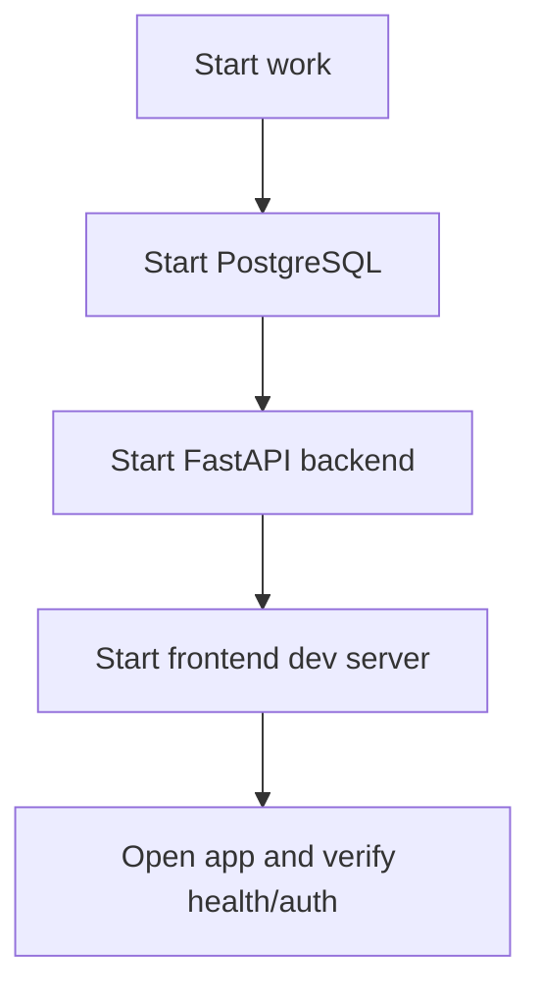

# Daily Run

## Purpose

This guide is for the normal day-to-day development loop after first-time setup is complete.

Use this if:

- you already installed dependencies
- your backend `.env` is already prepared
- you just want to get the stack running and start working

If you are setting up a machine for the first time, use:

- [first-time-setup.md](docs/getting-started/first-time-setup.md)

## Daily Startup Order

Start things in this order:

1. PostgreSQL
2. backend
3. frontend
4. browser verification

## Daily Run Diagram



## Step 1: Start PostgreSQL

From the repository root:

```bash
cd backend
docker compose -f compose.yml up -d
```

Quick check:

```bash
docker compose -f compose.yml ps
```

## Step 2: Start The Backend

From the backend directory:

```bash
python run_local.py
```

What this script does:

- ensures `backend/.venv` exists
- uses the virtual environment
- starts the PostgreSQL containers
- applies core and logs Alembic migrations
- starts Uvicorn on port `8000`

Quick health check in another terminal:

```bash
curl http://localhost:8000/health
```

Expected result:

```json
{"ok": true}
```

## Step 3: Start The Frontend

From the frontend directory:

```bash
python run_local.py
```

What this does:

- ensures `frontend/.venv` exists
- checks that `node_modules` exists
- starts the TypeScript watcher
- starts the Tailwind watcher
- starts the live dev server on `http://localhost:5173`

## Step 4: Verify The App

Open:

- `http://localhost:5173`

Expected behavior:

- if backend is reachable, the app boots normally
- if backend is unreachable, the app shows a visible startup warning

## Daily Smoke Checklist

Use this checklist each time you start work:

1. database container is running
2. backend `/health` returns `{"ok": true}`
3. frontend opens at `http://localhost:5173`
4. sign-in works if you need authenticated flows
5. dashboard loads
6. active tickets load

## Typical Daily Terminal Layout

- terminal 1: PostgreSQL
- terminal 2: backend
- terminal 3: frontend

Example:

- terminal 1: `cd backend && docker compose -f compose.yml up -d`
- terminal 2: `cd backend && python run_local.py`
- terminal 3: `cd frontend && python run_local.py`

## Quick Notes For Everyday Work

### If you are wondering whether to run migrations today

Usually, no.

Use `alembic upgrade head` only when:

- you are setting up the project on a machine for the first time
- someone has pulled schema changes and new Alembic migration files
- your local database was reset, deleted, or recreated

You do not need to run migrations as part of every normal daily startup.

### If the frontend says the backend did not respond

Check:

- backend terminal
- `curl http://localhost:8000/health`

### If sign-in is failing

Check:

- your backend `.env`
- Entra redirect URI and credentials
- whether your local database schema has been created with `alembic upgrade head`

### If tickets are slow

Remember:

- the AI service may still be warming up models
- batch mode is the default for `/api/tickets`

## Stop Everything

### Stop frontend

- `Ctrl+C` in the frontend terminal

### Stop backend

- `Ctrl+C` in the backend terminal

### Stop database

From the backend directory:

```bash
docker compose -f compose.yml down
```

## Related Docs

- [environment.md](docs/getting-started/environment.md)
- [runbooks troubleshooting](docs/runbooks/troubleshooting.md)
