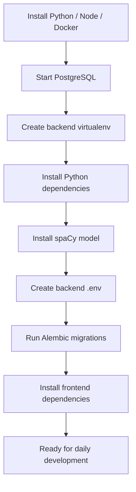

# First-Time Setup

## Purpose

This guide is for the first time you set up the repository on a machine.

It focuses on one-off setup work:

- installing dependencies
- preparing local services
- creating the backend Python environment
- installing required AI/NLP extras
- applying the database schema

If you have already done that once and only want to start the app today, use:

- [daily-run.md](/home/liam/Documents/GitHub/comp2003-2025-2026-team-3/docs/getting-started/daily-run.md)

If you need to understand environment variables, use:

- [environment.md](/home/liam/Documents/GitHub/comp2003-2025-2026-team-3/docs/getting-started/environment.md)

## Source Of Truth

This setup guide is based on:

- `backend/run_local.sh`
- `frontend/run_local.sh`
- `backend/compose.yml`
- `backend/requirements.txt`
- `backend/app/config.py`
- `frontend/package.json`

## What You Need Installed First

Make sure your machine has:

- Python 3 available as `python3`
- Node.js and npm
- Docker with Compose support

## Setup Overview



## Step 1: Start PostgreSQL

From the repository root:

```bash
cd backend
docker compose -f compose.yml up -d
```

What this gives you:

- PostgreSQL on port `5432`
- user `postgres`
- password `password`
- database `mydb`

These defaults come from:

- `backend/compose.yml`

## Step 2: Create The Backend Virtual Environment

From the backend directory:

```bash
cd backend
python3 -m venv .venv
source .venv/bin/activate
```

## Step 3: Install Backend Dependencies

From the backend directory with the virtual environment active:

```bash
pip install -r requirements.txt
```

This installs:

- FastAPI and Uvicorn
- SQLAlchemy and asyncpg
- sentence-transformers
- spaCy
- scikit-learn
- auth and settings libraries

## Step 4: Install The spaCy Language Model

The AI text processor expects the English spaCy model `en_core_web_sm`.

Install it with:

```bash
python -m spacy download en_core_web_sm
```

Why this matters:

- without it, text preprocessing logs warnings/errors and classification quality drops

## Step 5: Create The Backend Environment File

The backend loads settings from:

- `backend/.env`

There does not appear to be a checked-in `.env.example`, so you currently need to create this file yourself.

At minimum, review:

- `DATABASE_URL`
- `SECRET_KEY`
- `ENTRA_TENANT_ID`
- `ENTRA_CLIENT_ID`
- `ENTRA_CLIENT_SECRET`
- `ENTRA_REDIRECT_URI`
- `FRONTEND_URL`
- `CORS_ORIGINS`

See:

- [environment.md](/home/liam/Documents/GitHub/comp2003-2025-2026-team-3/docs/getting-started/environment.md)

## Step 6: Apply Database Migrations

From the backend directory with the virtual environment active:

```bash
alembic upgrade head
```

Why this matters:

- the profile, auth, and tenant/specialism features depend on the DB schema existing
- Microsoft sign-in can fail with a backend `500 Internal Server Error` on a fresh machine if the tables have not been created yet

Important usage note:

- this is not a command you need to run every time you start the app
- run it the first time a developer sets up the project on a machine
- run it again only when the schema changes and the repo includes new migrations
- if the database volume is deleted or a brand new local database is created, run it again

Migration files currently live in:

- `backend/alembic/versions/`

## Step 7: Install Frontend Dependencies

From the frontend directory:

```bash
cd ../frontend
npm install
```

This installs the frontend dev tooling, including:

- TypeScript
- Tailwind CSS
- concurrently
- live-server

## Step 8: First Smoke Test

After setup is done, the simplest next step is to follow:

- [daily-run.md](/home/liam/Documents/GitHub/comp2003-2025-2026-team-3/docs/getting-started/daily-run.md)

Your first successful smoke test should confirm:

1. PostgreSQL is running
2. the backend starts without import failures
3. the frontend starts on `http://localhost:5173`
4. `http://localhost:8000/health` returns `{"ok": true}`
5. sign-in works if Entra values are configured correctly

## Known Setup Gaps

These are important current realities:

- there is no checked-in backend `.env.example`
- Entra-backed sign-in requires real Entra configuration, not just defaults
- AI startup can involve heavy model loading
- some AI file-storage paths are environment-specific and may not match your machine
