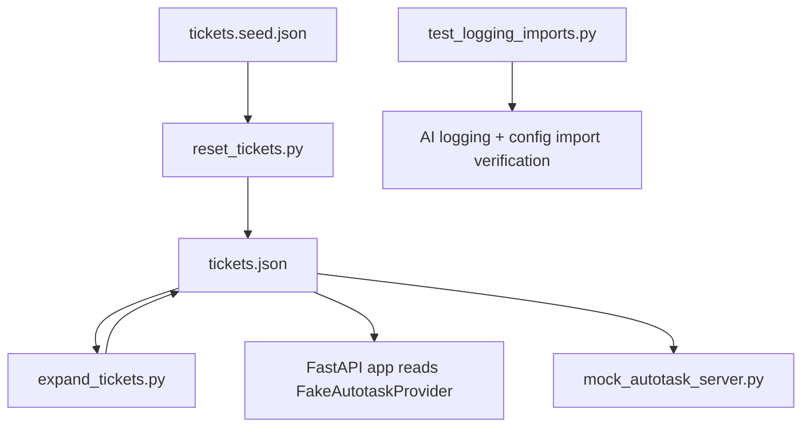
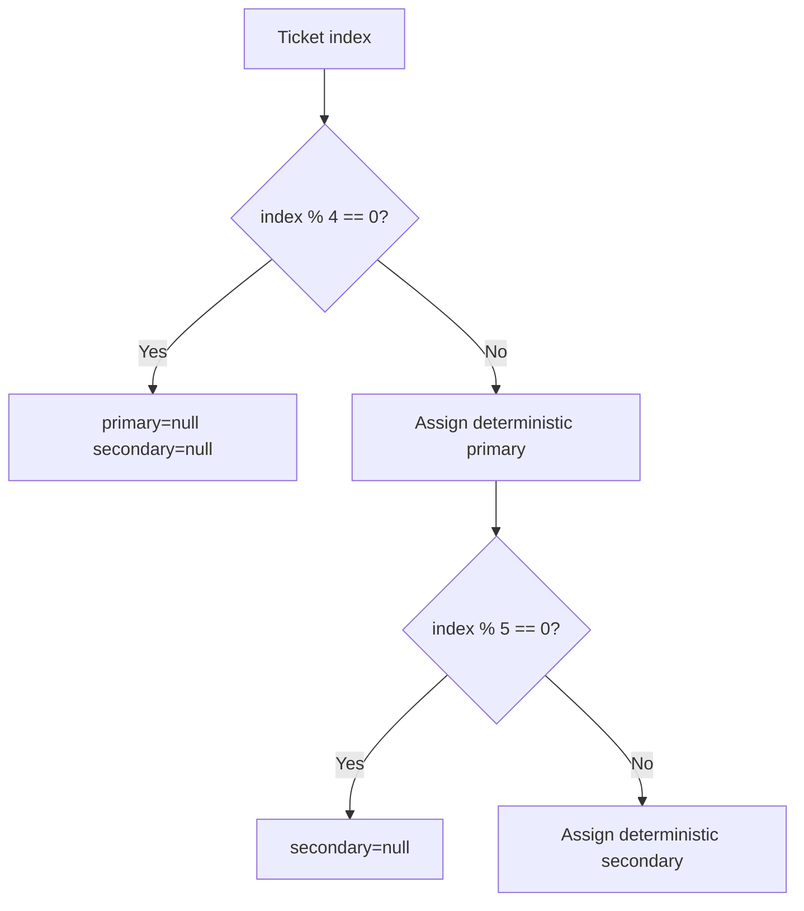
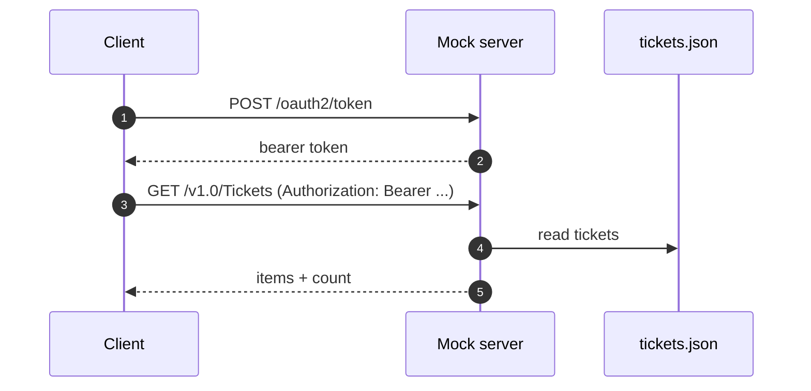
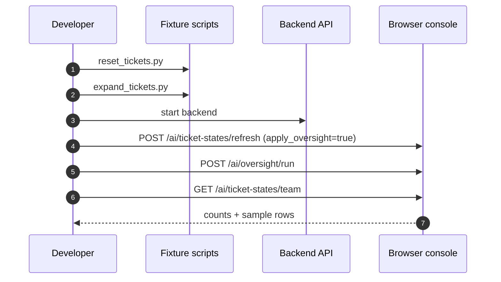

# Backend Test Scripts Runbook

## Purpose

This runbook documents backend test and fixture scripts that are important for local validation of AI-state refresh, oversight behavior, and data-shape diagnostics.

Source files:

- `backend/scripts/expand_tickets.py`
- `backend/scripts/reset_tickets.py`
- `backend/scripts/mock_autotask_server.py`
- `backend/tests/test_logging_imports.py`

## Why These Scripts Matter

These scripts let you:

- generate larger deterministic ticket datasets for load and oversight testing
- reset `tickets.json` back to a known baseline
- run a mock Autotask-like API surface for integration-style testing
- quickly verify AI logging imports and configuration wiring

Without these, many AI-state and assignment scenarios are harder to reproduce consistently.

## Script Overview



## 1) `reset_tickets.py`

### Purpose

Reset `backend/data/tickets.json` from a baseline fixture copy.

Defaults:

- source: `backend/data/tickets.seed.json`
- target: `backend/data/tickets.json`

### Command

```bash
cd backend
python scripts/reset_tickets.py
```

Optional explicit paths:

```bash
cd backend
python scripts/reset_tickets.py --source data/tickets.seed.json --target data/tickets.json
```

### When To Use

- before load tests, to start from known state
- after oversight/assignment tests have modified primary assignees
- before demos where deterministic dataset shape matters

## 2) `expand_tickets.py`

### Purpose

Deterministically expand ticket fixtures for load and oversight testing.

What it changes:

- multiplies source records (`--multiplier`)
- rewrites IDs and ticket numbers from `--start-id`
- assigns resources from a fixed analyst set
- intentionally creates fully unassigned tickets (every 4th ticket)

### Command

```bash
cd backend
python scripts/expand_tickets.py --multiplier 5 --start-id 100001
```

Optional output path:

```bash
cd backend
python scripts/expand_tickets.py --input data/tickets.json --output data/tickets.json --multiplier 5
```

### Assignment Pattern (Important For Oversight Tests)



Why this matters:

- unassigned tickets exercise auto-assignment rules
- mixed primary/secondary coverage exercises mapping and recommendation logic

## 3) `mock_autotask_server.py`

### Purpose

Provide a dev-only mock REST server with token and ticket endpoints that read from `backend/data/tickets.json`.

Endpoints:

- `POST /oauth2/token`
- `GET /v1.0/Tickets`
- `POST /v1.0/Tickets/query`

### Run

```bash
cd backend
python -m uvicorn scripts.mock_autotask_server:app --host 0.0.0.0 --port 9000
```

### Typical flow



## 4) `test_logging_imports.py`

### Purpose

Quick diagnostic script (not a pytest suite) to confirm AI logging/config imports resolve cleanly.

### Command

```bash
cd backend
python tests/test_logging_imports.py
```

### What success indicates

- `app.services.ai.logging_config` imports correctly
- `app.services.ai.config` imports correctly
- category definitions load

## Browser Console Test Workflow For AI-State

The following calls are useful when signed into the frontend and validating AI refresh + oversight behavior.

### Refresh ticket AI state

```js
await fetch("http://localhost:8000/api/v1/ai/ticket-states/refresh", {
  method: "POST",
  credentials: "include",
  headers: { "Content-Type": "application/json" },
  body: JSON.stringify({
    include_closed: false,
    limit: 500,
    apply_oversight: true,
    oversight_queue: "MS - SecOps"
  })
}).then(async r => console.log(r.status, await r.text()));
```

### Run one explicit oversight cycle

```js
await fetch("http://localhost:8000/api/v1/ai/oversight/run?queue=MS%20-%20SecOps", {
  method: "POST",
  credentials: "include"
}).then(async r => console.log(r.status, await r.text()));
```

### Check team row count

```js
await fetch("http://localhost:8000/api/v1/ai/ticket-states/team?limit=1000", {
  credentials: "include"
}).then(async r => {
  const data = await r.json();
  console.log("team count:", data.length);
});
```

## Interpreting Typical Results

Example successful shapes:

- oversight: `200` with counts like
  - `evaluated_count`
  - `auto_assigned_count`
  - `auto_moved_count`
  - `protected_in_progress_count`
  - `unchanged_count`
- refresh: `200` with counts like
  - `refreshed_count`
  - `removed_count`
  - `mapped_primary_count`
  - `mapped_secondary_count`

Interpretation guide:

- high `protected_in_progress_count` is expected when many tickets are already started
- `auto_assigned_count` can be zero if all tickets already have primaries
- `mapped_primary_count` close to `refreshed_count` means display-name mapping to profiles is working well

## Recommended End-To-End Test Sequence



## Common Pitfalls

- Running script commands from repo root when relative paths assume `cd backend`.
- Forgetting to refresh AI-state after modifying ticket fixtures.
- Calling protected endpoints without browser session cookie (`credentials: "include"`).
- Forgetting migrations before AI-state tests (`alembic upgrade head`).

## Related Docs

- [AI Service Flows](docs/services/ai-service/flows.md)
- [AI Service Troubleshooting](docs/services/ai-service/troubleshooting.md)
- [Troubleshooting Runbook](docs/runbooks/troubleshooting.md)
