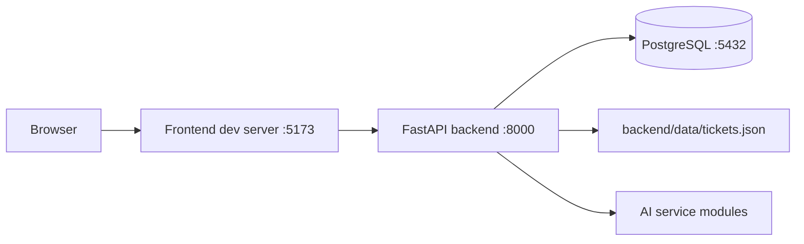

# Run Entire Codebase

## Purpose

This runbook explains how to start the full repository locally and verify that the main moving parts are working together.

It is based on the current implementation and scripts in:

- `backend/run_local.sh`
- `frontend/run_local.sh`
- `backend/compose.yml`
- `backend/app/config.py`
- `frontend/package.json`
- `frontend/src/main.ts`
- `frontend/src/shared/auth.ts`

This is a practical team-facing runbook, not a theoretical setup guide.

## What You Are Starting

The repository currently has three main runtime pieces:

1. PostgreSQL
2. FastAPI backend on `http://localhost:8000`
3. Frontend dev server on `http://localhost:5173`

At startup, the frontend immediately tries to call:

- `GET /api/v1/auth/me`

So if the backend is not running, the frontend will still load, but it will show a backend-unavailable message.

## Before You Start

Make sure you have:

- Python 3 available as `python3`
- Node.js and npm
- Docker with Compose support

Important current note:

- there is no checked-in `.env.example` in the repository root or backend directory based on the files inspected for this task
- the backend does have defaults in `backend/app/config.py`, but Microsoft Entra login requires real Entra values to be configured in `backend/.env`

## Recommended Startup Order

Start things in this order:

1. PostgreSQL
2. backend
3. frontend
4. browser verification

## Architecture View



## Step 1: Start PostgreSQL

From the repository root:

```bash
cd backend
docker compose -f compose.yml up -d
```

What this uses:

- `backend/compose.yml`

What it starts:

- a PostgreSQL container on port `5432`

Default database credentials from `compose.yml`:

- user: `postgres`
- password: `password`
- database: `mydb`

## Step 2: Prepare The Backend Python Environment

From the repository root:

```bash
cd backend
python3 -m venv .venv
source .venv/bin/activate
pip install -r requirements.txt
```

If spaCy model support is needed for the AI service, also run:

```bash
python -m spacy download en_core_web_sm
```

Why this matters:

- the AI text processor expects `en_core_web_sm`
- without it, preprocessing quality drops and warnings/errors will appear

## Step 3: Configure Backend Environment Variables

The backend loads settings from:

- `backend/.env`

Minimum useful values for local development come from defaults in `backend/app/config.py`, but if you want auth to work, you will need real Entra values.

Important backend settings:

- `DATABASE_URL`
- `SECRET_KEY`
- `ENTRA_TENANT_ID`
- `ENTRA_CLIENT_ID`
- `ENTRA_CLIENT_SECRET`
- `ENTRA_REDIRECT_URI`
- `FRONTEND_URL`
- `CORS_ORIGINS`

If you only want to get the backend process running for basic non-auth inspection:

- the defaults allow startup
- but protected ticket endpoints still require a session, so real sign-in is still needed for the normal app flow

## Step 4: Apply Database Migrations

From the backend directory:

```bash
source .venv/bin/activate
alembic upgrade head
```

Why this matters:

- the profile and auth-backed parts of the system depend on the database schema being present

Migration files currently exist under:

- `backend/alembic/versions/`

## Step 5: Start The Backend

From the backend directory:

```bash
./run_local.sh
```

What `backend/run_local.sh` does:

- ensures `.venv` exists
- activates it
- runs `uvicorn app.main:app --host 0.0.0.0 --port 8000`

Expected backend URL:

- `http://localhost:8000`

Quick backend smoke check:

```bash
curl http://localhost:8000/health
```

Expected result:

```json
{"ok": true}
```

## Step 6: Prepare And Start The Frontend

From the repository root:

```bash
cd frontend
npm install
./run_local.sh
```

What `frontend/run_local.sh` does:

- runs `npm run dev`

What `npm run dev` does:

- starts TypeScript watch compilation
- starts Tailwind watch compilation
- starts `live-server` on port `5173`

Expected frontend URL:

- `http://localhost:5173`

## Step 7: Verify The Full Stack

### Basic browser check

Open:

- `http://localhost:5173`

Expected behavior:

- if backend is reachable, the frontend should bootstrap normally
- if backend is not reachable, the frontend will show a visible startup message telling you to start the backend on `http://localhost:8000`

### Auth check

Because the ticket endpoints are protected, a realistic full-stack verification includes sign-in.

Expected auth flow:

1. open frontend
2. if unauthenticated, frontend calls `/api/v1/auth/me` and gets `401`
3. use the sign-in flow
4. backend redirects through Microsoft Entra ID
5. backend sets the session cookie
6. frontend reloads current user state

### Post-login checks

After successful login, verify:

- the account page loads
- dashboard requests succeed
- active tickets can be fetched and displayed
- ticket detail view opens without backend errors

## Recommended Smoke-Test Checklist

Use this after startup:

1. `docker compose -f backend/compose.yml ps` shows the database container running
2. `curl http://localhost:8000/health` returns `{"ok": true}`
3. the frontend loads at `http://localhost:5173`
4. the backend does not show immediate model-loading or import crashes
5. sign-in succeeds if Entra is configured
6. `/api/v1/auth/me` returns current session/profile after login
7. dashboard and ticket list load data

## Useful Terminal Layout

A practical setup is:

- terminal 1: `cd backend && docker compose -f compose.yml up -d`
- terminal 2: `cd backend && ./run_local.sh`
- terminal 3: `cd frontend && ./run_local.sh`

## Shutdown Procedure

### Stop frontend

In the frontend terminal:

- `Ctrl+C`

### Stop backend

In the backend terminal:

- `Ctrl+C`

### Stop PostgreSQL

From the backend directory:

```bash
docker compose -f compose.yml down
```

If you want to keep database state, this is enough.

If you later want to remove the volume as well, do that deliberately and only if you are sure you want to discard local data.

## Known Runbook Gaps

These are important current realities:

- this repo does not appear to include a ready-made `.env.example` for the backend auth settings
- the app relies on Entra for the normal authenticated experience
- the AI service may do heavy startup work such as model loading and optional category generation
- some older docs in the repository still describe outdated behavior, so prefer this runbook plus the current code over older markdown claims
