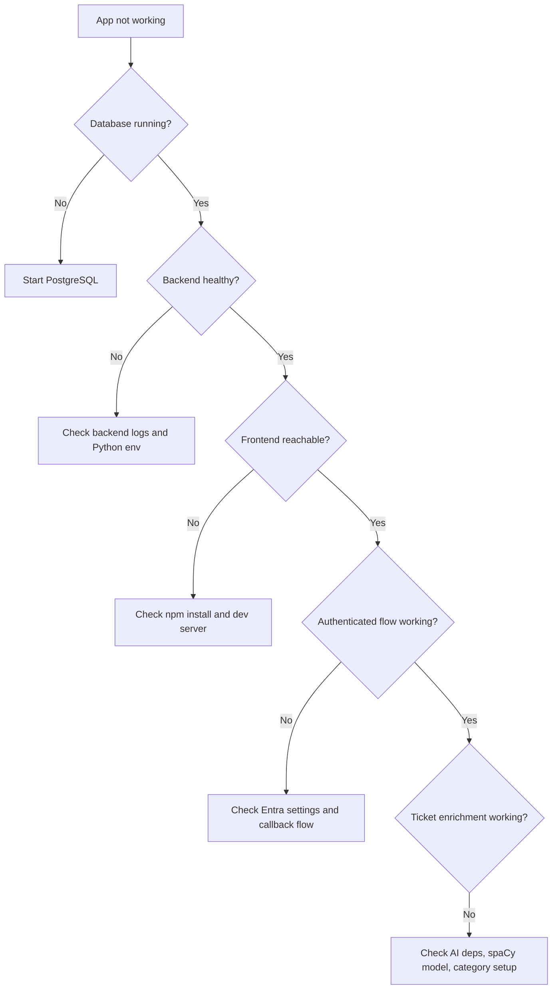

# Troubleshooting

## Purpose

This runbook helps developers diagnose problems when the full stack does not start cleanly or the app does not behave as expected after startup.

It covers:

- database issues
- backend startup issues
- frontend startup issues
- auth issues
- AI-service startup and runtime issues
- cross-stack integration mismatches

## Quick Triage Order

When something is broken, check things in this order:

1. Is PostgreSQL running?
2. Is the backend running on `http://localhost:8000`?
3. Is the frontend running on `http://localhost:5173`?
4. Is the backend environment configured, especially for Entra?
5. Are required Python/Node dependencies installed?
6. Is the issue actually in auth rather than general startup?

## System Troubleshooting Map



## Symptom: PostgreSQL is not running

Likely cause:

- the Compose service was never started
- Docker is not running

What to check:

```bash
cd backend
docker compose -f compose.yml ps
```

If needed:

```bash
cd backend
docker compose -f compose.yml up -d
```

## Symptom: Backend fails to start

Likely causes:

- Python dependencies are missing
- `.venv` is missing or incomplete
- environment variables are wrong
- AI model dependencies are failing during import/startup

What to check:

1. activate the backend virtual environment
2. confirm dependencies were installed from `requirements.txt`
3. inspect the terminal output from `./run_local.sh`

Useful recovery steps:

```bash
cd backend
python3 -m venv .venv
source .venv/bin/activate
pip install -r requirements.txt
```

Health check once running:

```bash
curl http://localhost:8000/health
```

## Symptom: Frontend loads but says the backend did not respond

Likely cause:

- backend is not running or not reachable on `http://localhost:8000`

Why this message appears:

- `frontend/src/main.ts` catches backend bootstrap failure and renders a visible warning

What to check:

- backend terminal
- `curl http://localhost:8000/health`
- whether port `8000` is already occupied by something else

## Symptom: Frontend dev server does not start

Likely causes:

- `npm install` was not run
- frontend dev dependencies are missing
- another process is already using port `5173`

What to check:

```bash
cd frontend
npm install
npm run dev
```

If the port is busy:

- stop the existing process using `5173`
- then rerun the frontend dev server

## Symptom: Backend starts, but auth does not work

Likely causes:

- Entra settings are missing or wrong
- redirect URI mismatch
- callback state mismatch
- invalid client credentials

What to check in backend config:

- `ENTRA_TENANT_ID`
- `ENTRA_CLIENT_ID`
- `ENTRA_CLIENT_SECRET`
- `ENTRA_REDIRECT_URI`
- `FRONTEND_URL`

What to check in the browser flow:

- does clicking sign in reach `/auth/login`?
- does the callback return to `/auth/callback`?
- does the backend set the session cookie?

Important code locations:

- `backend/app/auth.py`
- `backend/app/routers/auth.py`

## Symptom: `/api/v1/auth/me` returns `401`

Possible meanings:

- no session cookie exists yet
- the session cookie is invalid or expired
- the local profile linked to the session no longer exists

What to check:

- whether the user completed sign-in
- whether the backend session cookie is being set
- whether the profile row still exists in the database

Expected unauthenticated behavior:

- before sign-in, `401` is normal

## Symptom: Sign-in succeeds externally, but the app still rejects the user

Likely causes:

- the resolved local profile is not `active`
- Entra identity mapped to a local profile that is deactivated

What to check:

- profile status in the database
- profile-service behavior in `resolve_entra_profile(...)`

Expected behavior from code:

- inactive/deactivated profiles can produce `403`

## Symptom: Database-related API failures after backend startup

Likely causes:

- migrations were not applied
- schema is outdated relative to the current models
- `DATABASE_URL` does not match the running database

What to check:

```bash
cd backend
source .venv/bin/activate
alembic upgrade head
```

When this command is needed:

- first-time setup on a machine
- after pulling schema changes that add a new migration
- after recreating or wiping the local database

When it is not needed:

- normal day-to-day startup when the schema has not changed

Why this matters:

- copying `.env` values to another machine does not copy the PostgreSQL tables
- a fresh `mydb` can still be missing tables even if all environment variables are correct

One common symptom:

- Microsoft sign-in reaches `/auth/callback` and then fails with `500 Internal Server Error` because the auth/profile flow expects tables like `tenant` and `identity_provider` to already exist

Relevant files:

- `backend/alembic.ini`
- `backend/alembic/versions/`

## Symptom: AI service errors on startup or request

Likely causes:

- sentence-transformer dependencies are missing
- spaCy model is missing
- generated categories are malformed
- startup category generation failed

What to check:

- backend logs from `backend/app/services/ai/config.py`
- whether `en_core_web_sm` is installed
- whether `backend/data/generated_categories.json` exists and is valid JSON

Helpful command:

```bash
cd backend
source .venv/bin/activate
python -m spacy download en_core_web_sm
```

## Symptom: Ticket endpoints return empty/error responses after login

Likely causes:

- `backend/data/tickets.json` is missing or malformed
- the fake provider failed to load
- AI categorization failed and the route returned a safe fallback/error payload

What to check:

- backend logs from `FakeAutotaskProvider`
- existence of `backend/data/tickets.json`
- `/api/tickets` errors in backend console

## Symptom: Ticket list is slow

Likely causes:

- AI model warm-up
- sequential mode being used
- low cache hit rate
- frontend rendering many tickets

What to check:

- whether `/api/tickets` is using default `batch=true`
- `/api/cache/stats`
- backend timing logs
- frontend console timing logs

## Symptom: File-based AI workflows fail

Likely causes:

- hard-coded Windows-style paths in AI config do not match the current environment

Relevant settings in:

- `backend/app/services/ai/config.py`

Important note:

- request-time API categorization can still work even when some offline file-storage paths are invalid

## Symptom: Logs are confusing or spread across too many places

Likely cause:

- logging is split between backend console logging, AI rotating-file logging, and frontend browser console logging

What to check:

- backend terminal
- browser devtools console
- AI logs under `backend/logs/ai_services/` if created

See also:

- [logging-system overview](/home/liam/Documents/GitHub/comp2003-2025-2026-team-3/docs/services/logging-system/overview.md)

## Symptom: The app seems to run, but behavior does not match older docs

Likely cause:

- older markdown in `docs/legacy/` describes earlier repository states

What to do:

- trust source code first
- use the newer docs under `docs/services/`, `docs/architecture/`, and `docs/runbooks/`

## Known Cross-Stack Gaps

These are not always startup failures, but they can surprise developers:

- no checked-in `.env.example` was found during this documentation pass
- authenticated ticket flows depend on Entra being configured correctly
- frontend and backend logs do not share a common request ID
- AI startup may involve non-trivial model loading cost
