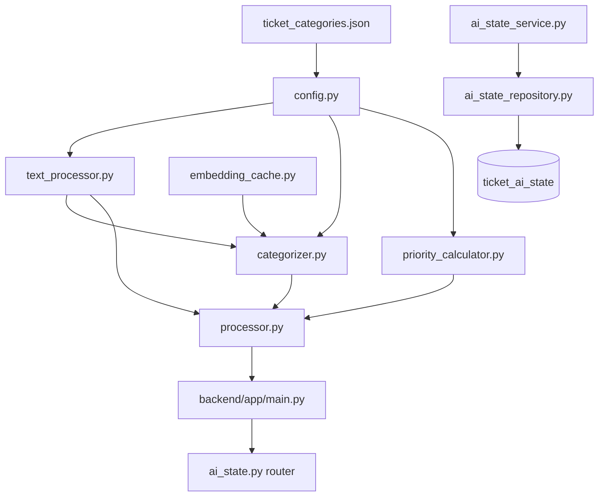
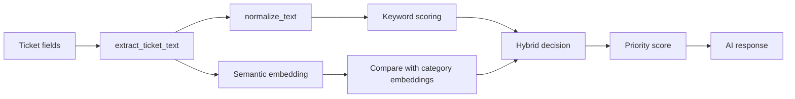

# AI Service Architecture

## Architecture In One Sentence

The AI service is a configurable ticket-classification pipeline with a hosted AI-state layer that combines category configuration, lightweight text normalization, keyword matching, optional semantic similarity, heuristic priority scoring, and persisted ticket snapshots.

## Why It Is Structured This Way

The current design is intentionally lighter than the earlier prototype.

That matters because the target deployment is CPU-based and should:

- start reliably on hosted infrastructure
- avoid unnecessary runtime dependencies
- keep category behavior configurable
- separate real request-time logic from prototype-only experiments

## Module Map



## Beginner-Friendly Explanation Of Each Module

### `config.py`

Purpose:

- load category definitions
- load the embedding model
- build shared category embeddings
- expose shared constants

What it does now:

- reads `backend/data/ticket_categories.json`
- validates category definitions
- loads `all-MiniLM-L6-v2` when available
- falls back safely if the semantic model cannot be loaded

Why it matters:

- this is the central source of AI-service behavior

### `text_processor.py`

Purpose:

- normalize raw ticket text into a simpler classification-friendly form

What it does now:

- lowercases text
- tokenizes with regex
- removes simple stop words
- extracts the relevant fields from ticket dictionaries

Important current detail:

- the service no longer depends on spaCy preprocessing

### `categorizer.py`

Purpose:

- decide which configured category best matches the ticket

How it works:

- keyword scoring checks configured keywords first
- semantic similarity compares ticket text to category descriptions when the model is available
- hybrid logic chooses between those signals

Important current detail:

- batch mode and single-ticket mode both support keyword-only fallback

### `priority_calculator.py`

Purpose:

- convert the chosen category and urgency signals into a 0-100 priority score

How it works:

- uses category weights from the category config
- checks urgency words in the text
- uses semantic confidence as a small adjustment
- applies a small text-length adjustment

### `embedding_cache.py`

Purpose:

- avoid recomputing embeddings for repeated texts

How it works:

- stores embeddings in memory
- supports TTL and reuse across requests in the same process

### `processor.py`

Purpose:

- provide the live AI response shape used by ticket endpoints

What it coordinates:

- text extraction
- category prediction
- priority calculation
- response shaping

### `ai_state_service.py`

Purpose:

- refresh and read persisted AI ticket state for the hosted backend

What it coordinates:

- pulling tickets from the current provider
- classifying them through the existing AI path
- storing the resulting AI metadata in the database
- mapping ticket resources onto local profiles when display names match
- returning refresh/list/get responses for AI endpoints

### `ai_state_repository.py`

Purpose:

- persist tenant-scoped AI ticket state

What it stores:

- ticket snapshot fields needed by the AI/routing layer
- category and confidence
- priority label and score
- classification method
- refresh timestamps
- closed/open state

## Runtime Architecture

### Request-time classification path



### Persisted AI-state path

```mermaid
flowchart TD
  Provider[Ticket provider] --> Refresh[POST /api/v1/ai/ticket-states/refresh]
  Refresh --> AIService[AIStateService]
  AIService --> Processor[process_ticket]
  AIService --> ProfileLookup[Resolve resource names to profiles]
  Processor --> Persist[(ticket_ai_state)]
  ProfileLookup --> Persist
  Persist --> Read[GET /api/v1/ai/ticket-states]
  Persist --> MyPrimary[GET /api/v1/ai/ticket-states/my-primary]
  Persist --> MySecondary[GET /api/v1/ai/ticket-states/my-secondary]
  Persist --> Team[GET /api/v1/ai/ticket-states/team]
  Persist --> One[GET /api/v1/ai/ticket-states/{id}]
```

## Important Design Choices

### Configurable categories instead of hard-coded categories

Why:

- SecOps should be able to change the classification scheme without rewriting Python modules
- category labels, keywords, and priority weights belong to data/config, not code

### Optional semantic model

Why:

- hosted environments should not hard-fail if the embedding model has not been provisioned yet
- keyword-only fallback is better than total service failure

### Lightweight normalization

Why:

- spaCy added dependency and startup cost without being central to the desired product direction
- the current classifier only needs simple normalization for this phase

## Architecture Strengths

Verified from the current code:

- category behavior is now externally configurable
- request-time logic is cleaner and more honest
- deleted prototype-only modules are no longer in the live path
- single-ticket and batch modes both still work
- model availability failures are handled more safely
- AI ticket state can now be persisted centrally in the hosted backend
- AI-specific endpoints now exist for category reading and ticket-state refresh/list/get
- AI ticket state can now support profile-based primary/secondary ticket views

## Architecture Weaknesses

Also visible in the current code:

- there is still no assignment or routing layer
- category management still requires editing a JSON file rather than using a dedicated API
- cache and metrics are still process-local rather than durable
- persisted state now includes profile-resource mapping, but not routing decisions yet
