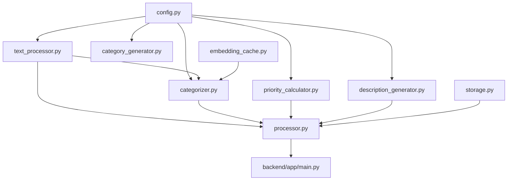
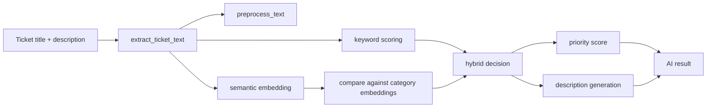
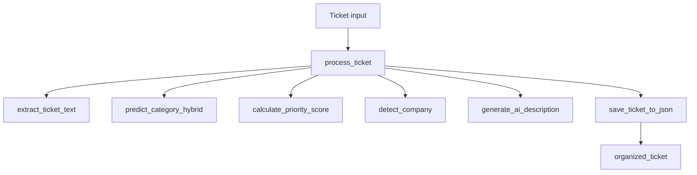

# AI Service Architecture

## Architecture In One Sentence

The AI service is a modular ticket-enrichment pipeline that combines text preprocessing, keyword rules, semantic similarity, priority heuristics, and output shaping.

## Why It Is Structured This Way

The code is split into small modules so each step in the pipeline is easier to understand and change.

That is helpful because "AI service" can sound intimidating, but the current implementation is really a set of focused building blocks:

- configuration and model loading
- text preprocessing
- category prediction
- priority calculation
- explanation generation
- caching
- orchestration
- optional file storage

## Module Map

## Beginner-Friendly Explanation Of Each Module

### `config.py`

Purpose:

- central place for model loading, category setup, keyword configuration, priority constants, and file path settings

What it does:

- loads the sentence-transformer model
- loads generated categories if available
- falls back to default categories if needed
- builds category embeddings up front

Why it matters:

- this file is where much of the AI service's behavior starts

Important current detail:

- category descriptions may be loaded dynamically from `generated_categories.json`
- if that file is missing and `tickets.json` exists, category generation may run on startup

### `text_processor.py`

Purpose:

- clean and normalize text before classification

What spaCy is doing here:

- splits text into tokens
- reduces words to normalized forms
- removes stopwords and punctuation

Why this matters:

- raw ticket text is noisy
- cleaning the text improves keyword matching and theme detection

### `categorizer.py`

Purpose:

- decide which category best matches the ticket

How it works:

- one path uses keyword matching
- one path uses semantic similarity
- the service combines them in a hybrid decision

This is the heart of the classification pipeline.

### `priority_calculator.py`

Purpose:

- convert the category and text signals into a 0-100 priority score

How it works:

- uses category weights
- checks urgency words
- uses semantic confidence
- applies a small text-length adjustment

This is more heuristic scoring than machine learning.

### `description_generator.py`

Purpose:

- create a readable explanation and potential remediation section

Important clarification:

- despite the name, this is mostly template-driven logic based on issue type keywords
- it is not currently using a generative LLM to write fully novel descriptions

### `embedding_cache.py`

Purpose:

- avoid recomputing embeddings for the same text

How it works:

- stores embeddings in an in-memory cache
- uses LRU-style eviction and TTL expiration

Why it matters:

- embedding generation is relatively expensive
- cache hits help batch performance

### `processor.py`

Purpose:

- act as the orchestrator for end-to-end ticket processing

What it coordinates:

- text extraction
- category prediction
- priority calculation
- company detection
- description generation
- optional JSON storage

### `storage.py`

Purpose:

- save or load processed tickets to and from files

Important note:

- this looks like part of an older or more prototype-style operational workflow
- it is not the main mechanism used for request-time API responses

### `category_generator.py`

Purpose:

- generate categories from the ticket dataset itself

How it works:

- embeds tickets
- clusters them with KMeans
- scores cluster counts with silhouette score
- names categories from discovered themes

This is separate from normal request-time classification.

## Runtime Architecture

### Request-time enrichment path

### Data flow through the orchestrator

## Important Design Choices

### Hybrid classification instead of one method only

Why:

- keywords are fast and interpretable
- semantic similarity can catch meaning when exact keywords are weak
- combining them gives better fallback behavior

### Precomputed category embeddings

Why:

- category descriptions do not change per request
- encoding them once is cheaper than recomputing every time

### Batch processing support

Why:

- processing many tickets individually is much slower
- batching embeddings and similarity calculations improves throughput significantly

### In-memory cache

Why:

- repeated texts should not always require fresh embedding generation

## Architecture Strengths

Verified from the current code:

- modular enough to read one concept at a time
- combines interpretable rules with semantic similarity
- supports both single-ticket and batch paths
- includes caching and timing metrics
- supports startup category generation for more dynamic categorization

## Architecture Weaknesses

Also visible in the current code:

- the service mixes request-time inference with file-based operational workflows
- some configuration is environment-specific and hard-coded
- the "AI description" path is more rule/template driven than the name suggests
- there is no clear model abstraction boundary if the team wants to swap models later
- there is no persisted metrics or experiment tracking system
- some modules depend heavily on import-time side effects such as model loading
