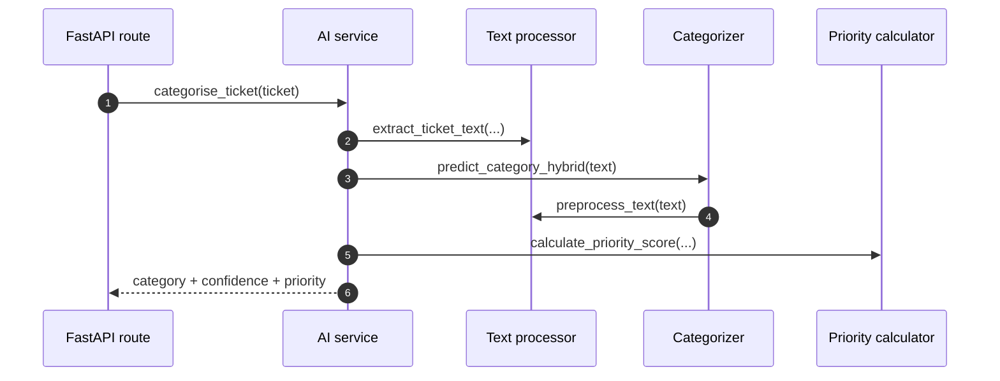
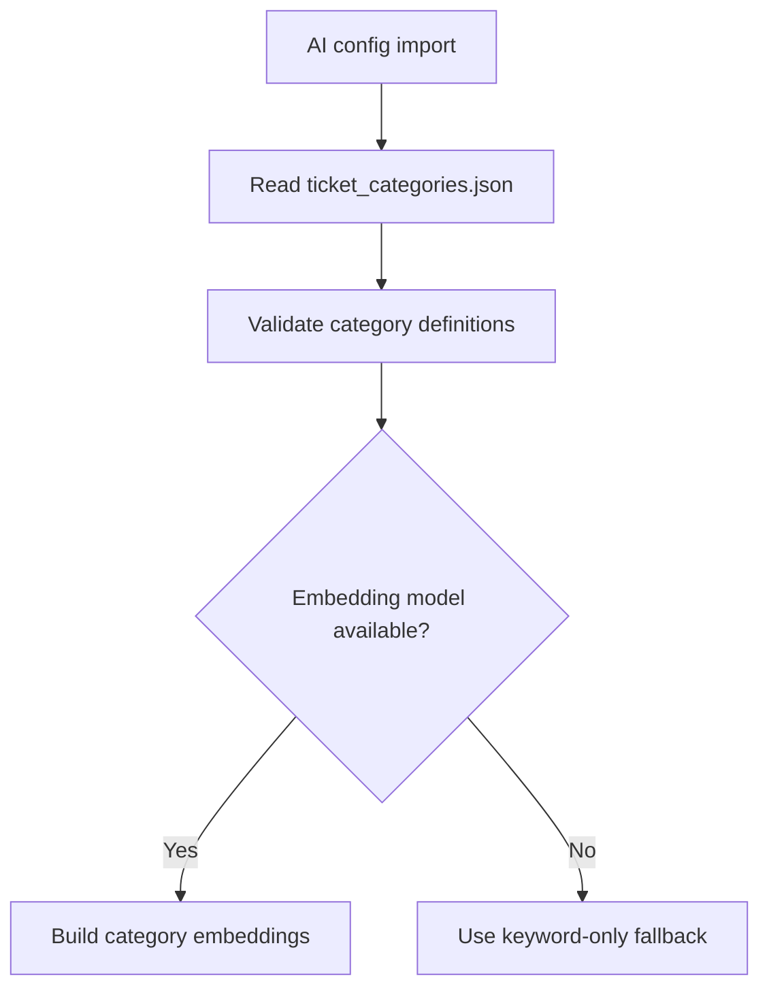
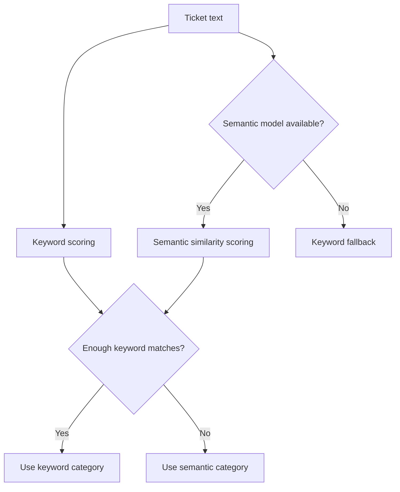
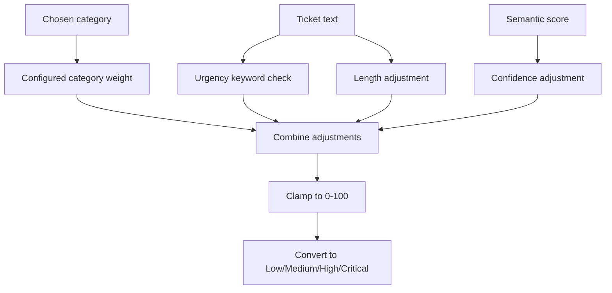
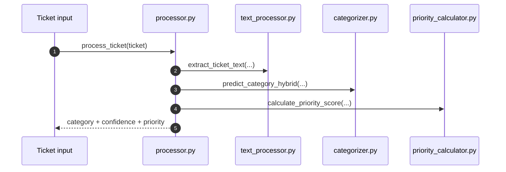

# AI Service Flows

## Purpose

This document explains what happens when the current AI service processes tickets.

It is written for developers who want to understand the implemented behavior, not the future routing vision.

## Flow 1: Categorize A Ticket During API Request

Primary integration points:

- `GET /api/tickets`
- `GET /api/tickets/{autotask_ticket_id}`
- `GET /api/tickets/stream/categorize`

The key idea is:

- the provider owns raw ticket data
- the AI service adds category and priority metadata

### High-level sequence

## Flow 2: Load Configured Categories

Primary code:

- `load_category_definitions()` in `config.py`

What happens:

1. load `backend/data/ticket_categories.json`
2. validate that each category has key fields
3. expose labels, keywords, and priority weights to the rest of the AI service
4. precompute semantic embeddings if the model is available

### Category-config flow

## Flow 3: Hybrid Category Decision

This is the main implemented AI decision flow.

### Plain-English version

The system tries two ways to decide a category:

1. keyword matching
2. semantic similarity

If keyword evidence is strong enough, it trusts the keyword result.

If not, it falls back to the semantic result.

If the semantic model is unavailable, it falls back to keyword-only behavior.

### Hybrid decision diagram

## Flow 4: Keyword Matching

Primary code:

- `predict_category_by_keywords(...)` in `categorizer.py`

What happens:

1. normalize and tokenize the text
2. compare tokens and normalized phrases against configured keywords
3. score categories with matches
4. return categories with non-zero scores

Why developers like this path:

- it is fast
- it is interpretable
- it is easy to tune through the category config

## Flow 5: Semantic Similarity

Primary code:

- `predict_category_by_semantic(...)` in `categorizer.py`

What happens when the model is available:

1. encode the ticket text into an embedding
2. compare it with precomputed category embeddings
3. scale similarity values into 0-100 style scores
4. choose the highest-scoring category

What happens when the model is unavailable:

- the function returns a safe fallback rather than crashing startup or the API path

## Flow 6: Batch Categorization

Primary code:

- `predict_categories_batch(...)` in `categorizer.py`

Why batch mode exists:

- list endpoints often classify many tickets at once
- batching reduces repeated embedding work

What batch mode does:

1. check the embedding cache
2. encode only uncached texts
3. compare ticket embeddings against category embeddings in one batch
4. make per-ticket hybrid decisions

If the semantic model is unavailable:

- batch mode falls back to keyword-only decisions

## Flow 7: Priority Calculation

Primary code:

- `calculate_priority_score(...)`
- `calculate_priority_scores_batch(...)`
- `get_priority_label(...)`

This stage is heuristic rather than learned.

### Inputs to the score

- category priority weight from config
- urgency keywords in the ticket text
- semantic confidence for the chosen category
- a small length adjustment

### Priority flow

## Flow 8: End-To-End Processing Through `processor.py`

Primary code:

- `process_ticket(...)`

What it does:

1. extract relevant ticket text
2. predict the category
3. calculate priority
4. return the AI response object used by the API

### End-to-end processor flow

## What New Developers Should Remember

The current AI service is not yet the future routing engine.

Today it is a chain of smaller implemented decisions:

- load configured categories
- normalize ticket text
- run keyword checks
- optionally run embedding comparison
- score urgency heuristically

That makes it easier to inspect and safely extend in the next phase.
