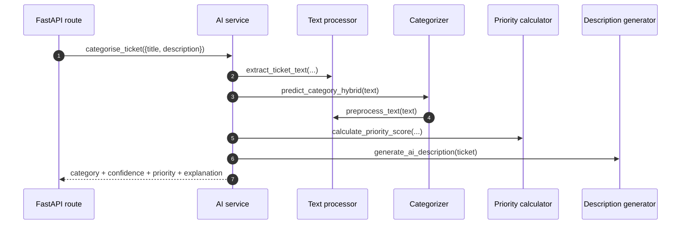
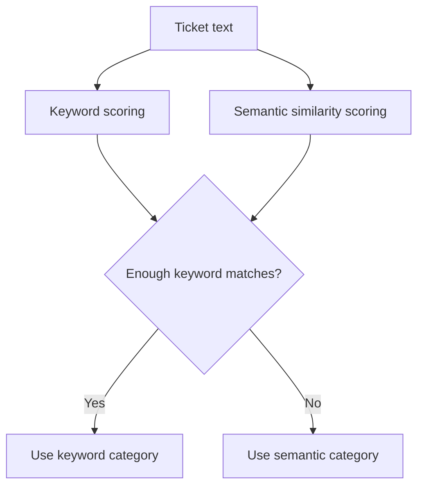
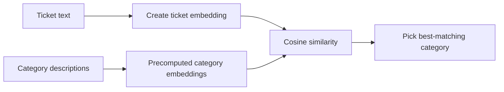
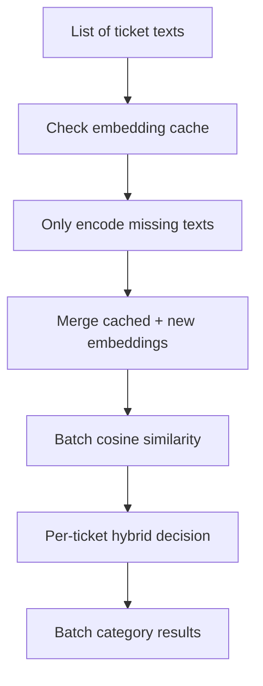
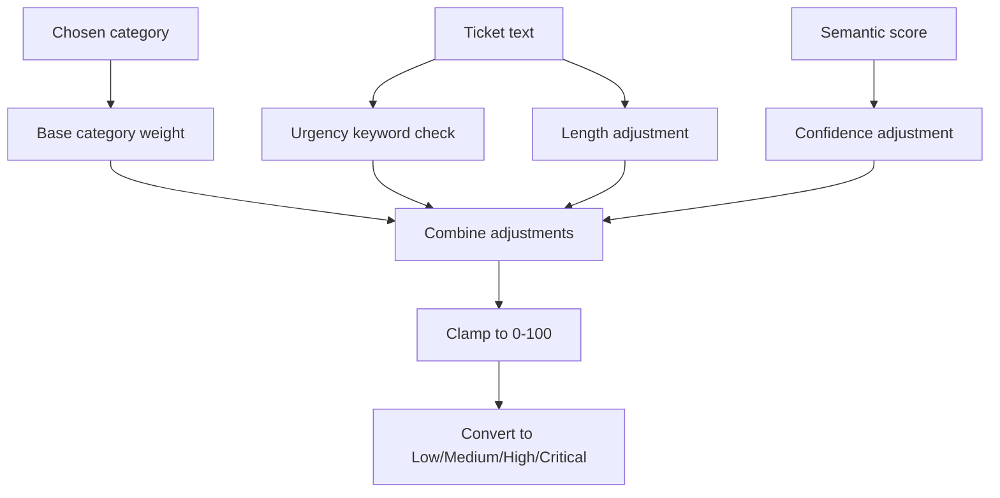
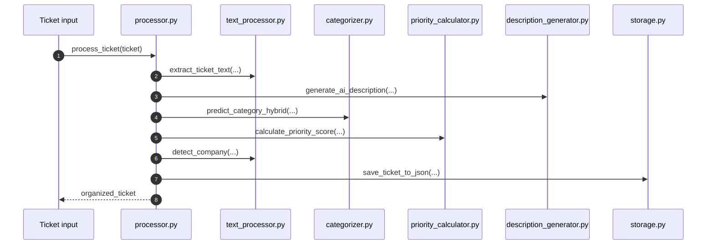
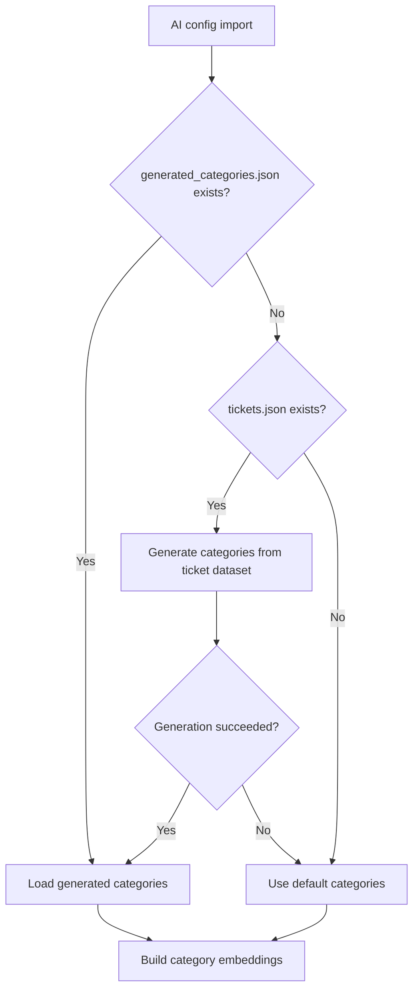

# AI Service Flows

## Purpose

This document explains what happens when the AI service processes tickets.

It is written for developers who may be new to NLP, embeddings, or classification systems.

## Flow 1: Categorize A Ticket During API Request

Primary integration points:

- `GET /api/tickets`
- `GET /api/tickets/{autotask_ticket_id}`
- `GET /api/tickets/stream/categorize`

The single most important thing to understand is that the AI service enriches raw ticket data rather than replacing it.

### High-level sequence

## Flow 2: Hybrid Category Decision

This is the most important AI decision flow in the service.

### Plain-English version

The system tries two ways to decide a category:

1. keyword matching
2. semantic similarity

If keyword evidence is strong enough, it trusts the keyword result.

If not, it falls back to the semantic result.

### Why that matters

This means the system is not purely embedding-based and not purely rule-based.

It is a hybrid classifier.

### Hybrid decision diagram

## Flow 3: Keyword Matching

Primary code:

- `predict_category_by_keywords(...)` in `categorizer.py`

What happens:

1. preprocess the text
2. compare resulting tokens against configured keywords for each category
3. count matches
4. keep categories with non-zero scores

Why developers like this path:

- it is fast
- it is easier to reason about
- it is more interpretable than embeddings alone

Weakness:

- it only works well if the ticket uses words close to the configured keywords

## Flow 4: Semantic Similarity

Primary code:

- `predict_category_by_semantic(...)` in `categorizer.py`

### What an embedding is, in beginner terms

An embedding is a numeric representation of text that tries to preserve meaning.

The code:

1. encodes the ticket text into an embedding
2. compares that embedding to precomputed category embeddings
3. converts similarity values into scaled 0-100 scores
4. chooses the highest-scoring category

### Semantic flow diagram

## Flow 5: Batch Categorization

Primary code:

- `predict_categories_batch(...)` in `categorizer.py`

Why batch mode exists:

- one-by-one embedding work is expensive
- the ticket API often needs to enrich many tickets at once

What batch mode does:

1. check the embedding cache for existing embeddings
2. encode only the texts that are not cached
3. stack ticket embeddings together
4. compare them against category embeddings in one batch
5. make per-ticket hybrid decisions

### Batch flow diagram

## Flow 6: Priority Calculation

Primary code:

- `calculate_priority_score(...)`
- `calculate_priority_scores_batch(...)`
- `get_priority_label(...)`

This stage is not doing deep machine learning.

It is using heuristics.

### Inputs to the score

- category weight
- urgency keywords in the text
- semantic confidence for the chosen category
- a small length adjustment

### Priority flow

## Flow 7: Description Generation

Primary code:

- `generate_ai_description(...)`

Despite the name, this is not a large language model generating fully free-form text.

What actually happens:

1. gather fields like title, description, issue type, location, due date
2. build a readable explanation block
3. pick remediation suggestions from a rule-based remediation map
4. return the composed explanation text

Important developer note:

- the commented-out embedding block inside this function is not currently active

## Flow 8: End-to-End Processing Through `processor.py`

Primary code:

- `process_ticket(...)`

What it does:

1. extract text
2. generate description
3. predict category
4. calculate priority
5. detect company mentions
6. create organized output
7. optionally save detailed output to JSON files

### End-to-end processor flow

## Flow 9: Category Generation At Startup

Primary code:

- `load_generated_categories()` in `config.py`
- `generate_categories_from_tickets(...)` in `category_generator.py`

This is a separate path from normal request-time categorization.

What it does:

1. check whether `generated_categories.json` exists
2. if not, and `tickets.json` exists, try to generate categories
3. if generation works, load those categories
4. if anything fails, fall back to default categories

### Category-generation flow

## What New Developers Should Remember

The AI service is not "one algorithm."

It is a chain of smaller decisions and helpers:

- text cleaning
- keyword checks
- embedding comparison
- heuristic scoring
- template-driven explanation generation

That makes it easier to inspect, explain, and improve, even if you are new to AI.
