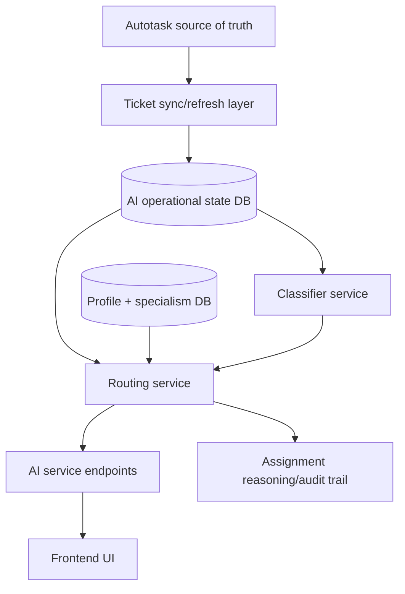

# AI Service Future Direction

## Purpose

This file separates the future AI-service target from the current implemented classifier.

That matters because the code now has a cleaner foundation, but it still does not implement the real routing workflow you described.

## Current Reality

The AI service currently provides:

- configurable category classification
- heuristic priority scoring
- batch support
- model fallback behavior

It does not yet provide:

- SecOps specialism-aware assignment
- company continuity assignment
- workload balancing
- profile/resource-linked routing state
- AI-specific CRUD endpoints for category management or routing actions

## Best Next Improvements

### 1. Extend the persisted AI operational state

The hosted database-backed AI-state layer now exists.

The next major step is to extend it with:

- profile/resource mapping
- assignment decisions
- company continuity signals
- workload signals
- override and audit state

This should still not replace Autotask as the source of truth.

### 2. Build the routing layer

Now that persisted state exists, add a dedicated routing service that can score candidates using:

- ticket category
- profile specialisms
- company continuity
- current ticket load
- priority pressure
- future availability signals

### 3. Add AI-specific endpoints

The AI service should eventually expose endpoints for:

- reading configured categories
- updating category definitions safely
- categorizing a ticket directly
- evaluating assignment recommendations
- viewing assignment reasoning and audit details

### 4. Add evaluation and benchmarking

Useful next additions:

- labeled test datasets
- classifier accuracy checks
- routing decision test fixtures
- regression reports

### 5. Add hosted deployment readiness checks

Useful next additions:

- model provisioning checks at startup
- health endpoints that report semantic-model availability
- clearer deployment documentation for client-hosted infrastructure

## Suggested Future Architecture

This is not implemented yet. It is a recommendation-level picture only.

## Recommendation For The Team

The best next step is not another round of classifier cleanup.

The best next sequence is:

1. extend the AI-state model with profile/resource mapping
2. design the routing data model
3. build specialism-aware assignment
4. add company continuity logic
5. add workload balancing
6. expose richer AI-specific endpoints for the frontend and future integrations

That path moves the service from "clean classifier" to "real SecOps workflow engine."
