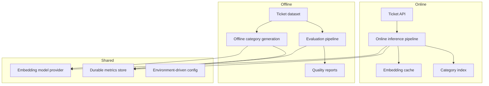

# AI Service Future Direction

## Purpose

This file separates future improvement ideas from the description of what currently exists.

That is important because the AI service already works, but it also clearly shows signs of being in a prototype or early iteration stage.

## Current Reality

The current AI service is useful and understandable, but it mixes several concerns:

- request-time categorization
- batch optimization
- startup-time category generation
- file-based processing/storage workflows
- in-memory metrics and caches

That is normal for a developing prototype, but it creates opportunities for cleanup and clearer boundaries.

## Good Next Improvements

### 1. Separate online inference from offline processing

Right now, the service mixes:

- API-time enrichment used by `/api/tickets`
- file-processing and JSON export workflows

A stronger design would separate:

- online inference modules
- offline processing scripts/jobs

### 2. Clarify what is truly model-driven vs heuristic

The service would benefit from clearer naming and boundaries such as:

- semantic classifier
- heuristic priority scorer
- template-based remediation generator

That would make the architecture easier for new developers to trust and modify.

### 3. Improve portability of file paths

The hard-coded Windows paths in `config.py` should become:

- repository-relative paths
- environment-driven settings
- or optional offline-job configuration

### 4. Add stronger model abstraction

Right now, the sentence-transformer model is loaded directly in `config.py`.

A future abstraction could separate:

- model provider
- embedding service
- category index

That would make model swaps easier.

### 5. Add evaluation and benchmarking

The current service logs timings, but it does not appear to have a formal evaluation workflow for:

- category accuracy
- priority usefulness
- description quality

Useful future additions:

- labeled test datasets
- regression evaluation scripts
- confusion-matrix style reports

### 6. Persist metrics more deliberately

The current metrics object is helpful but temporary.

Future improvements could include:

- durable performance metrics storage
- API-level metrics endpoints
- dashboards for latency and cache efficiency

## Suggested Future Architecture

This is not implemented yet. It is a recommendation-level picture only.

## Recommendation For The Team

The best next step is probably not "replace the whole AI service."

A better sequence would be:

1. cleanly separate online and offline responsibilities
2. fix path/config portability
3. make naming more honest about heuristic vs model-driven steps
4. add evaluation and benchmarking
5. add more durable metrics and observability

That path improves maintainability without losing the parts of the service that are already working.
