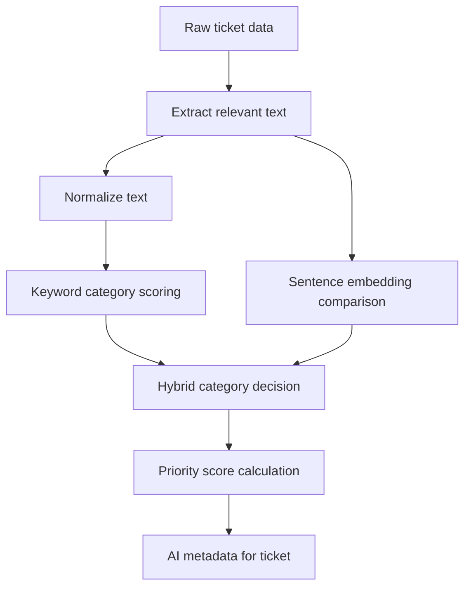

# AI Service Overview

## Why This Exists

The AI service helps the backend turn raw SecOps ticket text into operational metadata the frontend can use immediately.

Today that means:

- assigning a category
- producing a confidence-like score
- calculating a priority score
- returning a priority label
- exposing the configured category list through the API
- persisting hosted AI ticket state for refreshable ticket snapshots
- exposing profile-aware AI ticket-state endpoints for team and user views
- powering the frontend `Active Tickets` page views for `My Assigned`, `My Primary`, `My Secondary`, and `Team Queue`
- storing authenticated-user specialisms in the profile service
- recommending candidate assignees for a ticket based on category-matched profile specialisms
- boosting recommendations when the same analyst is already handling that company
- balancing recommendations against current active workload
- supporting manual override with persisted audit state
- surfacing the effective assignee and override state in list views

In plain English:

- the ticket provider returns raw tickets
- the AI service reads the ticket text
- the AI service decides which configured category fits best
- the AI service scores how urgent the ticket appears

## Human-Friendly Summary

This is not a generative AI system and it is not yet the future workflow manager you want.

It is currently a lightweight ticket-classification pipeline made of:

1. text extraction
2. lightweight text normalization
3. keyword matching
4. semantic similarity, when the embedding model is available
5. heuristic priority scoring
6. specialism-aware assignment recommendation from persisted AI ticket state
7. company continuity scoring
8. workload balancing
9. manual override and effective-assignee tracking

That makes it a CPU-friendly AI-assisted classifier rather than an autonomous decision engine.

## What The AI Service Actually Does Today

Verified from the current code:

- loads category definitions from `backend/data/ticket_categories.json`
- exposes those categories through `GET /api/categories`
- exposes AI-specific endpoints under `GET/POST /api/v1/ai/...`
- extracts relevant fields from ticket data before classification
- uses regex-based normalization instead of spaCy
- uses keyword matching for interpretable category detection
- uses sentence embeddings with `all-MiniLM-L6-v2` when available
- falls back to keyword-only classification if the embedding model is unavailable
- supports both single-ticket and batch categorization paths
- caches embeddings in memory for repeated batch work
- calculates priority scores from configured weights plus simple heuristics
- can refresh and persist AI ticket state into the hosted backend database
- maps ticket `primary_resource` and `secondary_resource` names onto local profiles when matching display names exist
- stores the authenticated user's selected AI-category-aligned specialisms in the profile service database
- recommends assignee candidates for a ticket by combining:
  - category-specialism match
  - company continuity
  - workload balancing
  - current ticket ownership continuity
- persists manual assignment override state with reason and timestamp
- returns the effective assignee alongside the raw ticket snapshot for frontend list views

## What "AI" Means Here

There are two main decision techniques in the current implementation.

### 1. Config-driven keyword classification

Each category has:

- a stable key
- a UI label
- a description
- a keyword list
- a priority weight

Those definitions live in [ticket_categories.json](/home/liam/Documents/GitHub/comp2003-2025-2026-team-3/backend/data/ticket_categories.json).

This is the most important current change because categories are no longer hard-coded inside Python source.

### 2. Semantic similarity with embeddings

When the embedding model is available, the service:

- encodes the ticket text
- compares it with precomputed category embeddings
- uses cosine similarity as a semantic signal

If the model is not provisioned, the service still starts and falls back to keyword-only behavior.

### 3. Explainable specialism-aware recommendation

For assignment recommendation, the service currently:

- looks up the persisted AI category for a ticket
- loads active profiles and their assigned specialisms
- finds profiles whose specialism key matches the ticket category key
- boosts candidates already handling open tickets for the same company
- applies a workload penalty or bonus from current open ticket pressure
- allows a human to override the effective assignee while keeping the AI recommendation visible
- returns a scored candidate list with reasoning text and workload signals

This is intentionally lightweight and explainable. It is the first routing signal, not the final routing engine.

## High-Level Pipeline

## Source Of Truth

This documentation is based on the current implementation in:

- `backend/app/services/ai/__init__.py`
- `backend/app/services/ai/config.py`
- `backend/app/services/ai/text_processor.py`
- `backend/app/services/ai/categorizer.py`
- `backend/app/services/ai/priority_calculator.py`
- `backend/app/services/ai/embedding_cache.py`
- `backend/app/services/ai/processor.py`
- `backend/app/services/ai_state_service.py`
- `backend/app/repositories/ai_state_repository.py`
- `backend/app/models/ai_state.py`
- `backend/app/routers/ai_state.py`
- `backend/app/main.py`
- `backend/data/ticket_categories.json`

## Where The AI Service Is Used

The current backend integration points are:

- `GET /api/categories`
- `GET /api/tickets`
- `GET /api/tickets/{autotask_ticket_id}`
- `GET /api/tickets/stream/categorize`
- `GET /api/v1/ai/categories`
- `POST /api/v1/ai/ticket-states/refresh`
- `GET /api/v1/ai/ticket-states`
- `GET /api/v1/ai/ticket-states/my-primary`
- `GET /api/v1/ai/ticket-states/my-secondary`
- `GET /api/v1/ai/ticket-states/my-assigned`
- `GET /api/v1/ai/ticket-states/team`
- `GET /api/v1/ai/ticket-states/{autotask_ticket_id}`
- `GET /api/v1/ai/ticket-states/{autotask_ticket_id}/assignment-recommendation`
- `PUT /api/v1/ai/ticket-states/{autotask_ticket_id}/assignment-override`
- `DELETE /api/v1/ai/ticket-states/{autotask_ticket_id}/assignment-override`
- `GET /api/v1/auth/profile/specialisms`
- `PUT /api/v1/auth/profile/specialisms`

The current frontend integration points are:

- `#/active-tickets`
- `#/active-tickets/my-primary`
- `#/active-tickets/my-secondary`
- `#/active-tickets/team`

Important current detail:

- the separate sidebar `Team Tickets` entry has been removed, and the `Active Tickets` page now switches between personal and team AI-state views using the top tab bar
- the `Settings` page now reads and writes real profile specialisms instead of mutating placeholder browser-only state
- the ticket detail page now shows an `AI Recommendation` panel backed by the assignment-recommendation endpoint
- the ticket detail page now allows manual override and override clearing
- the active/team ticket cards now show the effective assignee and manual override badge

## Important Current Limitations

Verified from the current implementation:

 - this service does not yet automatically write ticket ownership back to an external system
- category quality depends on the configured category definitions and ticket text quality
- embedding cache and metrics are in-memory only
- persisted AI ticket state, recommendation logic, and manual override now exist, but external write-back and full production workflow automation do not yet
- there is still no category-management API yet, only category reading plus ticket-state refresh/list/get endpoints
- user-specific ticket views depend on the AI ticket state being refreshed after matching profiles exist
- local testing may require triggering refresh from the authenticated browser session if Swagger is not authenticated for the protected AI endpoints

## Recommended Reading Order

1. [overview.md](/home/liam/Documents/GitHub/comp2003-2025-2026-team-3/docs/services/ai-service/overview.md)
2. [architecture.md](/home/liam/Documents/GitHub/comp2003-2025-2026-team-3/docs/services/ai-service/architecture.md)
3. [flows.md](/home/liam/Documents/GitHub/comp2003-2025-2026-team-3/docs/services/ai-service/flows.md)
4. [dependencies.md](/home/liam/Documents/GitHub/comp2003-2025-2026-team-3/docs/services/ai-service/dependencies.md)
5. [troubleshooting.md](/home/liam/Documents/GitHub/comp2003-2025-2026-team-3/docs/services/ai-service/troubleshooting.md)
6. [future-direction.md](/home/liam/Documents/GitHub/comp2003-2025-2026-team-3/docs/services/ai-service/future-direction.md)
