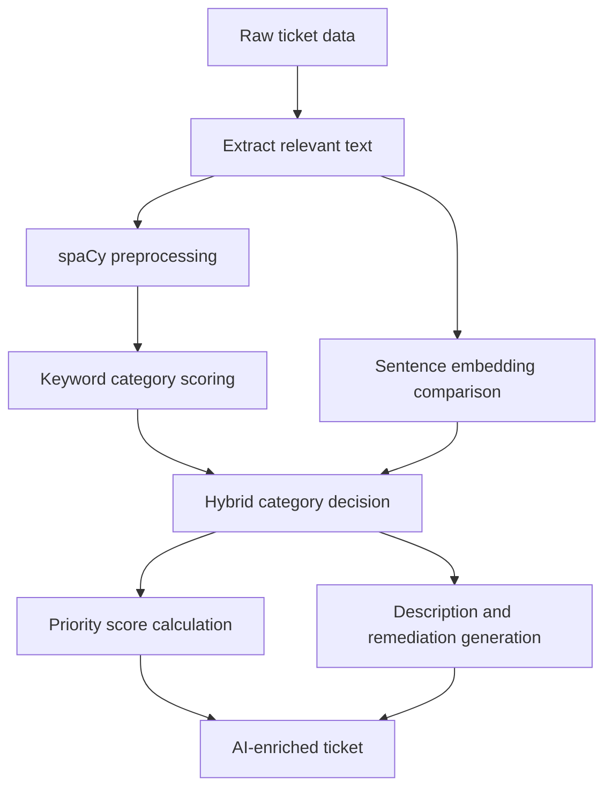

# AI Service Overview

## Why This Exists

The AI service helps the application turn raw ticket text into something more useful for humans.

Instead of returning only the original ticket fields, the AI service tries to add:

- a category
- a confidence-like score
- a calculated priority score
- a human-readable priority label
- an AI-generated explanation/remediation block

In simple terms:

- the ticket provider gives the backend raw ticket data
- the AI service reads the text in that ticket
- the AI service tries to work out what the ticket is about and how urgent it seems

## Human-Friendly Summary

If you are new to AI or NLP, the important thing to know is that this service is not one giant mysterious model.

It is a pipeline made of smaller steps:

1. clean the text
2. compare the text to known categories
3. choose a category
4. calculate a priority score using rules and confidence signals
5. build a useful summary/explanation

So this is really an "AI-assisted ticket enrichment" pipeline rather than a fully autonomous reasoning system.

## What The AI Service Actually Does Today

Verified from the current code:

- preprocesses ticket text with spaCy
- uses keyword matching for fast category guesses
- uses sentence embeddings for semantic similarity
- combines those into a hybrid category decision
- calculates a priority score using heuristics
- produces a human-readable priority label
- generates a ticket explanation and remediation suggestions
- supports both single-ticket and batch processing
- caches embeddings in memory to reduce repeated work
- can auto-generate categories from ticket data at startup if generated categories are missing
- can save processed ticket output to JSON files in the file-processing path

## What "AI" Means Here

There are two main AI-style techniques in this codebase:

### 1. NLP preprocessing with spaCy

spaCy is a natural language processing library.

Here it is used mainly for:

- tokenizing text into words/pieces
- normalizing words into lemmas
- removing stopwords and punctuation

This is not "decision making" by itself. It prepares text so later steps can work better.

### 2. Semantic similarity with sentence embeddings

The service uses the `all-MiniLM-L6-v2` sentence-transformer model.

That model turns text into a numeric vector called an embedding.

A useful beginner mental model is:

- texts with similar meaning should end up closer together in vector space

The service uses that to compare:

- the ticket text embedding
- category description embeddings

and then chooses the closest category.

## High-Level Pipeline

## Source Of Truth

This documentation is based on the current implementation in:

- `backend/app/services/ai/__init__.py`
- `backend/app/services/ai/config.py`
- `backend/app/services/ai/text_processor.py`
- `backend/app/services/ai/categorizer.py`
- `backend/app/services/ai/priority_calculator.py`
- `backend/app/services/ai/description_generator.py`
- `backend/app/services/ai/embedding_cache.py`
- `backend/app/services/ai/processor.py`
- `backend/app/services/ai/storage.py`
- `backend/app/services/ai/category_generator.py`
- `backend/app/main.py`

Legacy AI docs were used only as reference.

## Where The AI Service Is Used

The main backend integration points today are:

- `GET /api/tickets`
- `GET /api/tickets/{autotask_ticket_id}`
- `GET /api/tickets/stream/categorize`

Those routes call AI functions from `backend/app/services/ai`.

## The Service In Plain English

When a ticket comes in, the AI service roughly asks:

- what words are in this ticket?
- do those words strongly match a known category?
- if not, which category description is semantically closest?
- how serious does this ticket sound?
- can we produce a useful explanatory text for the user or operator?

## Important Current Limitations

Verified from the current implementation:

- this is not a learning system that continuously retrains itself during normal request handling
- the "description generator" is mostly template/remediation logic, not full generative AI text synthesis
- many priority decisions are heuristic and rule-based
- category quality depends heavily on the ticket text, available categories, and preprocessing behavior
- embedding cache and metrics are in-memory only
- some file-storage paths in `config.py` are hard-coded Windows-style paths, which may not match the current repository environment
- the file-processing/storage path looks more prototype-like than the request-time API categorization path

## Recommended Reading Order

For teammates, the best reading order is:

1. [overview.md](/home/liam/Documents/GitHub/comp2003-2025-2026-team-3/docs/services/ai-service/overview.md)
2. [architecture.md](/home/liam/Documents/GitHub/comp2003-2025-2026-team-3/docs/services/ai-service/architecture.md)
3. [flows.md](/home/liam/Documents/GitHub/comp2003-2025-2026-team-3/docs/services/ai-service/flows.md)
4. [dependencies.md](/home/liam/Documents/GitHub/comp2003-2025-2026-team-3/docs/services/ai-service/dependencies.md)
5. [troubleshooting.md](/home/liam/Documents/GitHub/comp2003-2025-2026-team-3/docs/services/ai-service/troubleshooting.md)
6. [future-direction.md](/home/liam/Documents/GitHub/comp2003-2025-2026-team-3/docs/services/ai-service/future-direction.md)
