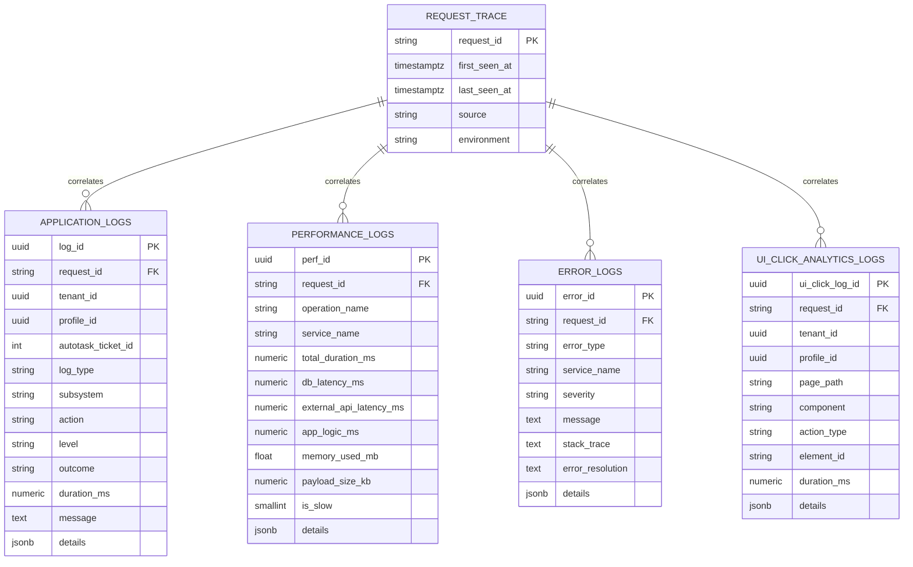
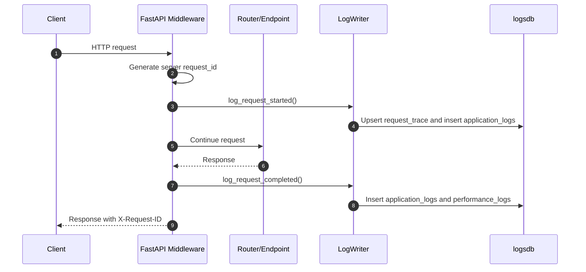

# Logging System Architecture

## Purpose

This document explains how the current durable logging architecture is structured, what each component is responsible for, and where its boundaries are.

The key architectural improvement is that durable log writes now go through one service:

- `backend/app/services/log_writer.py`

That service writes to a dedicated PostgreSQL logging database configured by:

- `backend/app/log_database.py`
- `settings.LOG_DATABASE_URL`
- `backend/compose.yml`
- `backend/alembic_logs/`

## Architecture In One Sentence

The app now has a database-backed structured logging layer centered on `LogWriter`, while retaining console and AI file logging as supporting development outputs.

## Main Components

### `LogWriter`

File:

- `backend/app/services/log_writer.py`

Responsibilities:

- provide the only normal application API for durable log writes
- create or update `request_trace` rows before request-linked events
- write rows to `application_logs`
- write rows to `performance_logs`
- write rows to `error_logs`
- write rows to `ui_click_analytics_logs`
- convert UUID-like values into real UUID objects for PostgreSQL
- JSON-encode structured `details`
- swallow logging failures so logging does not break the user-facing request path

Important behavior:

- each write opens its own async logging DB session
- failed log writes are rolled back and emitted through fallback Python logging
- `request_trace` uses a PostgreSQL upsert so repeated writes for the same request ID update `last_seen_at`

### `LogContext`

File:

- `backend/app/services/log_writer.py`

`LogContext` is a small shared object that carries common metadata:

- request ID
- source, such as `backend` or `frontend`
- endpoint and HTTP method
- tenant ID
- profile ID
- Autotask ticket ID
- frontend page/component context
- logger name

The purpose is to avoid passing long repeated parameter lists through routers and services.

### Logging database models

File:

- `backend/app/models/logs.py`

Tables:

- `request_trace`
- `application_logs`
- `performance_logs`
- `error_logs`
- `ui_click_analytics_logs`

These models define the durable schema and the relationships between request traces and individual log families.

### Request logging middleware

File:

- `backend/app/main.py`

Responsibilities:

- generate a new server-owned request ID for every HTTP request
- validate any inbound `X-Request-ID` only as untrusted metadata
- store the server request ID in `request.state.request_id`
- write request-start application logs
- write request-completion application logs
- write request-level performance logs
- write error logs for unhandled exceptions
- return the server request ID in the response `X-Request-ID` header

Security boundary:

- inbound `X-Request-ID` is not trusted as identity or authorization data
- the backend always creates the authoritative request ID

### Frontend UI log ingestion

Backend files:

- `backend/app/routers/logs.py`
- `backend/app/schemas/logs.py`

Frontend file:

- `frontend/src/shared/api/uiLogs.ts`

Responsibilities:

- accept authenticated UI interaction events through `POST /api/v1/logs/ui-clicks`
- validate event shape with `UIClickLogCreate`
- build a frontend `LogContext`
- write to `ui_click_analytics_logs` through `LogWriter`
- avoid blocking frontend actions if the log request fails

### Existing console and AI file logging

Files:

- `backend/app/main.py`
- `backend/app/services/ai/logging_config.py`
- `backend/app/services/ai/*.py`

These paths still exist. They are useful for local development and AI debugging, but they are not the canonical durable structured logging path.

## Database Shape

## Request Path Architecture

## Boundaries And Ownership

### What should use `LogWriter`

Use `LogWriter` for events that should be queryable later:

- request lifecycle events
- auth events
- profile and specialism changes
- AI ticket state changes
- manual overrides
- errors and exception context
- request-level performance rows
- frontend UI interactions

### What should stay in normal Python logging

Use normal `logger.debug(...)`, `logger.info(...)`, or AI file logging for:

- very noisy local debugging
- model initialization chatter
- temporary development-only traces
- messages that are not worth retaining as database records

### What should not happen

Do not:

- insert into log tables directly from routers or services
- use request IDs for authorization or identity checks
- make business success depend on a logging write succeeding
- place secrets, session tokens, Entra authorization codes, or raw credentials in log details

## Current Performance Model

The middleware writes one request-level `performance_logs` row per completed request.

Currently populated:

- `total_duration_ms`
- `app_logic_ms`, as a route-level fallback equal to total request duration
- `memory_used_mb`, process RSS memory where measurable
- `payload_size_kb`, from known `Content-Length` header values
- `is_slow`, based on `duration_ms >= 1000`

Currently not populated by middleware:

- `db_latency_ms`
- `external_api_latency_ms`

Those require explicit timing around database calls and external/provider calls. See [future-direction.md](future-direction.md).

## Architecture Strengths

Verified strengths:

- durable logs are now centralized through `LogWriter`
- frontend UI events are persisted through a backend ingestion endpoint
- request IDs exist for backend correlation
- logging failures are isolated from the user-facing request path
- log rows carry tenant/profile/ticket context where available
- the schema separates application events, errors, performance, and UI interactions

## Architecture Limitations

Verified limitations:

- no log viewer UI exists yet
- no retention or cleanup policy exists yet
- DB and external API latency are not separately measured yet
- not every existing console/file log has a durable equivalent
- frontend UI logs create their own backend ingestion request ID rather than sharing a browser action ID across all related API calls
- AI file logging still exists separately from durable logging
