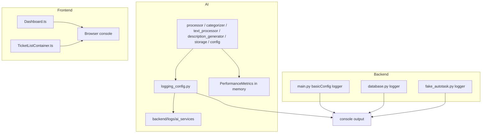

# Logging System Architecture

## Architecture In One Sentence

The repository currently has a split logging architecture: a general backend logger, a richer AI-specific logging module, and frontend browser-console instrumentation.

## Why It Looks This Way

The logging approach appears to have evolved incrementally rather than being designed as a single observability platform from the start.

That is visible in the code:

- `backend/app/main.py` configures base Python logging with `logging.basicConfig(...)`
- the AI service has its own logging bootstrap in `backend/app/services/ai/logging_config.py`
- the frontend relies on `console.log`, `console.warn`, and `console.error`

So the current system is best understood as three related logging layers, not one unified subsystem.

## High-Level Diagram



## Current Components

### 1. General backend logging

Primary source:

- `backend/app/main.py`

Implementation:

- `logging.basicConfig(level=logging.DEBUG, format='%(asctime)s - %(levelname)s - %(message)s')`
- module loggers created with `logging.getLogger(__name__)`

What it covers:

- FastAPI lifespan events
- `/api/tickets` request timing and progression
- errors during ticket processing
- stream endpoint progress and failures

Other backend modules also use standard Python logging:

- `backend/app/database.py`
- `backend/app/providers/fake_autotask.py`

### 2. AI-specific logging configuration

Primary source:

- `backend/app/services/ai/logging_config.py`

This is the most intentional part of the logging system.

It creates:

- a named logger root: `ai_services`
- a console handler
- a rotating main log file
- a rotating performance log file
- a rotating error log file
- an in-memory performance metrics collector

Configured files:

- `backend/logs/ai_services/ai_services.log`
- `backend/logs/ai_services/ai_services_performance.log`
- `backend/logs/ai_services/ai_services_errors.log`

### 3. AI metrics collector

Primary source:

- `PerformanceMetrics` in `backend/app/services/ai/logging_config.py`

What it does:

- stores operation durations in memory
- calculates count, total, average, min, and max
- can emit a summary to a logger

What it does not do:

- persist metrics to a database
- expose them through a monitoring API
- retain metrics across process restarts

### 4. Frontend console instrumentation

Primary sources:

- `frontend/src/pages/Dashboard.ts`
- `frontend/src/components/TicketListContainer.ts`

What it covers:

- fetch timing
- parse timing
- render timing
- filtering timing
- category grouping timing
- error conditions when requests fail

What it means in practice:

- useful for live debugging in the browser
- not centrally stored
- disappears with page refresh or closed devtools

## AI Logging Internals

The AI logger configuration is worth understanding because it is more complex than the rest of the codebase.

### Handler layout

```mermaid
flowchart TD
  Setup[setup_logging()] --> Root[logger ai_services]
  Root --> Console[StreamHandler INFO+]
  Root --> MainFile[RotatingFileHandler DEBUG+]
  Root --> ErrorFile[RotatingFileHandler WARNING+]
  Setup --> PerfLogger[logger ai_services.performance]
  PerfLogger --> PerfFile[RotatingFileHandler DEBUG+]
```

### What this design is trying to do

- keep the terminal readable by limiting console noise
- still retain detailed debug data in files
- separate timing/performance output from general operational output
- separate warnings/errors from all-purpose logs

### Important caveat

This richer AI logging setup only applies to modules that use `backend/app/services/ai/logging_config.py`.

It does not automatically unify the rest of the backend or the frontend.

## Runtime Boundaries

### Backend main logger vs AI logger

These are related but not identical logging paths.

- main backend behavior uses the root/basicConfig setup
- AI services use the `ai_services` logger tree

This can create differences in:

- formatting
- handlers
- where messages end up
- how much detail is retained

### Frontend vs backend logs

There is no correlation system between frontend console logs and backend logs today.

That means:

- you cannot easily trace one browser action across both ends with a shared request ID
- debugging often means manually comparing timestamps

## Architecture Strengths

Verified from the current implementation:

- the backend has broad instrumentation around the ticket API flow
- the AI modules have a more advanced handler setup than the rest of the system
- performance logging is not just ad hoc strings; some timings are also collected into a metrics object
- rotating file handlers prevent unlimited growth of AI log files

## Architecture Weaknesses

Also verified from the current implementation:

- logging is not centralized across the whole application
- the system mixes stdout logging, file logging, and browser console logging without a unified schema
- frontend logs are ephemeral
- AI metrics are in-memory only
- there is no database-backed logging path
- there is no shared request/trace correlation ID
- there is no documented log retention strategy beyond file rotation for AI logs

## Recommended Mental Model For The Team

For now, think of the logging system as:

1. development-facing operational output
2. AI-focused performance instrumentation
3. a foundation for future observability work, not the final destination
