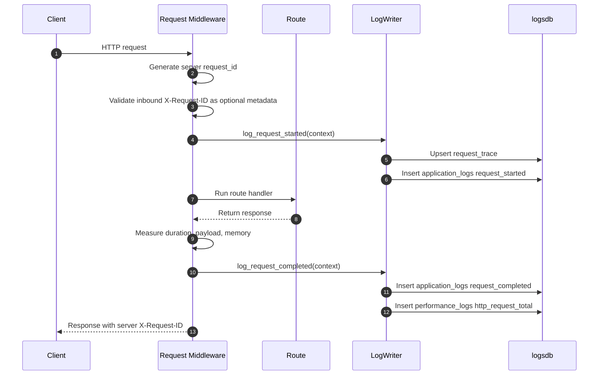
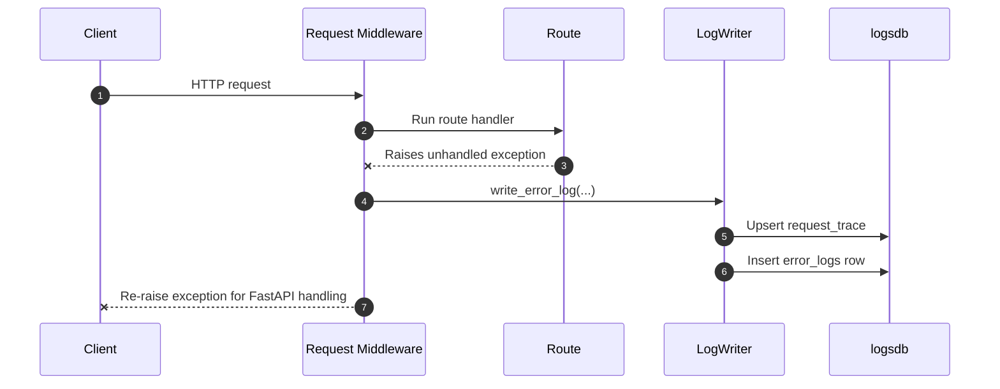
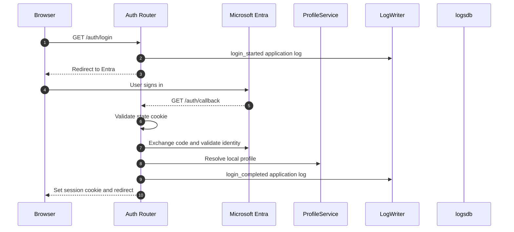
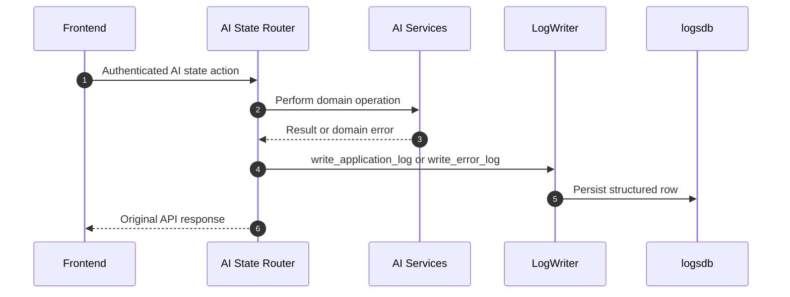
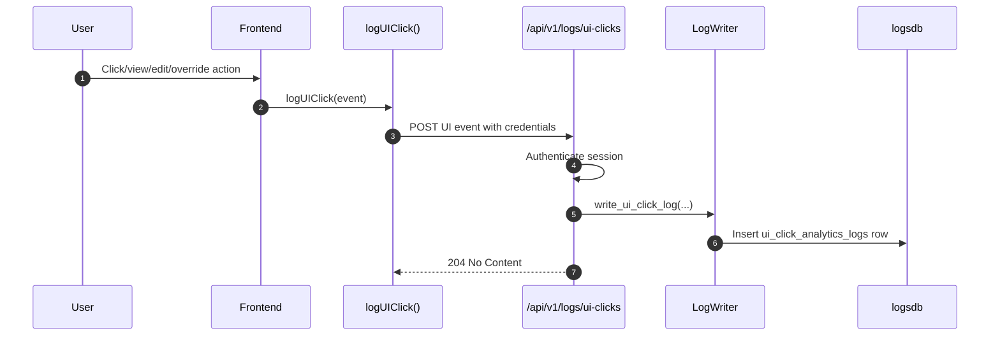
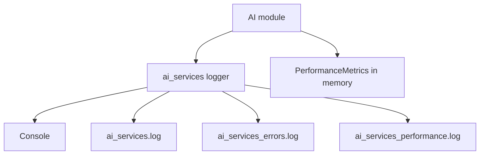
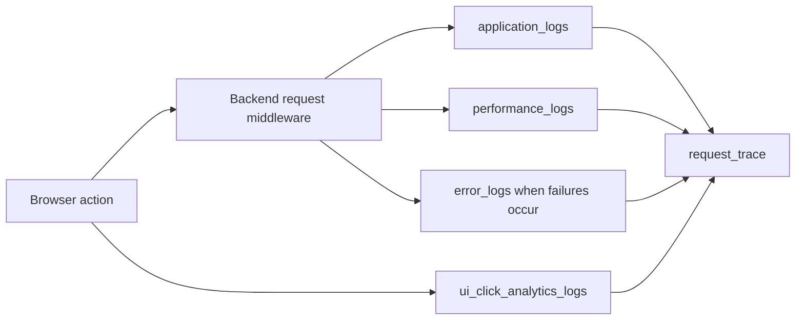

# Logging System Flows

## Purpose

This document explains how log data moves through the current implementation.

The main idea is that durable logs are written at meaningful boundaries:

- request middleware
- auth routes
- AI ticket state routes
- profile/specialism routes
- frontend UI ingestion

Low-level console and AI file logs still exist, but they are supporting outputs rather than the durable system of record.

## Flow 1: Backend Request Lifecycle

Primary files:

- `backend/app/main.py`
- `backend/app/services/log_writer.py`

### What happens

### What gets written

`application_logs`:

- `log_type = backend_request`
- `subsystem = http`
- `action = request_started`
- `action = request_completed`

`performance_logs`:

- `operation_name = http_request_total`
- `service_name = http`
- `total_duration_ms`
- `app_logic_ms`
- `memory_used_mb`
- `payload_size_kb`
- endpoint, method, status code, tenant/profile context where available

### Important details

The backend always creates the authoritative request ID. If the client sends `X-Request-ID`, the middleware validates it with a simple safe-character and length rule, then stores it in JSON `details` as metadata. It is not used for authorization.

## Flow 2: Unhandled Backend Exception

Primary files:

- `backend/app/main.py`
- `backend/app/services/log_writer.py`

### What happens

### What gets written

`error_logs` includes:

- `service_name = http`
- `severity = high`
- `action = request_unhandled_exception`
- exception type
- stack trace
- endpoint and method
- request ID

Logging the exception does not convert it into a success response. The middleware re-raises the exception after writing the durable error row.

## Flow 3: Auth Events

Primary file:

- `backend/app/routers/auth.py`

### What happens

### Failure logging

The auth router writes durable error logs for:

- invalid callback state
- denied profile resolution
- missing profile for an existing session

Sensitive values such as authorization codes and session tokens should not be logged.

## Flow 4: AI Ticket State Events

Primary file:

- `backend/app/routers/ai_state.py`

### What gets logged

The AI state router writes application logs for successful high-value operations:

- `ticket_states_refreshed`
- `oversight_run_completed`
- `ticket_state_closed`
- `ticket_category_overridden`
- `ticket_state_updated`
- `assignment_override_set`
- `assignment_override_cleared`

It writes error logs for validation failures around:

- closing ticket state
- overriding category
- updating ticket state
- setting or clearing assignment overrides

### Flow

### Boundary

The router logs durable business events. The AI modules still have their own local console/file logging and in-memory metrics, but those low-level AI metrics are not automatically copied into `logsdb`.

## Flow 5: Profile And Specialism Events

Primary file:

- `backend/app/routers/profiles.py`

### What gets logged

Profile management writes application logs for:

- tenant created
- profile created
- profile updated
- profile deactivated
- identity linked
- specialism created
- specialism assigned
- authenticated profile specialisms replaced

It writes error logs for:

- profile creation validation failure
- identity link failure
- specialism assignment failure
- authenticated specialism replacement validation failure

These logs are useful for understanding who changed people/profile data and which tenant or profile was involved.

## Flow 6: Frontend UI Interaction Logging

Primary files:

- `frontend/src/shared/api/uiLogs.ts`
- `frontend/src/components/TicketListContainer.ts`
- `frontend/src/components/TicketEditModal.ts`
- `frontend/src/components/TicketCloseModal.ts`
- `frontend/src/components/TicketCategoryReassignModal.ts`
- `frontend/src/pages/TicketDetail.ts`
- `backend/app/routers/logs.py`
- `backend/app/schemas/logs.py`

### What happens

### Current frontend event examples

The frontend currently emits UI logs for:

- changing the ticket list view
- opening a ticket
- opening edit, category reassignment, or close actions
- saving a ticket edit
- saving a category reassignment
- closing a ticket
- setting or clearing assignment overrides

### Failure behavior

`logUIClick()` catches failures and logs a debug message in the browser console. It does not block the UI action.

## Flow 7: AI Console/File Logging

Primary file:

- `backend/app/services/ai/logging_config.py`

This flow still exists:

This is useful for local AI debugging, but it is separate from durable database logs.

## Current End-To-End Observability Story

The system now has durable structured logs, but it does not yet have full distributed tracing across one browser action and every related API call. The current correlation root is request-oriented.
