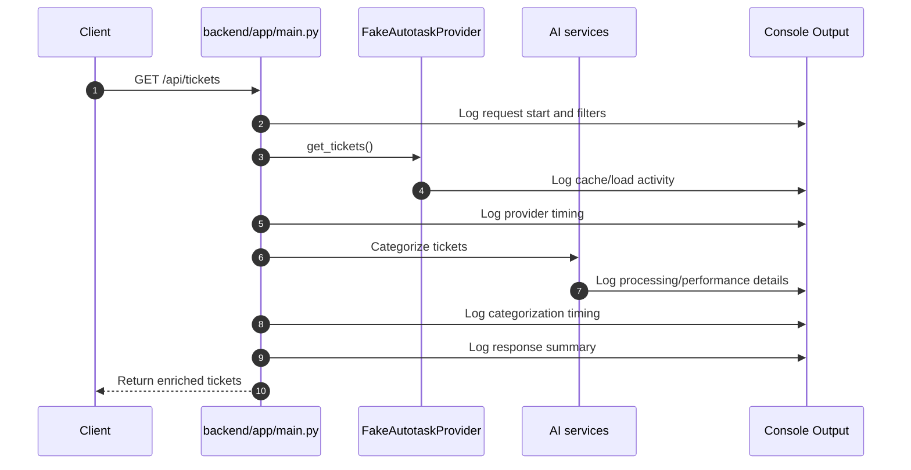
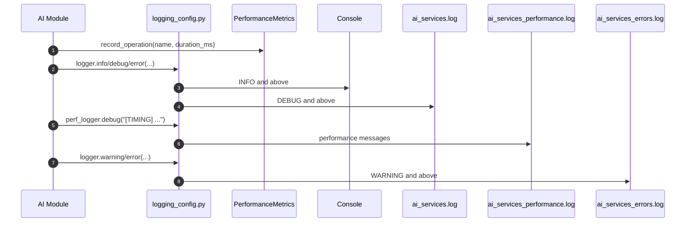
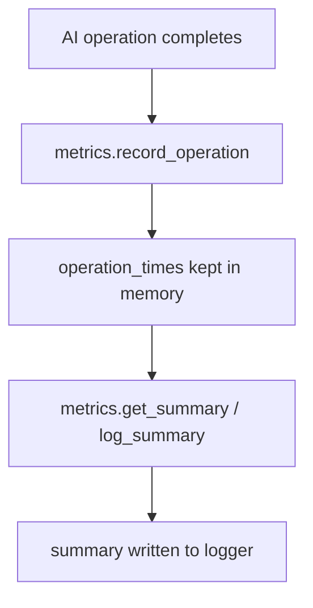
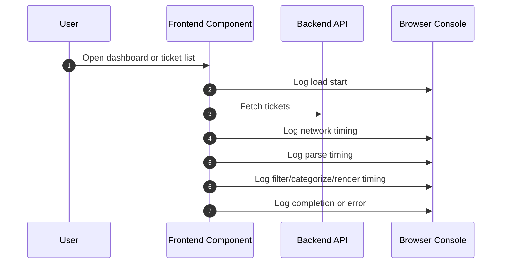
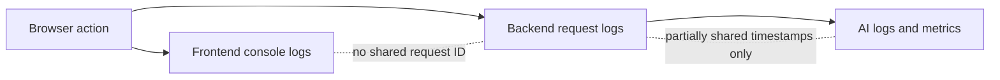

# Logging System Flows

## Purpose

This document explains how logging information is produced and where it goes in the current codebase.

The key point is that logs follow different paths depending on which part of the app produced them.

## Flow 1: Backend Ticket Request Logging

Primary source:

- `backend/app/main.py`

The `/api/tickets` route is the most heavily instrumented backend path.

### What happens

### What gets logged

- request start
- selected filters
- provider fetch timing
- categorization timing
- response timing
- errors with stack traces

### Why this matters

This route acts as the main performance story for the backend. If you are diagnosing slow behavior, this is usually the first place to look.

## Flow 2: AI Module Logging To Console And Files

Primary sources:

- `backend/app/services/ai/logging_config.py`
- `backend/app/services/ai/processor.py`
- `backend/app/services/ai/categorizer.py`
- `backend/app/services/ai/text_processor.py`
- `backend/app/services/ai/description_generator.py`
- `backend/app/services/ai/storage.py`

### What happens

### What this flow is trying to do

- keep terminal output readable
- still capture detailed debug information
- preserve separate timing/performance logs
- preserve warnings and errors separately

### Important practical note

This flow is only used by AI modules that import the AI logging configuration. It is not the global logging path for the entire repository.

## Flow 3: In-Memory AI Performance Metrics

Primary source:

- `PerformanceMetrics` in `backend/app/services/ai/logging_config.py`

### What happens

### What gets measured

Examples from the code:

- `spacy_nlp`
- `model.encode`
- `cosine_similarity`
- `predict_category_hybrid`
- `extract_ticket_text`
- `save_ticket_to_json`
- `process_ticket_total`
- `generate_ai_description_total`

### Limitation

These metrics live only in process memory.

That means:

- they reset when the process restarts
- they are not queryable from a database
- they are not exposed as a first-class monitoring interface

## Flow 4: Frontend Logging In The Browser

Primary sources:

- `frontend/src/pages/Dashboard.ts`
- `frontend/src/components/TicketListContainer.ts`

### What happens

### Why this is useful

- good for local performance debugging
- helpful when tuning UI rendering or fetch behavior

### Why this is limited

- only visible in developer tools
- not persisted
- not correlated with backend logs

## Flow 5: Backend Startup And Shutdown Logging

Primary sources:

- `backend/app/main.py`
- `backend/app/database.py`

### What happens

1. FastAPI lifespan startup logs application startup and environment
2. shutdown logs application shutdown
3. database shutdown logs connection disposal

This is basic but useful operational logging for local runs.

## Current End-To-End Observability Story

This is the honest current picture:

## What Is Missing From These Flows

Verified by current implementation:

- no database-backed logging sink
- no centralized query path for logs
- no cross-layer trace identifier
- no security/audit event model
- no explicit log events for profile or auth business operations beyond normal app logging
