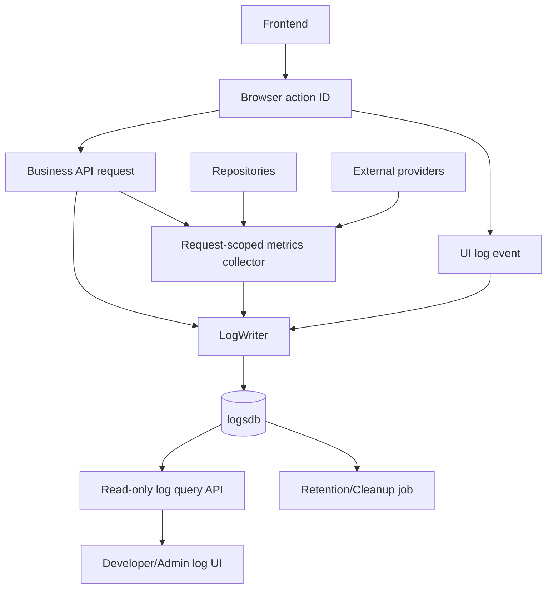

# Logging System Future Direction

## Purpose

This document separates verified current behavior from sensible next steps.

The repository now has a working database-backed logging foundation. The future work is no longer "add a log database"; it is about making the logging system more precise, easier to query, and safer to operate over time.

## Current Reality

Verified current behavior:

- durable logs are stored in `logsdb`
- `LogWriter` is the central write path
- backend middleware writes request lifecycle and performance rows
- important auth, AI, profile, and specialism events are instrumented
- frontend UI actions can be persisted through `/api/v1/logs/ui-clicks`
- console logging and AI rotating file logging still exist for local development

Verified limitations:

- no log search or admin UI
- no retention policy
- no per-route logging policy
- no DB latency timing
- no external/provider latency timing
- no cross-request browser action trace ID
- no formal audit/security event taxonomy

## Recommended Evolution Path

### Phase 1: Keep `LogWriter` As The Boundary

Current state:

- implemented

The most important design rule should stay in place:

> Other application files describe events. `LogWriter` decides how those events are persisted.

Future improvements should avoid direct table inserts from routers, services, providers, or frontend ingestion endpoints.

### Phase 2: Add Request-Scoped Metric Collection

Current request performance logs include:

- total request duration
- app logic fallback duration
- process memory
- known payload size

Future improvement:

- add a request-scoped metric collector on `request.state`
- allow lower-level code to add timings for database and external/provider calls
- have middleware write the accumulated totals at request completion

Suggested shape:

```text
request.state.performance_metrics.db_latency_ms += measured_db_time
request.state.performance_metrics.external_api_latency_ms += measured_provider_time
request.state.performance_metrics.app_logic_ms = calculated_remainder
```

This would allow:

- `db_latency_ms`
- `external_api_latency_ms`
- more accurate `app_logic_ms`

### Phase 3: Instrument Database Latency

Possible approaches:

1. Explicit service/repository timers
2. SQLAlchemy event hooks around SQL execution

Explicit timers are easier to reason about but may measure service work, not only SQL time.

SQLAlchemy event hooks are more accurate for SQL execution but need careful handling because this app uses async SQLAlchemy and multiple session factories.

Recommendation:

- start with explicit timers around high-value service operations
- add SQLAlchemy-level timing only if the team needs more precise database observability

### Phase 4: Instrument External And Provider Latency

Useful targets:

- Microsoft Entra OpenID/JWKS/token calls
- current `FakeAutotaskProvider` calls, labeled clearly as provider latency
- future real Autotask API calls
- any future remote AI service calls

Important distinction:

- local AI model work should usually count as app/AI logic
- remote HTTP calls should count as external API latency

### Phase 5: Add A Log Query Surface

Current state:

- developers can query logs through DBeaver or SQL

Future options:

- backend read-only log query endpoints
- admin/developer UI for recent requests, errors, and UI actions
- saved queries for common troubleshooting cases

Useful first views:

- recent failed requests
- slow requests
- errors by service/action/severity
- logs for one `request_id`
- logs for one tenant/profile/ticket
- recent UI actions by page/component

### Phase 6: Define Retention And Cleanup

Current state:

- no retention policy exists

Future decisions:

- how long to keep request-level logs
- how long to keep UI click analytics
- whether error logs should be retained longer
- whether old details JSON should be redacted or archived
- whether local development should retain fewer logs than shared environments

Possible implementation:

- scheduled cleanup job
- database partitioning by time
- archival tables or exports

### Phase 7: Add A Security And Audit Taxonomy

The current `application_logs` table can store security-relevant events, but the app does not yet have a formal audit event policy.

Future audit categories could include:

- authentication success/failure
- authorization failure
- profile creation/deactivation
- identity linking
- manual ticket category override
- manual assignment override
- specialism changes
- cache clear

Important future work:

- define which events are audit-grade
- decide which details are safe to store
- avoid secrets, tokens, auth codes, or raw credentials
- decide whether audit logs need stricter retention or immutability

### Phase 8: Add Cross-Layer Browser Action Correlation

Current state:

- backend request IDs correlate logs for one backend request
- UI click logs are sent as separate backend requests

Future improvement:

- generate a frontend action ID for a user action
- include it in the UI log event
- include it in related API calls
- store it in `details` or add a dedicated schema field in a future migration

This would let developers trace:

```text
user clicks close ticket -> UI log -> API close request -> app log -> performance log -> any error log
```

## Possible Future Architecture



## What Not To Do Next

Avoid these shortcuts:

- do not fill `db_latency_ms` with total request time
- do not fill `external_api_latency_ms` with guessed values
- do not make user-facing requests fail because logging failed
- do not log raw auth tokens, Entra authorization codes, or secrets
- do not add direct database inserts outside `LogWriter`
- do not turn every debug line into a durable database row

## Suggested Next Implementation Order

1. Add request-scoped metrics storage.
2. Add explicit provider/external call timers.
3. Add explicit DB/service timers for high-value routes.
4. Add log query endpoints for recent requests and errors.
5. Add a simple developer-facing log view.
6. Define retention and cleanup.
7. Add browser action correlation.
8. Formalize audit/security event categories.

## Current Recommendation

Keep the current logging system intentionally structured and sparse.

It is better for the database to contain high-signal events with trustworthy fields than to contain every local debug message or guessed metric. The next round of work should focus on better measurement boundaries and queryability, not simply more rows.
