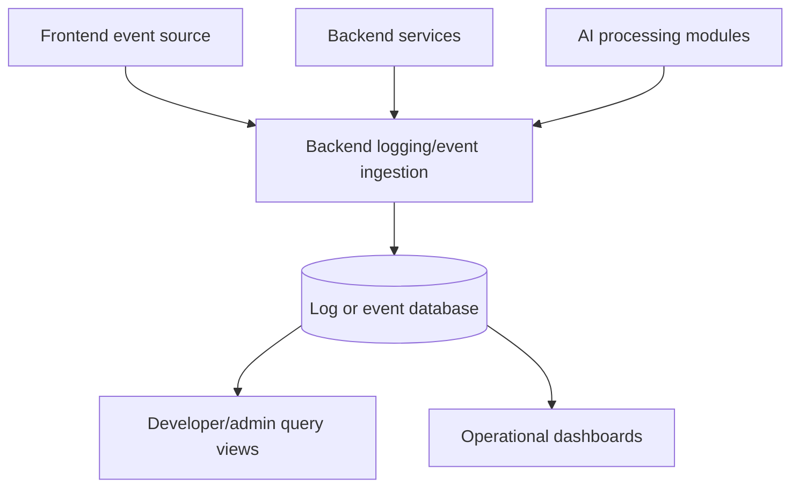
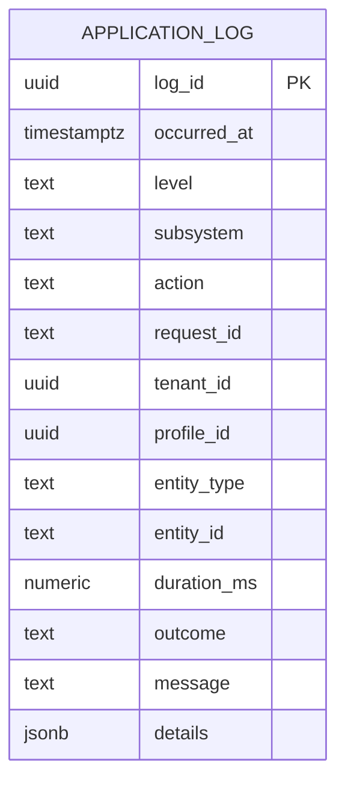

# Logging System Future Direction

## Purpose

This document is intentionally different from the other logging docs.

The other files describe what exists today.

This file explains where the logging system likely needs to go next, based on the current implementation and the gaps already visible in the codebase.

## Current Reality

Today the repository mainly has:

- console-based backend logging
- rotating AI log files
- browser console logs
- in-memory AI performance metrics

That is good enough for local development and short-lived debugging sessions, but it is not ideal if the team wants better observability, searchable history, and more structured operational analysis.

## Why File Logging Is Not The End State

Using rotating log files is a practical step for a prototype, but it has limits:

- logs are harder to query than database records
- logs stay tied to one environment or machine
- cross-request analysis is awkward
- joining logs to application concepts is difficult
- frontend and backend logs still remain disconnected

So your instinct is sound: if this system matures, a database-backed or centralized event/logging model is likely a better long-term direction than local files alone.

## Recommended Evolution Path

### Phase 1: Unify application logging shape

Before changing storage, standardize what a log event looks like.

Suggested common fields:

- timestamp
- level
- subsystem
- action
- request_id
- profile_id if available
- tenant_id if available
- ticket_id if available
- duration_ms if relevant
- outcome
- error details

Why this comes first:

- a shared schema matters more than the storage mechanism

### Phase 2: Introduce correlation IDs

Add a request or trace ID that can flow through:

- frontend request initiation
- backend request handling
- AI processing steps
- auth/profile resolution

This would dramatically improve debugging.

### Phase 3: Separate operational events from debug noise

Not every log line should be treated equally.

A better model would distinguish:

- audit or security events
- business events
- performance events
- debug tracing
- infrastructure/health events

### Phase 4: Move durable logs/events into a queryable store

If the team wants logs in a database, a future design could look like this:

Possible database approaches:

- a dedicated `application_log` table
- separate tables for audit events and performance events
- event-stream style tables if the team wants richer history

### Phase 5: Keep file or console logging as supporting outputs

Moving toward database-backed events does not necessarily mean removing all console or file logs.

A sensible end state could be:

- console logs for local development
- structured durable events in the database
- optional file logs only where still operationally useful

## Suggested Data Model For Durable Logging

This is not implemented yet. It is a documentation-level suggestion only.

## Good Candidates For Structured Durable Events

If the team adds richer logging, these would likely be high-value events:

- auth login success/failure
- profile resolution and first-login provisioning
- ticket fetch and categorization summary
- slow AI operations
- cache clears and cache stats snapshots
- specialism assignments
- deactivation or reactivation of profiles

## Recommendation For This Repository

The best next move is probably not "replace everything with a database tomorrow".

The better sequence is:

1. standardize event shape
2. add request IDs
3. decide which events deserve durable storage
4. introduce database-backed event persistence for those important events
5. keep console logs for local developer feedback

That path lets the team improve the system without losing the usefulness of the current logging during development.
