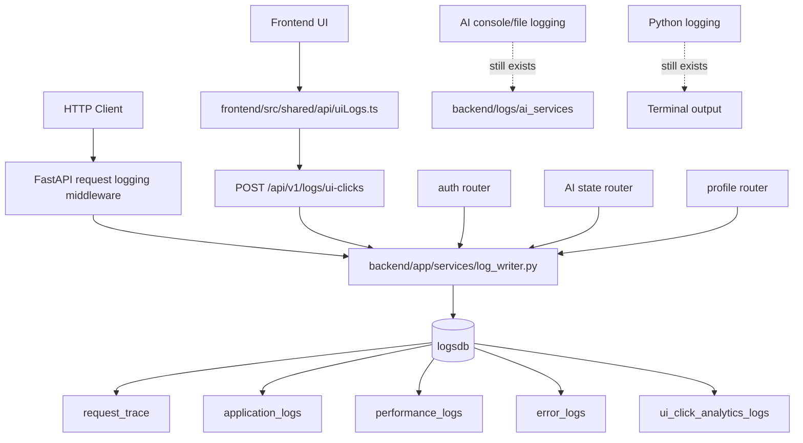

# Logging System Overview

## Why This Exists

The logging system exists so developers can answer practical questions after the app has done work:

- what request or user action happened?
- which tenant, profile, ticket, endpoint, or frontend component was involved?
- did it succeed, fail, or run slowly?
- where should a future developer or AI agent look next?

The current implementation now has a dedicated durable logging database. That means important application, error, performance, and UI interaction events are stored as structured rows instead of only appearing in the terminal, browser console, or rotating AI log files.

## Plain-English Summary

The easiest mental model is:

1. Every backend HTTP request gets a server-generated request ID.
2. Middleware writes request start, request completion, and request-level performance rows.
3. Important backend business actions call `LogWriter` directly.
4. Frontend UI actions call a backend ingestion endpoint, which also uses `LogWriter`.
5. All durable log rows are connected through `request_trace.request_id` when they are request-linked.

The central rule is:

> Application code should call `backend/app/services/log_writer.py`; it should not insert directly into the logging tables.

## Source Of Truth

This documentation is based on the current implementation in:

- `backend/app/models/logs.py`
- `backend/app/services/log_writer.py`
- `backend/app/log_database.py`
- `backend/app/main.py`
- `backend/app/routers/logs.py`
- `backend/app/routers/auth.py`
- `backend/app/routers/ai_state.py`
- `backend/app/routers/profiles.py`
- `backend/app/schemas/logs.py`
- `frontend/src/shared/api/uiLogs.ts`
- `frontend/src/components/TicketListContainer.ts`
- `frontend/src/components/TicketEditModal.ts`
- `frontend/src/components/TicketCloseModal.ts`
- `frontend/src/components/TicketCategoryReassignModal.ts`
- `frontend/src/pages/TicketDetail.ts`
- `backend/compose.yml`
- `backend/alembic_logs/versions/5bccb4e25b7a_create_logging_tables.py`

Existing console and AI file logging still exists and remains useful for local development, but the durable logging database is now the canonical place for structured logging events.

## What Gets Written

### Request traces

`request_trace` is the correlation root. A request trace stores:

- `request_id`
- `first_seen_at`
- `last_seen_at`
- `source`
- `environment`

Every durable request-linked log writes or touches a `request_trace` row first.

### Application logs

`application_logs` stores general structured backend events. Examples:

- backend request started
- backend request completed
- login started or completed
- profile created or updated
- specialism assigned
- AI ticket state refreshed
- ticket category overridden
- embedding cache cleared

These rows are for business and operational meaning, not low-level debug chatter.

### Performance logs

`performance_logs` stores request-level timing and resource information. The middleware currently writes:

- `total_duration_ms`
- `app_logic_ms`, currently the full request duration fallback
- `memory_used_mb`, measured as process RSS memory where available
- `payload_size_kb`, based on known request and response `Content-Length` headers
- endpoint, method, status, tenant/profile context where available

Verified limitation:

- `db_latency_ms` and `external_api_latency_ms` are not populated yet because the app does not yet time database calls or external/provider calls separately.

### Error logs

`error_logs` stores structured failures with debugging context. Examples:

- invalid Entra callback state
- denied profile resolution
- missing session profile
- failed AI ticket state updates
- unhandled HTTP request exceptions

These rows can include exception type, stack trace, severity, endpoint, method, status, tenant/profile/ticket context, and JSON details.

### UI click analytics logs

`ui_click_analytics_logs` stores frontend interaction events submitted through:

- `POST /api/v1/logs/ui-clicks`

Examples:

- ticket viewed
- edit modal opened
- ticket edited
- category reassignment opened or saved
- ticket closed
- assignment override set or cleared

The frontend helper is intentionally non-blocking. If logging fails, the user action continues.

## Current Topology

## What This System Is Not

The current system is not a full observability platform yet.

It does not currently include:

- a log search UI
- retention policies
- OpenTelemetry tracing
- separate DB latency and external API latency timing
- automatic structured capture of every Python `logger.info(...)` call
- a security-reviewed audit log policy

Those are future improvements. The implemented system is a structured durable logging foundation for developers and future tooling.

## What To Read Next

Recommended order:

1. [overview.md](overview.md)
2. [architecture.md](architecture.md)
3. [flows.md](flows.md)
4. [dependencies.md](dependencies.md)
5. [troubleshooting.md](troubleshooting.md)
6. [future-direction.md](future-direction.md)
