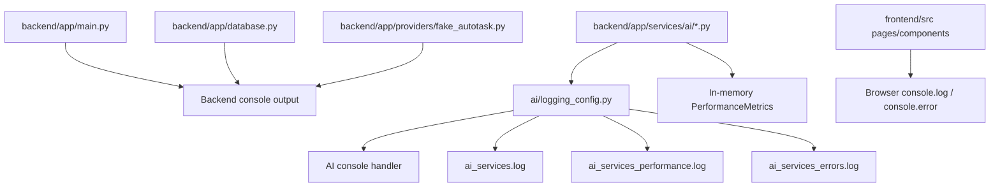

# Logging System Overview

## Why This Exists

The repository logs information for three main reasons:

- to help developers see what the application is doing
- to troubleshoot failures
- to measure performance, especially in the AI ticket-processing path

At the moment, the logging system is not one single centralized subsystem. It is a combination of:

- backend console logging
- AI-service-specific Python logging with rotating files
- frontend browser console logging
- in-memory performance metrics for selected AI operations

That is important to understand up front:

- the codebase has logging
- but it does not yet have a unified observability architecture

## Human Summary

If you are new to logging or observability, the easiest mental model is:

- the backend prints operational and timing information with Python's `logging`
- the AI modules go further and write some logs into files under `backend/logs/ai_services/`
- the frontend prints timing and debug information to the browser console
- there is no database-backed log store, correlation ID system, or central log query interface yet

## Source Of Truth

This documentation is based on the current implementation in:

- `backend/app/main.py`
- `backend/app/database.py`
- `backend/app/providers/fake_autotask.py`
- `backend/app/services/ai/logging_config.py`
- `backend/app/services/ai/processor.py`
- `backend/app/services/ai/categorizer.py`
- `backend/app/services/ai/description_generator.py`
- `backend/app/services/ai/text_processor.py`
- `backend/app/services/ai/storage.py`
- `frontend/src/pages/Dashboard.ts`
- `frontend/src/components/TicketListContainer.ts`
- `frontend/src/main.ts`

Legacy logging docs were used only as reference.

## What The Logging System Covers Today

### Backend application lifecycle and request logging

The backend logs:

- startup and shutdown events
- ticket API request start/end markers
- request filters and mode flags
- timing breakdowns for ticket fetch, categorization, and response preparation
- provider activity and some database lifecycle events

### AI processing logs

The AI modules log:

- module initialization
- batch and per-step processing timings
- cache behavior
- generation and storage activity
- warnings and errors

### Frontend console logs

The frontend logs:

- fetch start and end
- network timing
- JSON parsing timing
- render timing
- filtering and categorization timing in the ticket list
- dashboard calculation and render timing

## Current Logging Topology

## The Most Important Truth About This System

The logging system is useful for development, but it is not yet designed as a production-grade, centralized observability solution.

Examples of what is missing today:

- no database-backed log store
- no log search UI
- no request correlation IDs
- no shared structured event schema across frontend and backend
- no log retention/query policy beyond rotating AI log files
- no unified security/audit logging model

That does not mean the current logging is bad for local development. It means the team should treat it as a development-focused logging setup that still needs architectural improvement.

## What To Read Next

For teammates, the best reading order is:

1. [overview.md](/home/liam/Documents/GitHub/comp2003-2025-2026-team-3/docs/services/logging-system/overview.md)
2. [architecture.md](/home/liam/Documents/GitHub/comp2003-2025-2026-team-3/docs/services/logging-system/architecture.md)
3. [flows.md](/home/liam/Documents/GitHub/comp2003-2025-2026-team-3/docs/services/logging-system/flows.md)
4. [dependencies.md](/home/liam/Documents/GitHub/comp2003-2025-2026-team-3/docs/services/logging-system/dependencies.md)
5. [troubleshooting.md](/home/liam/Documents/GitHub/comp2003-2025-2026-team-3/docs/services/logging-system/troubleshooting.md)
6. [future-direction.md](/home/liam/Documents/GitHub/comp2003-2025-2026-team-3/docs/services/logging-system/future-direction.md)
