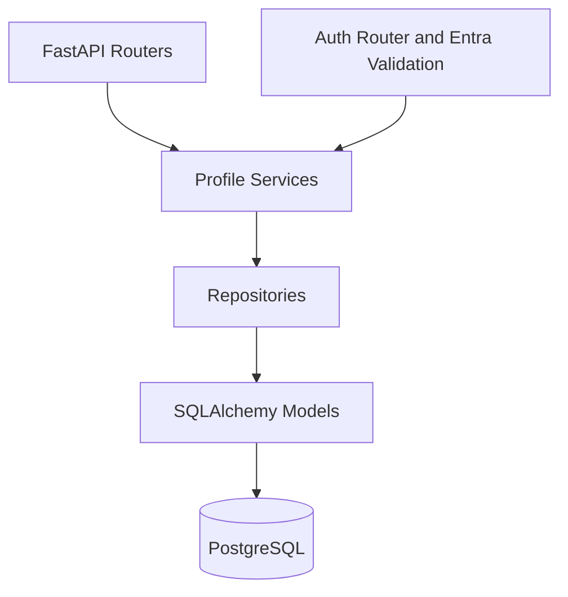
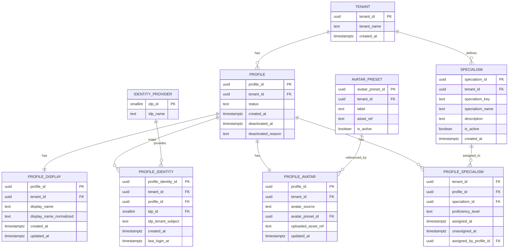
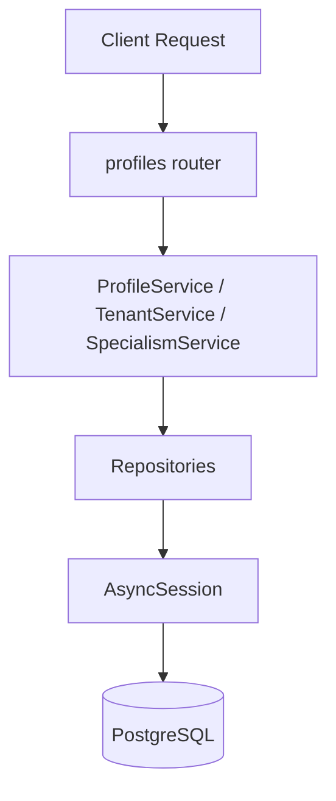
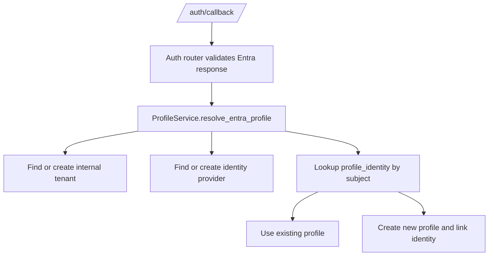

# Profile Service Architecture

## Architecture In One Sentence

The profile service is a backend domain that translates external identities into local application profiles and stores the profile-related data the rest of the system needs.

## Why The Architecture Looks Like This

This part of the system has two jobs at the same time:

- expose normal CRUD-style profile APIs
- participate in the authentication journey by resolving Entra users into local profiles

That means it needs both:

- clear database-backed domain logic
- a clean handoff from the auth layer into the profile domain

## Layered Structure

The profile service follows the backend's standard module layering:

1. Router layer
2. Service layer
3. Repository layer
4. ORM model layer
5. Database session layer

Source of truth:

- `backend/app/routers/profiles.py`
- `backend/app/services/profile_service.py`
- `backend/app/repositories/profile_repository.py`
- `backend/app/models/profile.py`
- `backend/app/database.py`

## High-Level Architecture Diagram

## Module Map

### Router layer

File:

- `backend/app/routers/profiles.py`

Responsibilities:

- define HTTP endpoints
- validate query, path, and body inputs through FastAPI and Pydantic
- turn missing-resource and invalid-operation cases into HTTP responses
- create service instances with the current database session

What this means for a developer:

- if you want to know which endpoints exist and what request shape they accept, start here
- if you want to know whether an error becomes `404`, `400`, or `201`, start here

Notable behavior:

- many profile operations require `tenant_id` as a query parameter
- some lower-level failures are intentionally flattened into generic `400` responses, especially around identity linking and specialism assignment

### Service layer

File:

- `backend/app/services/profile_service.py`

Classes:

- `ProfileService`
- `TenantService`
- `SpecialismService`

Responsibilities:

- coordinate repository calls
- apply business rules
- convert ORM results into response schemas
- implement Entra-specific local profile resolution and provisioning

What this means for a developer:

- if you want to understand "why does the system behave this way?", this is usually the best place to read first

Important design note:

- the service layer is fairly thin in several methods
- some methods are mostly orchestration wrappers around repository calls rather than deep business-logic engines

### Repository layer

File:

- `backend/app/repositories/profile_repository.py`

Repositories:

- `ProfileRepository`
- `TenantRepository`
- `IdentityRepository`
- `SpecialismRepository`

Responsibilities:

- execute SQLAlchemy queries and updates
- load related records for profile reads
- commit writes
- hide repeated database access patterns from the service layer

What this means for a developer:

- if you want to know exactly which tables are read or updated, this is where that becomes concrete

Important implementation detail:

- many repository methods call `commit()` directly even though `get_db()` in `backend/app/database.py` also commits at the end of a successful request
- that means transaction boundaries are more granular than a simple "one request, one transaction" mental model

### Model layer

File:

- `backend/app/models/profile.py`

Responsibilities:

- define tables, foreign keys, indexes, and relationships for the profile domain

What this means for a developer:

- if you want to understand the shape of the data or build a mental model of the domain, this file is the core reference

### Schema layer

File:

- `backend/app/schemas/profile.py`

Responsibilities:

- define request and response contracts for tenants, profiles, identities, specialisms, and avatar fields

What this means for a developer:

- if you want to know which values the API allows, this is the fastest place to check

## Domain Model Diagram

This diagram is adapted from your proposed model and aligned to the current code in `backend/app/models/profile.py`.

## How To Read The Data Model

### Tenant

The tenant is the top-level organizational boundary.

In practice, that means:

- profiles belong to a tenant
- specialisms belong to a tenant
- avatar presets belong to a tenant

The login provisioning flow also uses a configured internal tenant name when resolving Entra users locally.

### Profile

The profile is the application's local user record.

It stores:

- the tenant relationship
- lifecycle state such as `active`, `deactivated`, or `suspended`
- creation and deactivation metadata

The profile is intentionally kept separate from:

- display data
- avatar data
- identity mapping data
- specialism assignments

That separation keeps the model flexible and easier to extend.

### Identity provider and profile identity

These two tables together answer the question:

"Which local profile should this external login map to?"

`identity_provider` stores the provider type, such as `microsoft`.

`profile_identity` stores the provider-specific subject and links it to a local profile.

For Entra-created users in the current implementation, the subject format is:

- `{entra_tenant_id}:{object_id}`

### Display and avatar tables

These store profile-adjacent information that is useful to the UI but separate from the core lifecycle state.

That includes:

- the display name used for search and presentation
- avatar configuration and preset references

### Specialisms

Specialisms let the tenant define categories of skill or expertise and assign them to profiles.

This is modeled as:

- `specialism` for the definition
- `profile_specialism` for the assignment

## Runtime Interaction Diagram

Auth provisioning path:

## Boundaries With Other Parts Of The System

### Authentication system

Boundary:

- the auth module validates the Entra identity and manages session cookies
- the profile service converts that validated identity into a local application profile

This is an important distinction:

- auth proves who the user is
- the profile service decides how that user exists inside the app

### Frontend

Boundary:

- the frontend currently consumes authenticated profile data mainly through `/api/v1/auth/me`
- the current frontend does not appear to expose the full profile CRUD surface yet

### Ticket and AI services

Boundary:

- there is no direct dependency from the profile service to ticket categorization or ticket provider code
- the shared connection is user/session context used elsewhere in the app

## Architecture Risks And Gaps

Verified from the current code:

- profile routes are not protected by `get_current_session`, so route-layer access control is not enforced here
- some repository methods commit immediately, which limits broader transaction control
- identity linking and specialism assignment collapse broad exceptions into `False`, which reduces observability
- there is no explicit service-level check that the profile and specialism belong to the same tenant before assignment beyond the inserted tenant-scoped row

## Practical Reading Tips

If you are trying to understand a bug or add a feature:

1. Start in `backend/app/routers/profiles.py` to find the endpoint
2. Move to `backend/app/services/profile_service.py` to understand the rule being applied
3. Move to `backend/app/repositories/profile_repository.py` to see what is actually written or queried
4. Use `backend/app/models/profile.py` to confirm the table and relationship assumptions
