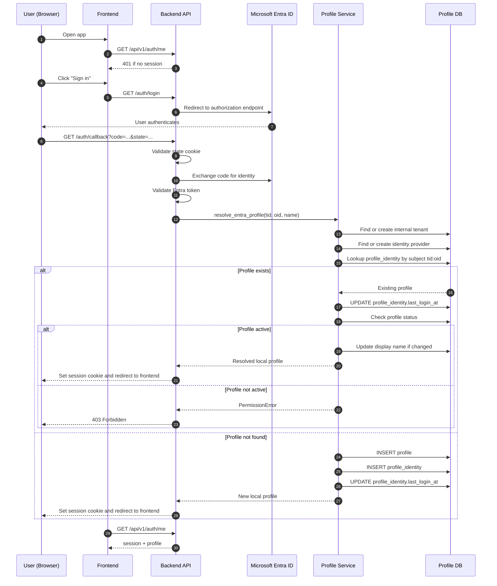
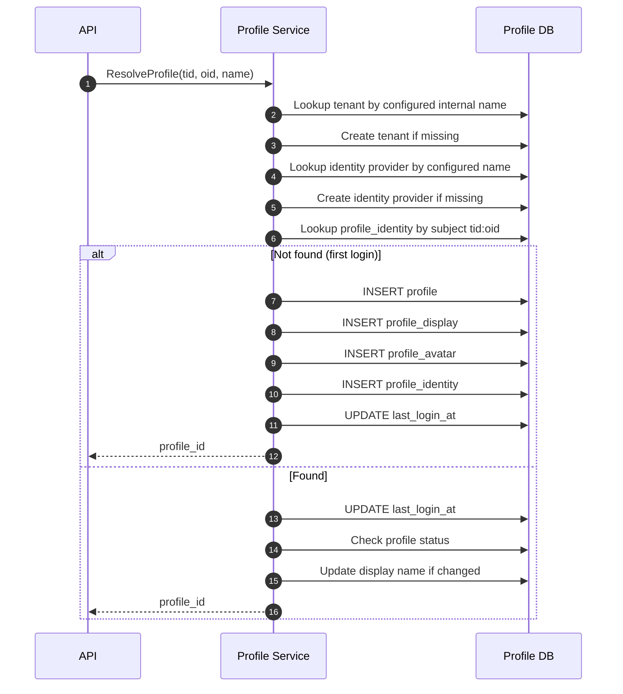
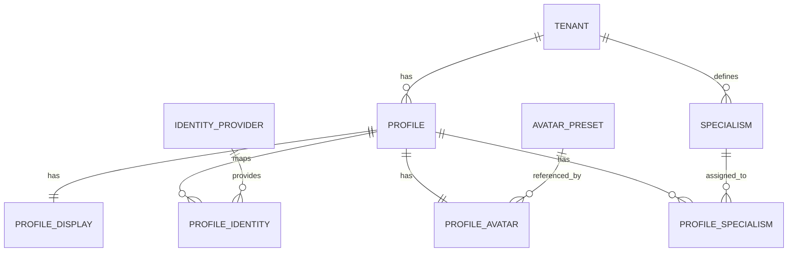

# Profile Service Flows

## Purpose

This document explains the main profile-service flows in a way that is useful for day-to-day development.

If `architecture.md` tells you how the pieces are arranged, this file tells you what actually happens when the system is used.

Source of truth:

- `backend/app/routers/profiles.py`
- `backend/app/services/profile_service.py`
- `backend/app/repositories/profile_repository.py`
- `backend/app/routers/auth.py`

## Most Important Flow: Entra Login To Local Profile

For this repository, this is the flow that matters most.

Why:

- it is the point where external identity becomes internal application state
- it is also the point where local profile status can block a valid external login

### Important correction from common assumptions

The current codebase uses a backend-led Entra flow.

That means the current implementation is:

- browser hits backend login route
- backend redirects to Entra
- Entra redirects back to backend callback
- backend resolves or provisions the local profile
- backend sets a session cookie
- frontend later asks the backend who the current user is

It is not currently:

- frontend obtaining a bearer token directly and sending that bearer token to the API on each request

### Implemented sign-in flow

This diagram adapts your sequence to match the current repository code.

### What this flow is trying to achieve

In plain English:

1. trust Entra for identity
2. trust the app for authorization and local state
3. avoid creating a separate user-management experience before the user can sign in

### What the current code actually inserts on first login

Verified from `ProfileService.resolve_entra_profile(...)` and `ProfileRepository.create_profile(...)`:

- it creates an internal tenant if needed
- it creates the identity provider if needed
- it creates:
  - `profile`
  - `profile_display`
  - `profile_avatar`
  - `profile_identity`

It does not currently insert default `profile_specialism` rows during first login.

## Developer-Oriented Resolve Flow

This is a simplified service-centric version of the same idea.

## Data Model Flow

This diagram is the quickest way to understand what records are related.

## Flow: Create A Tenant

Entry point:

- `POST /api/v1/tenants`

What happens:

1. FastAPI validates `TenantCreate`
2. `TenantService.create_tenant(...)` runs
3. `TenantRepository.create_tenant(...)` inserts the tenant row
4. the created tenant is returned

When you would care:

- onboarding a new logical organization
- preparing the database for profile creation flows outside Entra auto-provisioning

## Flow: Create A Profile

Entry point:

- `POST /api/v1/profiles`

What happens:

1. FastAPI validates `ProfileCreate`
2. `ProfileService.create_profile(...)` confirms the tenant exists
3. `ProfileRepository.create_profile(...)` inserts:
   - `profile`
   - `profile_display`
   - `profile_avatar`
4. `ProfileResponse` is returned

Why this matters:

- a profile is never created as just a bare `profile` row
- the current implementation expects display and avatar companion rows to exist too

## Flow: Read, List, And Search Profiles

### Read one profile

Entry point:

- `GET /api/v1/profiles/{profile_id}?tenant_id=...`

What happens:

1. the router receives `profile_id` and `tenant_id`
2. the service fetches the profile through the repository
3. the repository loads related display, avatar, identity, and specialism relationships
4. if nothing matches that tenant/profile pair, the route returns `404`

### List profiles in a tenant

Entry point:

- `GET /api/v1/tenants/{tenant_id}/profiles`

Supported query options:

- `status`
- `limit`
- `offset`

What happens:

1. the service passes tenant and filter values to the repository
2. the repository filters by tenant and optional status
3. the repository applies limit and offset
4. a list of `ProfileResponse` objects is returned

### Search by name

Entry point:

- `GET /api/v1/tenants/{tenant_id}/profiles/search?q=...`

What happens:

1. the search term is lowercased
2. the repository joins `profile` with `profile_display`
3. it matches using `display_name_normalized.contains(...)`
4. results are returned up to the requested limit

Important detail:

- this is normalized substring matching, not full-text search

## Flow: Update Or Deactivate A Profile

### Update profile

Entry point:

- `PATCH /api/v1/profiles/{profile_id}?tenant_id=...`

What happens:

1. `ProfileUpdate` is validated
2. the service builds a partial update dictionary
3. `display_name` is handled separately through `update_display_name(...)`
4. other fields are applied through `update_profile(...)`
5. the service reloads the profile and returns the latest state

Why `display_name` is special:

- the display name lives in `profile_display`, not in `profile`

### Deactivate profile

Entry point:

- `POST /api/v1/profiles/{profile_id}/deactivate?tenant_id=...`

What happens:

1. the service calls `deactivate_profile(...)`
2. the repository updates:
   - `status="deactivated"`
   - `deactivated_at`
   - `deactivated_reason`
3. the route returns `204` if a row matched, otherwise `404`

## Flow: Link An External Identity

Entry point:

- `POST /api/v1/profiles/identities`

What happens:

1. the request is validated as `ProfileIdentityCreate`
2. the service calls `IdentityRepository.link_profile_identity(...)`
3. the repository inserts a `profile_identity` row
4. the route returns a small success response

Current limitation:

- many failures are turned into a generic `400 Failed to link identity`, so the client does not get much diagnostic detail

## Flow: Resolve A Profile From Identity Lookup

Entry point:

- `GET /api/v1/auth/profile?idp_name=...&idp_subject=...`

What happens:

1. the service looks up the identity provider by name
2. the service looks up the profile linked to that provider subject
3. if found, it updates `last_login_at`
4. it returns the profile
5. if not found, it returns `404`

## Flow: Manage Specialisms

### Create specialism

Entry point:

- `POST /api/v1/specialisms`

What happens:

1. the request is validated
2. the service inserts a tenant-scoped specialism
3. the created specialism is returned

### List specialisms

Entry point:

- `GET /api/v1/tenants/{tenant_id}/specialisms`

What happens:

1. the repository filters by tenant
2. if `active_only=true`, only active specialisms are returned

### Assign specialism to profile

Entry point:

- `POST /api/v1/profiles/{profile_id}/specialisms/{specialism_id}`

What happens:

1. the service attempts to insert a `profile_specialism` row
2. success returns a small status payload
3. failure becomes a generic `400`

### Get profile specialisms

Entry point:

- `GET /api/v1/profiles/{profile_id}/specialisms?tenant_id=...`

What happens:

1. the repository returns matching profile-specialism rows
2. the service reshapes them into a response containing:
   - the specialism
   - `proficiency_level`
   - `assigned_at`

## Flow Gaps To Keep In Mind

Verified in the current implementation:

- no endpoint removes a specialism assignment
- no endpoint updates a specialism definition
- no dedicated endpoint reactivates a profile
- route-layer authorization is not currently applied to profile routes
