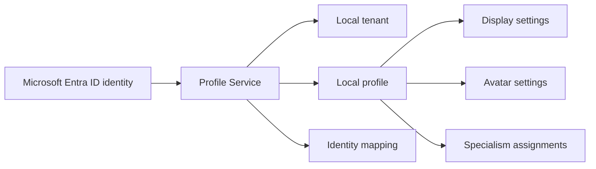

# Profile Service Overview

## Why This Exists

The profile service gives the application a stable internal model of "who is using the system" and "which organization they belong to".

That matters because external sign-in systems like Microsoft Entra ID tell us who a user is in Entra terms, but the application still needs its own local records so it can:

- track a person as a profile inside the app
- group profiles into tenants
- store display information and avatar settings
- link one local profile to one or more external identities
- store specialisms assigned to people
- decide whether a signed-in user is allowed to continue based on local profile state

In short:

- Entra ID proves identity
- the profile service decides how that identity exists inside this application

## Who This Documentation Is For

This profile-service doc set is written for human developers first.

It aims to explain:

- what problem the profile service solves
- how the data model fits together
- what happens during login and profile creation
- where to look in code when something breaks

The source of truth is still the current implementation:

- `backend/app/models/profile.py`
- `backend/app/schemas/profile.py`
- `backend/app/repositories/profile_repository.py`
- `backend/app/services/profile_service.py`
- `backend/app/routers/profiles.py`
- `backend/app/routers/auth.py`

Legacy docs were used only as background context.

## What The Profile Service Owns

The profile service owns the application's internal people and organization model.

Verified from the code, it is responsible for:

- tenants
- profiles
- external identity links
- profile display metadata
- profile avatar metadata
- tenant-defined specialisms
- profile-to-specialism assignments
- resolving or creating a local profile during Entra sign-in

It is not a separate deployable microservice today. It is a domain inside the FastAPI backend.

## The Big Picture

When someone signs in, the app does not want to work only with raw Entra claims forever. It wants to convert those claims into a local application profile.

That local profile becomes the application's stable reference point.

### Conceptual view

### Why this design is useful

- external identity can change shape over time, but the app still keeps a stable local `profile_id`
- local business rules like `active` or `deactivated` are controlled by the app, not by the identity provider
- app-specific data like specialisms or avatar preferences do not need to live in Entra ID

## What The Service Stores

Verified from `backend/app/models/profile.py`:

- `tenant`
  - the organization boundary for isolation
- `profile`
  - the main user record
- `profile_display`
  - human-readable display name and normalized search value
- `identity_provider`
  - registry of external identity sources such as `microsoft`
- `profile_identity`
  - link from an external subject to a local profile
- `avatar_preset`
  - preset avatar choices available within a tenant
- `profile_avatar`
  - the profile's chosen avatar configuration
- `specialism`
  - tenant-defined skill/category records
- `profile_specialism`
  - assignments of specialisms to profiles

## The Core Idea In Plain English

Think of the system like this:

- a `tenant` is the organization container
- a `profile` is the person inside that tenant
- a `profile_identity` says "this external login belongs to this profile"
- a `profile_display` stores the name the UI will show
- a `profile_avatar` stores how the profile picture is configured
- a `specialism` is a skill/category the tenant defines
- a `profile_specialism` says which skills belong to which profile

## Main Responsibilities

### Tenant management

- create tenants
- fetch a tenant by ID
- list all tenants
- look up a tenant by name for Entra provisioning

### Profile lifecycle

- create a profile inside a tenant
- fetch a profile by tenant and profile ID
- list profiles for a tenant
- search profiles by display name
- update profile fields
- deactivate a profile

### Identity mapping

- connect a profile to an external identity provider subject
- find a profile from an identity provider name plus subject
- update `last_login_at` when that identity is used

### Entra-driven local provisioning

- create the configured internal tenant if it does not exist
- create the configured identity provider if it does not exist
- resolve an existing linked profile on login
- block login if the profile is not `active`
- update the local display name if Entra's name changed
- create a new local profile and identity link on first login

### Specialisms

- create tenant-scoped specialisms
- list them
- assign them to profiles
- return a profile's assigned specialisms

## Human-Friendly Mental Model

If you are new to identity systems, this is the most important thing to understand:

1. A user signs in with Microsoft Entra ID.
2. The backend validates that identity.
3. The profile service asks: "Do we already know this person locally?"
4. If yes, it returns the existing local profile.
5. If not, it creates one.
6. From that point on, the app works primarily with the local profile.

That means the profile service is the bridge between external identity and internal application data.

## Current Entry Points

### Profile API routes

Defined in `backend/app/routers/profiles.py`:

- `POST /api/v1/tenants`
- `GET /api/v1/tenants`
- `GET /api/v1/tenants/{tenant_id}`
- `POST /api/v1/profiles`
- `GET /api/v1/profiles/{profile_id}`
- `PATCH /api/v1/profiles/{profile_id}`
- `POST /api/v1/profiles/{profile_id}/deactivate`
- `GET /api/v1/tenants/{tenant_id}/profiles`
- `GET /api/v1/tenants/{tenant_id}/profiles/search`
- `POST /api/v1/profiles/identities`
- `GET /api/v1/auth/profile`
- `POST /api/v1/specialisms`
- `GET /api/v1/tenants/{tenant_id}/specialisms`
- `POST /api/v1/profiles/{profile_id}/specialisms/{specialism_id}`
- `GET /api/v1/profiles/{profile_id}/specialisms`

### Auth integration point

Defined in `backend/app/routers/auth.py`:

- `/auth/callback` calls `ProfileService.resolve_entra_profile(...)`

## What The Service Does Not Currently Do

Verified by the current code:

- it does not have route-layer authorization guards on the profile management endpoints
- it does not implement avatar upload storage
- it does not implement specialism removal
- it does not provide a dedicated profile reactivation flow
- it does not provide audit logging for profile changes
- it does not expose especially detailed error messages for identity linking or specialism assignment failures

## Recommended Reading Order

For a new team member, the best order is:

1. [overview.md](/home/liam/Documents/GitHub/comp2003-2025-2026-team-3/docs/services/profile-service/overview.md)
2. [architecture.md](/home/liam/Documents/GitHub/comp2003-2025-2026-team-3/docs/services/profile-service/architecture.md)
3. [flows.md](/home/liam/Documents/GitHub/comp2003-2025-2026-team-3/docs/services/profile-service/flows.md)
4. [dependencies.md](/home/liam/Documents/GitHub/comp2003-2025-2026-team-3/docs/services/profile-service/dependencies.md)
5. [troubleshooting.md](/home/liam/Documents/GitHub/comp2003-2025-2026-team-3/docs/services/profile-service/troubleshooting.md)
